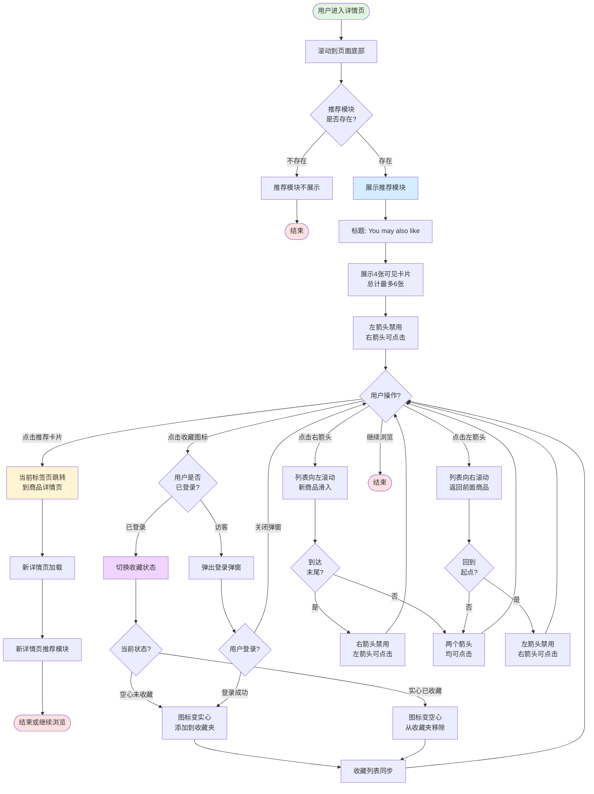

# 详情页推荐模块业务流程

## 1. 流程概述
- **流程名称**: 详情页推荐模块展示与交互
- **起点**: 用户进入详情页并滚动到底部
- **终点**: 用户完成推荐商品浏览、跳转或收藏操作
- **预期耗时**: 5-30秒(取决于用户浏览意愿和推荐商品数量)
- **涉及角色**: 访客、买家(权限有差异,访客收藏需登录)
- **核心目标**: 通过智能推荐相似商品,提升用户留存和转化率,延长用户浏览时长

## 2. 业务流程图

## 3. 详细步骤

### 步骤1: 用户进入详情页并滚动到底部
**执行方**: 用户  
**操作内容**:
- 从列表页点击商品进入详情页
- 浏览商品详情(图片、价格、标题、描述等)
- 滚动到页面底部

**系统响应**:
- 详情页正常加载
- Description、Location等信息展示
- 推荐模块进入可视区域(如果存在)

**数据变化**: 无

**观测点**:
- 页面滚动位置到达底部
- 推荐模块区域可见

**关联测试用例**: TC-REC-001, TC-REC-002

---

### 步骤2: 检查推荐模块是否存在
**执行方**: 系统  
**操作内容**:
- 后端推荐算法根据当前商品信息计算推荐商品
- 判断是否有推荐商品可展示

**系统响应**:
- 有推荐商品: 展示推荐模块
- 无推荐商品: 不展示推荐模块,直接显示Footer

**数据变化**: 无

**观测点**:
- 推荐模块是否存在
- 推荐商品数量(最多6张)

**关联测试用例**: TC-REC-003

---

### 步骤3: 展示推荐模块(有推荐商品时)
**执行方**: 系统  
**操作内容**:
- 渲染推荐模块标题"You may also like"
- 渲染推荐商品卡片(图片、标题、价格、Free Delivery标签、收藏图标)
- 渲染左右箭头导航按钮
- 触发推荐模块曝光埋点

**系统响应**:
- 展示4张可见卡片(桌面端)
- 总计最多6张卡片
- 左箭头初始禁用(浅灰色)
- 右箭头初始可点击(深色)
- 触发`detail_recommend_show`埋点
- 触发`detail_recommend_item_sho`埋点(至少4个)

**数据变化**: 无

**观测点**:
- 标题"You may also like"清晰可见
- 4张卡片横向排列
- 每张卡片包含完整信息
- 左右箭头状态正确
- 埋点触发正常

**关联测试用例**: TC-REC-001, TC-REC-002

---

### 步骤4: 用户点击推荐商品卡片跳转
**执行方**: 用户  
**操作内容**:
- 点击任意推荐商品卡片

**系统响应**:
- 当前标签页跳转到被点击商品的详情页
- 触发`detail_recommend_item_cli`埋点
- URL变更为新商品详情页URL
- 新详情页正常加载
- 新详情页也包含推荐模块(延续推荐链路)
- 浏览器历史记录正常记录

**数据变化**: 无

**观测点**:
- URL成功变更
- 新详情页正常加载
- 新详情页推荐模块存在
- 浏览器后退按钮可用

**关联测试用例**: TC-REC-004

---

### 步骤5: 用户点击收藏图标(已登录)
**执行方**: 用户  
**操作内容**:
- 将鼠标悬停在推荐商品卡片上
- 点击卡片右上角的收藏图标

**系统响应**:
- 判断当前收藏状态
- 如果是空心(未收藏): 图标变实心,添加到收藏夹
- 如果是实心(已收藏): 图标变空心,从收藏夹移除
- 触发`detail_recommend_favourit`埋点
- 收藏列表实时同步
- 页面不跳转,停留在当前详情页

**数据变化**: 
- 收藏列表增加或减少一条记录

**观测点**:
- 图标状态立即切换(空心↔实心)
- 埋点触发正常
- 收藏夹同步成功
- 页面无跳转
- 其他推荐商品收藏状态不受影响

**关联测试用例**: TC-REC-005, TC-REC-006

---

### 步骤6: 访客点击收藏图标弹出登录弹窗
**执行方**: 用户(访客)  
**操作内容**:
- 以访客身份点击推荐商品卡片的收藏图标

**系统响应**:
- 立即弹出登录弹窗
- 触发`welcome_show`埋点
- 弹窗内容包括:
  - 标题"Welcome to OK.com US"
  - 副标题"Free to post. Easy to find."
  - 输入框"Email or phone number"
  - Continue按钮(初始禁用)
  - 第三方登录按钮(Google、Facebook、Apple)
  - 隐私政策说明链接
- 背景页面变暗(遮罩层)
- 弹窗右上角有关闭按钮(X)
- 收藏图标保持灰色空心状态(未成功收藏)

**数据变化**: 无

**观测点**:
- 登录弹窗正常弹出
- 弹窗内容完整
- 遮罩层正常显示
- 收藏图标状态未改变
- 埋点触发正常

**关联测试用例**: TC-REC-007

---

### 步骤7: 用户登录后自动收藏
**执行方**: 用户  
**操作内容**:
- 在登录弹窗中输入邮箱/手机号
- 输入密码或使用第三方登录
- 完成登录

**系统响应**:
- 登录成功,关闭登录弹窗
- 自动执行收藏操作
- 收藏图标从空心变实心
- 商品添加到收藏夹

**数据变化**: 
- 用户登录态改变
- 收藏列表增加一条记录

**观测点**:
- 登录成功
- 收藏图标自动变实心
- 收藏夹同步成功

**关联测试用例**: TC-REC-007

---

### 步骤8: 用户点击右箭头翻页
**执行方**: 用户  
**操作内容**:
- 点击推荐模块右侧的右箭头按钮

**系统响应**:
- 推荐列表向左平滑滚动
- 第1张商品(左侧)逐渐移出视野
- 新商品从右侧滑入视野
- 左箭头从禁用状态变为可点击状态(深色)
- 仍然展示4张卡片(视觉上保持一致)
- 滚动动画流畅(无卡顿)
- 触发`detail_recommend_item_sho`埋点(新商品曝光)

**数据变化**: 无

**观测点**:
- 列表向左滚动
- 新商品滑入视野
- 左箭头变为可点击
- 滚动动画流畅
- 埋点触发正常

**关联测试用例**: TC-REC-008

---

### 步骤9: 用户点击右箭头到达末尾
**执行方**: 用户  
**操作内容**:
- 连续点击右箭头直至无法继续滚动

**系统响应**:
- 推荐列表滚动到末尾
- 右箭头变为禁用状态(浅灰色)
- 左箭头变为可点击状态(深色)
- 最后一组推荐商品完全展示
- 再次点击右箭头无反应

**数据变化**: 无

**观测点**:
- 右箭头禁用状态生效
- 最后一组商品完全展示
- 左箭头可点击
- 禁用状态点击无反应

**关联测试用例**: TC-REC-010

---

### 步骤10: 用户点击左箭头返回
**执行方**: 用户  
**操作内容**:
- 在已滚动状态下点击左箭头按钮

**系统响应**:
- 推荐列表向右平滑滚动
- 右侧商品逐渐移出视野
- 左侧商品从左侧滑入视野
- 右箭头从禁用状态变为可点击状态(如果之前到达末尾)
- 滚动动画流畅

**数据变化**: 无

**观测点**:
- 列表向右滚动
- 左侧商品滑入视野
- 右箭头状态更新
- 滚动动画流畅

**关联测试用例**: TC-REC-009

---

### 步骤11: 用户点击左箭头回到起点
**执行方**: 用户  
**操作内容**:
- 连续点击左箭头直至返回初始状态

**系统响应**:
- 推荐列表回到初始状态
- 左箭头变为禁用状态(浅灰色)
- 展示前4张推荐商品(初始位置)
- 右箭头变为可点击状态(深色)
- 再次点击左箭头无反应

**数据变化**: 无

**观测点**:
- 左箭头禁用状态生效
- 展示初始4张商品
- 右箭头可点击
- 禁用状态点击无反应

**关联测试用例**: TC-REC-011

---

## 4. 验证清单

### 4.1 前置条件验证
- [ ] 测试环境可正常访问OK.com(美国站或其他站点)
- [ ] 详情页有推荐模块(非招聘、非房产类目)
- [ ] 有测试账号(已登录状态)
- [ ] 推荐商品数量≥6张(用于测试翻页功能)

### 4.2 推荐模块展示验证
- [ ] 推荐模块标题"You may also like"正常显示
- [ ] 展示4张可见卡片(桌面端)
- [ ] 卡片内容完整(图片、标题、价格、标签、收藏图标)
- [ ] 左箭头初始禁用,右箭头初始可点击
- [ ] 访客和登录用户均可查看推荐模块
- [ ] 部分详情页无推荐模块(边界情况)

### 4.3 推荐商品卡片交互验证
- [ ] 点击推荐商品卡片跳转到新详情页
- [ ] 跳转方式为当前标签页跳转(非新标签页)
- [ ] 新详情页正常加载且包含推荐模块
- [ ] 浏览器后退按钮可返回上一页
- [ ] 埋点`detail_recommend_item_cli`触发正常

### 4.4 收藏功能验证(已登录)
- [ ] 点击空心收藏图标后变实心
- [ ] 点击实心收藏图标后变空心
- [ ] 收藏夹实时同步
- [ ] 页面不跳转,停留在当前详情页
- [ ] 其他推荐商品收藏状态不受影响
- [ ] 埋点`detail_recommend_favourit`触发正常

### 4.5 收藏功能验证(访客)
- [ ] 点击收藏图标弹出登录弹窗
- [ ] 登录弹窗内容完整(标题、输入框、第三方登录)
- [ ] 遮罩层正常显示
- [ ] 关闭按钮可关闭弹窗
- [ ] 收藏图标保持空心状态(未成功收藏)
- [ ] 登录成功后自动收藏
- [ ] 埋点`welcome_show`触发正常

### 4.6 推荐列表导航验证
- [ ] 点击右箭头列表向左滚动
- [ ] 新商品从右侧滑入视野
- [ ] 左箭头从禁用变为可点击
- [ ] 滚动动画流畅无卡顿
- [ ] 点击左箭头列表向右滚动
- [ ] 左侧商品从左侧滑入视野
- [ ] 右箭头状态更新正确

### 4.7 边界场景验证
- [ ] 右箭头滚动到末尾时禁用
- [ ] 左箭头滚动到起点时禁用
- [ ] 禁用状态下点击无反应
- [ ] 推荐商品总数为6张(通过左右箭头遍历验证)
- [ ] 推荐商品与当前商品类目相关

## 5. 关联文档

### 5.1 规则文档
- [详情页推荐模块规则](../../业务规则库/详情页规则/详情页推荐模块规则.md)

### 5.2 测试用例
- [OK.com-详情页推荐模块-测试用例-20260402.md](../../文本用例/Tiyan/通用详情页/OK.com-详情页推荐模块-测试用例-20260402.md)

### 5.3 相关业务域
- [通用业务全景](./通用业务全景.md)
- 详情页核心信息业务流程(推荐模块所在页面)
- 收藏功能业务流程(推荐商品可收藏)
- 推荐算法业务流程(待建立)

---

**📝 文档版本**: v1.0  
**📅 生成日期**: 2026-04-27  
**🔄 变更历史**:
- v1.0 (2026-04-27): 初始版本,基于OK.com-详情页推荐模块-测试用例-20260402.md生成
