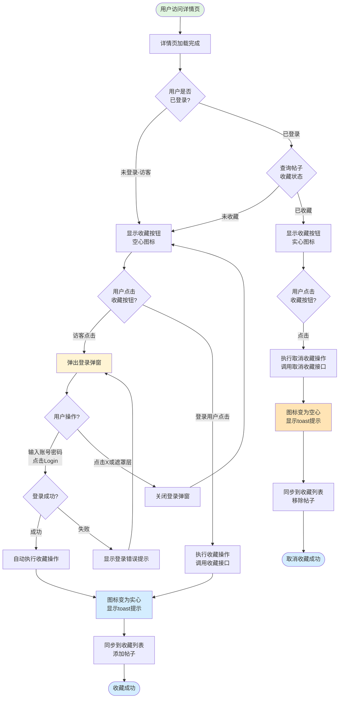

# 详情页收藏功能业务流程

## 1. 流程概述
- **流程名称**: 详情页收藏功能
- **起点**: 用户访问详情页,查看收藏按钮
- **终点**: 收藏状态更新成功,同步到收藏列表
- **预期耗时**: 1-3秒(含登录流程可能需要更长)
- **涉及角色**: 访客(需先登录)、登录用户(买家/卖家)
- **核心目标**: 让用户快速收藏感兴趣的帖子,方便后续查看和管理,提升用户粘性

## 2. 业务流程图

## 3. 详细步骤

### 步骤1: 用户访问详情页
**执行方**: 用户  
**操作内容**:
- 从列表页点击帖子卡片进入详情页
- 或从收藏列表点击帖子进入详情页
- 或直接访问详情页URL

**系统响应**:
- 详情页开始加载
- 渲染页面内容(图片、标题、价格等)

**数据变化**: 无

**观测点**:
- 页面加载完成
- 图片下方操作区域显示
- 收藏按钮位于操作区域中

**关联测试用例**: TC001

---

### 步骤2: 检查用户登录状态
**执行方**: 系统  
**操作内容**:
- 检查用户是否已登录(检查session/token)
- 如果已登录,查询当前帖子的收藏状态

**系统响应**:
- 未登录: 显示空心图标,不查询收藏状态
- 已登录且未收藏: 显示空心图标
- 已登录且已收藏: 显示实心图标

**数据变化**: 无

**观测点**:
- 访客看到空心图标
- 登录用户根据收藏状态看到空心或实心图标
- 收藏按钮始终可见

**关联测试用例**: TC001, TC005, TC015

---

### 步骤3: 访客点击收藏按钮
**执行方**: 用户(访客)  
**操作内容**:
- 访客点击收藏按钮

**系统响应**:
- 检测到访客身份
- 弹出登录弹窗(modal/dialog)
- 弹窗包含Email、Password输入框和Login按钮

**数据变化**: 无

**观测点**:
- 登录弹窗正常弹出
- 弹窗内容完整(Email、Password、Login按钮)
- 弹窗遮罩层覆盖背景
- 详情页内容仍可见但不可交互

**关联测试用例**: TC002

---

### 步骤4: 访客在登录弹窗中登录
**执行方**: 用户(访客)  
**操作内容**:
- 在Email输入框输入账号(如shenchang@58.com)
- 在Password输入框输入密码(如123456Tt)
- 点击"Log in"按钮

**系统响应**:
- 提交登录请求
- 验证账号密码
- 登录成功后创建用户会话

**数据变化**: 
- 用户状态从访客变为登录用户
- 创建session/token

**观测点**:
- 登录请求发送
- 账号密码验证通过
- 登录成功(无错误提示)

**关联测试用例**: TC003

---

### 步骤5: 登录成功后自动收藏
**执行方**: 系统  
**操作内容**:
- 登录成功后自动关闭登录弹窗
- 自动执行收藏操作(调用收藏接口)
- 将当前帖子添加到用户收藏列表

**系统响应**:
- 登录弹窗关闭
- 收藏按钮图标立即变为实心
- 可能显示toast提示(如"Added to favourites")
- 页面不刷新

**数据变化**: 
- 帖子添加到用户收藏列表
- 收藏状态更新为已收藏

**观测点**:
- 登录弹窗自动关闭
- 图标从空心变为实心(有过渡动画)
- toast提示显示(如适用)
- 页面URL不变,无刷新

**关联测试用例**: TC003

---

### 步骤6: 访客取消登录弹窗
**执行方**: 用户(访客)  
**操作内容**:
- 点击登录弹窗的关闭按钮(X)
- 或点击弹窗外的遮罩层

**系统响应**:
- 登录弹窗关闭
- 返回详情页
- 收藏按钮仍为空心图标

**数据变化**: 无

**观测点**:
- 登录弹窗正常关闭
- 详情页内容可交互
- 收藏按钮仍为空心
- 可以再次点击收藏按钮

**关联测试用例**: TC004, TC016

---

### 步骤7: 登录用户首次收藏帖子
**执行方**: 用户(登录用户)  
**操作内容**:
- 登录用户进入未收藏的帖子详情页
- 点击收藏按钮(空心图标)

**系统响应**:
- 无需登录弹窗
- 直接执行收藏操作(调用收藏接口)
- 将帖子添加到用户收藏列表

**数据变化**: 
- 帖子添加到用户收藏列表
- 收藏状态更新为已收藏

**观测点**:
- 图标立即变为实心(无延迟)
- 可能显示toast提示(如"Added to favourites")
- 页面不刷新
- 无登录弹窗

**关联测试用例**: TC005

---

### 步骤8: 登录用户取消收藏
**执行方**: 用户(登录用户)  
**操作内容**:
- 登录用户进入已收藏的帖子详情页(实心图标)
- 点击收藏按钮(取消收藏)

**系统响应**:
- 执行取消收藏操作(调用取消收藏接口)
- 从用户收藏列表移除帖子

**数据变化**: 
- 帖子从用户收藏列表移除
- 收藏状态更新为未收藏

**观测点**:
- 图标立即变为空心(无延迟)
- 可能显示toast提示(如"Removed from favourites")
- 页面不刷新

**关联测试用例**: TC006

---

### 步骤9: 重复点击收藏按钮(状态切换)
**执行方**: 用户(登录用户)  
**操作内容**:
- 在同一详情页多次点击收藏按钮
- 第1次点击: 收藏(空心→实心)
- 第2次点击: 取消收藏(实心→空心)
- 第3次点击: 再次收藏(空心→实心)

**系统响应**:
- 每次点击正确响应
- 图标状态正确切换: 空心↔实心
- 收藏列表同步更新

**数据变化**: 
- 收藏状态在已收藏↔未收藏之间切换
- 收藏列表实时更新

**观测点**:
- 图标状态切换正确
- 每次点击都能响应
- 无重复请求或错误
- 最终状态稳定

**关联测试用例**: TC007

---

### 步骤10: 快速连续点击(防抖测试)
**执行方**: 用户(登录用户)  
**操作内容**:
- 快速连续点击收藏按钮5次(间隔<100ms)
- 等待2秒观察最终状态

**系统响应**:
- 防抖处理,不触发5次收藏/取消操作
- 最终状态稳定(已收藏或未收藏)
- 无错误提示

**数据变化**: 
- 收藏状态最终稳定在一个明确状态

**观测点**:
- 按钮有防抖处理
- 最终状态稳定(不出现中间态)
- 无错误提示
- 收藏列表状态一致

**关联测试用例**: TC008

---

### 步骤11: 页面刷新后状态保持
**执行方**: 用户  
**操作内容**:
- 登录用户收藏帖子(图标变为实心)
- 刷新页面(F5或浏览器刷新按钮)
- 等待页面重新加载
- 观察收藏按钮状态

**系统响应**:
- 页面重新加载
- 查询帖子收藏状态
- 根据收藏状态显示图标

**数据变化**: 无

**观测点**:
- 刷新后收藏按钮仍显示实心图标
- 收藏状态正确保存
- 状态与刷新前一致

**关联测试用例**: TC010

---

### 步骤12: 同步到收藏列表
**执行方**: 系统  
**操作内容**:
- 收藏操作完成后,将帖子添加到用户收藏列表
- 取消收藏操作完成后,从用户收藏列表移除帖子
- 用户访问收藏列表页时显示最新收藏列表

**系统响应**:
- 收藏列表实时更新
- 从收藏列表点击帖子进入详情页,收藏按钮显示实心图标

**数据变化**: 
- 用户收藏列表更新

**观测点**:
- 收藏后帖子出现在收藏列表
- 取消收藏后帖子从列表移除
- 从收藏列表进入详情页,收藏按钮为实心
- 收藏列表无遗留无效条目

**关联测试用例**: TC013, TC014, TC015

---

## 4. 验证清单

### 4.1 前置条件验证
- [ ] 测试环境可正常访问OK.com美国站
- [ ] 有可用的测试账号(如shenchang@58.com)
- [ ] 有可访问的详情页URL
- [ ] 详情页包含收藏按钮

### 4.2 核心流程验证(访客)
- [ ] 访客看到收藏按钮(空心图标)
- [ ] 点击收藏按钮弹出登录弹窗
- [ ] 登录弹窗内容完整(Email、Password、Login)
- [ ] 登录成功后弹窗自动关闭
- [ ] 登录成功后自动收藏,图标变为实心
- [ ] 可能显示toast成功提示
- [ ] 页面不刷新

### 4.3 核心流程验证(登录用户)
- [ ] 登录用户进入详情页,自动识别收藏状态
- [ ] 未收藏状态点击按钮直接收藏
- [ ] 已收藏状态点击按钮取消收藏
- [ ] 图标状态正确切换(空心↔实心)
- [ ] 无需登录弹窗
- [ ] 页面不刷新

### 4.4 弹窗交互验证
- [ ] 点击X按钮关闭登录弹窗
- [ ] 点击遮罩层关闭登录弹窗
- [ ] 关闭后收藏按钮仍为空心
- [ ] 可以再次点击收藏按钮

### 4.5 状态保持验证
- [ ] 页面刷新后收藏状态保持
- [ ] 退出详情页再次进入,收藏状态保持
- [ ] 跨页面浏览后返回,收藏状态保持
- [ ] 退出登录后收藏按钮变为空心

### 4.6 收藏列表同步验证
- [ ] 收藏后帖子出现在收藏列表
- [ ] 取消收藏后帖子从列表移除
- [ ] 从收藏列表进入详情页,收藏按钮显示实心
- [ ] 收藏列表显示正确的帖子信息

### 4.7 防抖与性能验证
- [ ] 快速连续点击有防抖处理
- [ ] 最终状态稳定,无中间态
- [ ] 慢速网络下显示加载状态
- [ ] 请求超时时显示错误提示

### 4.8 视觉反馈验证
- [ ] 图标过渡动画流畅
- [ ] 鼠标悬停有视觉反馈
- [ ] 可能显示tooltip提示
- [ ] toast提示正确显示(如适用)

## 5. 关联文档

### 5.1 规则文档
- [详情页收藏功能规则](../../业务规则库/详情页规则/详情页收藏功能规则.md)

### 5.2 测试用例
- [OK.com-详情页收藏功能-测试用例-20260401.md](../../文本用例/Tiyan/通用详情页/OK.com-详情页收藏功能-测试用例-20260401.md)

### 5.3 相关业务域
- [通用业务全景](./通用业务全景.md)
- [收藏页业务流程](./收藏页业务流程.md) (收藏列表页)
- 登录认证业务流程(待建立)
- 用户会话管理业务流程(待建立)

---

**📝 文档版本**: v1.0  
**📅 生成日期**: 2026-04-27  
**🔄 变更历史**:
- v1.0 (2026-04-27): 初始版本,基于OK.com-详情页收藏功能-测试用例-20260401.md生成
