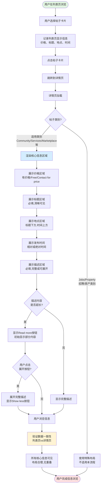

# 详情页核心信息区域业务流程

## 1. 流程概述
- **流程名称**: 详情页核心信息区域展示
- **起点**: 用户从列表页点击帖子卡片
- **终点**: 详情页核心信息完整展示,用户可查看所有信息
- **预期耗时**: 2-5秒(含页面加载和渲染)
- **涉及角色**: 访客、登录用户(功能对所有用户开放)
- **核心目标**: 让用户快速了解帖子的核心信息(价格、标题、地点、时间、描述),促进交易达成

## 2. 业务流程图

## 3. 详细步骤

### 步骤1: 用户在列表页选择帖子
**执行方**: 用户  
**操作内容**:
- 在列表页浏览帖子卡片
- 选择感兴趣的帖子(排除Jobs、Property类别)
- 查看列表页显示的价格、标题、地点、时间等信息

**系统响应**:
- 列表页展示帖子卡片(4列网格布局或其他布局)
- 每个卡片显示关键信息摘要

**数据变化**: 无

**观测点**:
- 列表页至少有一个适用类别的帖子卡片
- 卡片显示价格(或Free)、标题摘要、地点、时间等
- 卡片可点击,有hover效果

**关联测试用例**: TC026

---

### 步骤2: 用户点击帖子卡片跳转
**执行方**: 用户  
**操作内容**:
- 点击帖子卡片的任意可点击区域(图片、标题等)
- 触发跳转到详情页

**系统响应**:
- 浏览器导航到详情页URL
- URL格式: `/en/city-XXX/cate-YYY/post-title-ID/`
- 开始加载详情页

**数据变化**: 
- URL变化,进入详情页
- 浏览器历史记录新增一条

**观测点**:
- 点击后成功跳转
- URL包含`/city-`和帖子ID
- 页面开始加载,显示加载状态(如loading spinner)

**关联测试用例**: TC026

---

### 步骤3: 详情页加载核心信息
**执行方**: 系统  
**操作内容**:
- 向后端请求帖子详细数据
- 解析返回的帖子信息(价格、标题、地点、时间、描述等)
- 渲染详情页HTML结构

**系统响应**:
- 后端返回帖子完整数据
- 前端渲染核心信息区域

**数据变化**: 
- 页面DOM更新,核心信息元素渲染完成

**观测点**:
- 页面加载时间<5秒
- 无网络错误或接口5xx错误
- DOM中存在价格、标题、地点、时间、描述元素

**关联测试用例**: TC023

---

### 步骤4: 展示价格区域
**执行方**: 系统  
**操作内容**:
- 渲染价格元素
- 格式化价格: 添加货币符号"$",千分位分隔符
- 特殊处理: Free帖子显示"Free",无价格帖子显示"Contact for price"

**系统响应**:
- 价格区域清晰可见,位于页面显著位置
- 价格文字大号突出显示

**数据变化**: 无

**观测点**:
- 价格元素可见
- 价格包含"$"符号(如有价格)
- 价格≥1000时有千分位分隔符(如"$1,200")
- 免费帖子显示"Free"
- 价格与列表页一致

**关联测试用例**: TC001, TC002, TC003, TC004

---

### 步骤5: 展示标题区域
**执行方**: 系统  
**操作内容**:
- 渲染标题元素(通常为h1标签)
- 标题文字大小合适,位于页面顶部核心位置

**系统响应**:
- 标题清晰可见,完整展示

**数据变化**: 无

**观测点**:
- 标题元素可见
- 标题内容非空,长度5-200字符
- 标题与列表页一致(去除空格后)
- 标题不包含异常字符(乱码)
- 标题不换行超过3行
- 标题文字颜色与背景有足够对比度

**关联测试用例**: TC006, TC007, TC008, TC009

---

### 步骤6: 展示地点区域
**执行方**: 系统  
**操作内容**:
- 渲染地点元素,位于标题下方、发布时间上方
- 地点为纯文本展示,不可点击
- 通常伴有位置图标(pin icon)

**系统响应**:
- 地点区域清晰可见
- 地点格式规范(如"City, State")

**数据变化**: 无

**观测点**:
- 地点元素可见
- 地点位置正确: 标题下方、时间上方
- 地点内容非空,包含具体地址或城市名称
- 地点元素不可点击(tag_name != 'a')
- 地点与列表页一致或更详细
- 地点格式规范,不以逗号开头
- 垂直排列顺序: 标题→地点→时间

**关联测试用例**: TC010, TC011, TC012, TC013

---

### 步骤7: 展示发布时间
**执行方**: 系统  
**操作内容**:
- 渲染发布时间元素,位于地点下方
- 时间格式: 相对时间(如"2 hours ago")或绝对时间(如"Mar 20, 2026")

**系统响应**:
- 发布时间清晰可见

**数据变化**: 无

**观测点**:
- 时间元素可见
- 时间内容非空
- 时间格式正确: 包含"ago"/"minute"/"hour"/"day"或日期格式
- 时间逻辑合理,不显示负数或未来时间
- 新帖子(<1 hour)显示相对时间
- 时间与列表页基本一致(允许±1差异)

**关联测试用例**: TC014, TC015, TC016, TC017

---

### 步骤8: 展示描述区域
**执行方**: 系统  
**操作内容**:
- 渲染描述元素,位于价格/标题/地点/时间下方
- 描述内容必填,至少10个字符
- 如果内容超长,提供"Read more"展开按钮

**系统响应**:
- 描述区域清晰可见
- 描述内容完整展示或部分展示+展开按钮

**数据变化**: 无

**观测点**:
- 描述元素可见
- 描述内容非空,至少10个字符
- 文字排版正常(段落、换行正确)
- 如果超长,有"Read more"/"Show more"按钮
- 换行符正确处理(HTML ` `或`
`)
- 链接正确渲染(如包含URL)
- 特殊字符正确显示(emoji、标点符号)

**关联测试用例**: TC018, TC019, TC021

---

### 步骤9: 用户展开描述(可选)
**执行方**: 用户  
**操作内容**:
- 如果描述有展开按钮,用户点击"Read more"
- 系统展开完整描述
- 用户查看完整内容后可点击"Show less"收起

**系统响应**:
- 点击后展开完整描述
- 展开后显示"Show less"按钮(如支持)
- 收起后恢复初始状态

**数据变化**: 
- DOM更新,描述元素高度变化

**观测点**:
- 展开按钮可见且可点击
- 展开后文本长度>初始文本长度
- 展开后显示完整内容,无省略号
- 收起按钮可见且可点击(如支持)
- 收起后恢复初始状态

**关联测试用例**: TC020

---

### 步骤10: 验证数据一致性
**执行方**: 系统/测试  
**操作内容**:
- 对比列表页与详情页的价格、标题、地点、时间
- 验证核心信息的完整性和准确性

**系统响应**:
- 所有核心信息一致(或详情页更详细)
- 布局合理,无重叠

**数据变化**: 无

**观测点**:
- 列表页价格=详情页价格
- 列表页标题=详情页标题(去除空格后)
- 列表页地点包含于详情页地点或相反
- 列表页时间与详情页时间基本一致(允许±1)
- 所有核心信息同时可见(在一屏或滚动后可见)
- 元素之间间距适当,不重叠
- 刷新后信息保持一致(除时间可能轻微变化)

**关联测试用例**: TC003, TC007, TC011, TC016, TC023, TC024

---

## 4. 验证清单

### 4.1 前置条件验证
- [ ] 测试环境可正常访问OK.com美国站
- [ ] 列表页至少有一个适用类别的帖子(非Jobs、非Property)
- [ ] 浏览器为Chrome,窗口尺寸1440x900

### 4.2 核心流程验证
- [ ] 列表页帖子卡片正常展示
- [ ] 点击卡片后成功跳转到详情页
- [ ] 详情页URL包含`/city-`和帖子ID
- [ ] 详情页加载时间<5秒
- [ ] 价格区域正常展示(有价格/Free/Contact for price)
- [ ] 标题区域清晰可见,内容非空
- [ ] 地点区域位于标题下方、时间上方,内容非空
- [ ] 发布时间正常展示,格式正确
- [ ] 描述区域必填,内容非空,至少10个字符
- [ ] 描述超长时有展开/收起功能(如适用)

### 4.3 数据一致性验证
- [ ] 列表页价格=详情页价格
- [ ] 列表页标题=详情页标题
- [ ] 列表页地点与详情页地点一致或更详细
- [ ] 列表页时间与详情页时间基本一致
- [ ] 刷新后价格、标题、地点、描述保持一致

### 4.4 布局与格式验证
- [ ] 价格格式正确(货币符号、千分位)
- [ ] 标题长度合理(5-200字符)
- [ ] 地点格式规范(City, State)
- [ ] 时间格式正确(相对或绝对时间)
- [ ] 描述文字排版正常(段落、换行)
- [ ] 垂直排列顺序: 标题→价格→地点→时间→描述
- [ ] 元素之间间距适当,不重叠
- [ ] 所有核心信息在桌面端清晰可见

### 4.5 类别限制验证
- [ ] 测试的帖子类别为Community/Services/Marketplace/Cars/Others
- [ ] 已排除Jobs(招聘)和Property(房产)类别

### 4.6 异常场景验证
- [ ] 免费帖子价格显示"Free"
- [ ] 无价格帖子有合理占位(Contact for price)
- [ ] 标题超长时不换行超过3行
- [ ] 描述超长时有展开按钮
- [ ] 核心信息加载失败时有错误提示

## 5. 关联文档

### 5.1 规则文档
- [详情页核心信息区域规则](../../业务规则库/详情页规则/详情页核心信息区域规则.md)

### 5.2 测试用例
- [OK.com-详情页核心信息区域-测试用例-20260327.md](../../文本用例/Tiyan/通用详情页/OK.com-详情页核心信息区域-测试用例-20260327.md)

### 5.3 相关业务域
- [通用业务全景](./通用业务全景.md)
- 列表页模块业务流程(待建立)
- 帖子管理业务流程(待建立)

---

**📝 文档版本**: v1.0  
**📅 生成日期**: 2026-04-27  
**🔄 变更历史**:
- v1.0 (2026-04-27): 初始版本,基于OK.com-详情页核心信息区域-测试用例-20260327.md生成
