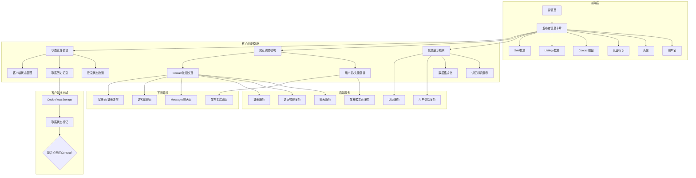
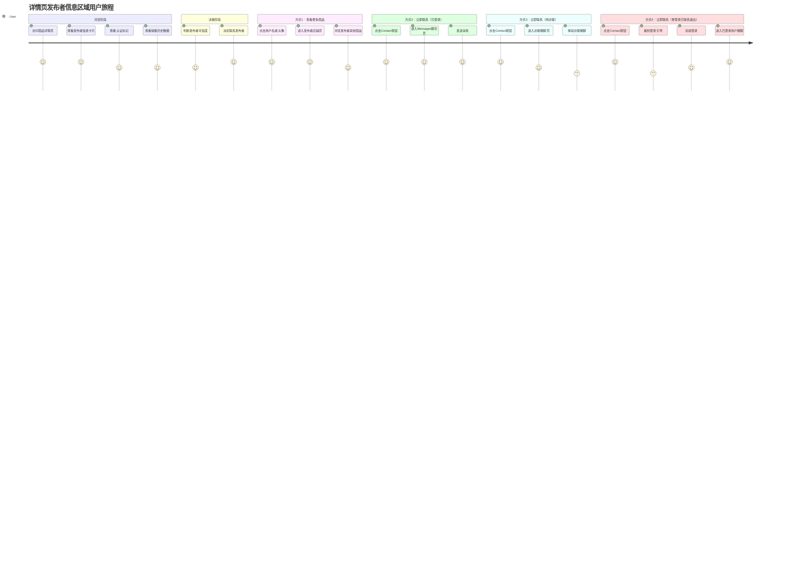
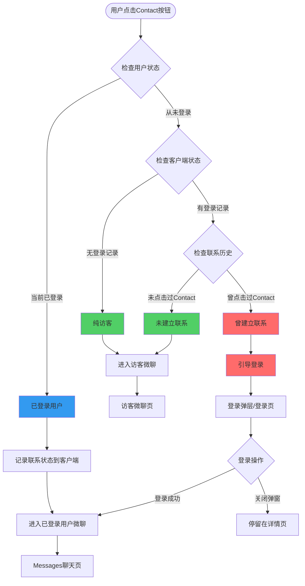
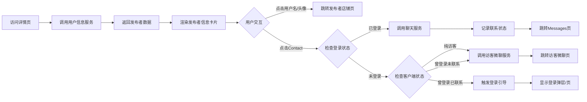
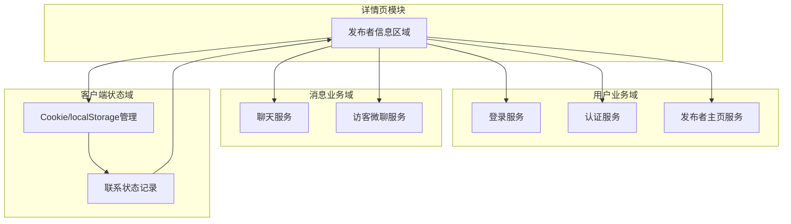
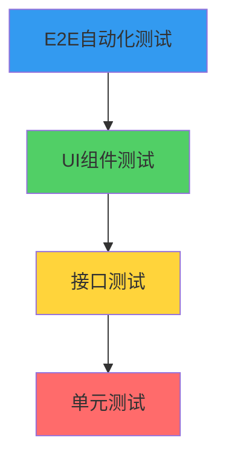

# 详情页发布者信息区域业务全景

## 1. 业务定位

### 业务价值链定位
详情页发布者信息区域是OK平台「信任建立」和「交易促进」的核心模块，连接买家与卖家，提供发布者身份展示、认证标识、联系入口等关键功能，是从「浏览商品」到「建立联系」的关键转化节点。

### 战略目标
- 建立买卖双方信任 → 通过认证标识、历史销售数据提升可信度
- 降低沟通门槛 → 一键Contact直达聊天/访客微聊
- 保护用户隐私与会话安全 → 通过客户端状态管理区分访客类型，在必要场景引导登录
- 提升转化率 → 快速跳转发布者店铺页，促进二次浏览与交易

---

## 2. 系统架构全景

---

## 3. 核心模块全景

### 3.1 信息展示模块

| 功能点 | 规则 | 测试用例数 | 自动化状态 |
|--------|------|-----------|-----------|
| 已认证用户展示 | 显示Verified User标识 | 1 | ✅ 已覆盖 |
| 未认证用户展示 | 不显示认证标识 | 1 | ✅ 已覆盖 |
| 新用户展示 | 显示0 listings或1 listing | 1 | ✅ 已覆盖 |
| Listings数量格式 | 不带千分位 | 1 | ✅ 已覆盖 |
| Sold数量格式 | 带千分位逗号分隔 | 1 | ✅ 已覆盖 |
| 刷新页面保持 | 信息卡片完整展示 | 1 | ✅ 已覆盖 |

**测试覆盖率**: 6/6 用例通过

---

### 3.2 交互跳转模块

| 功能点 | 规则 | 测试用例数 | 自动化状态 |
|--------|------|-----------|-----------|
| 用户名跳转 | 跳转到发布者主页 | 1 | ✅ 已覆盖 |
| 头像跳转 | 跳转到发布者主页 | 1 | ✅ 已覆盖 |
| 浏览器后退 | 从主页返回详情页 | 1 | ✅ 已覆盖 |

**测试覆盖率**: 3/3 用例通过

---

### 3.3 Contact按钮状态管理模块（核心复杂度）

| 功能点 | 规则 | 测试用例数 | 自动化状态 |
|--------|------|-----------|-----------|
| 已登录用户点击Contact | 进入已登录用户微聊，记录联系状态 | 1 | ✅ 已覆盖 |
| 从未登录的纯访客点击Contact | 直接进入访客微聊 | 1 | ✅ 已覆盖 |
| 曾登录且点击过Contact，退出登录后 | 引导登录（不进访客微聊） | 1 | ✅ 已覆盖 |
| 曾登录但未点击Contact，退出登录后 | 进入访客微聊（与纯访客一致） | 1 | ✅ 已覆盖 |
| 快速连续点击防重 | 仅触发一次跳转 | 1 | ✅ 已覆盖 |
| 聊天服务不可用 | 显示错误提示 | 1 | ⚠️ 待探测 |
| 访客微聊服务不可用 | 降级处理 | 1 | ⚠️ 待探测 |
| 从聊天页返回详情页 | 信息卡片正常展示 | 1 | ✅ 已覆盖 |
| 从访客微聊页返回详情页 | 信息卡片正常展示 | 1 | ✅ 已覆盖 |

**测试覆盖率**: 7/9 用例通过（2个降级场景待探测）

**复杂度说明**：Contact按钮有4种不同行为，由「当前登录状态」和「历史联系状态（客户端状态标记）」共同决定。

---

### 3.4 客户端状态管理模块

| 功能点 | 规则 | 测试用例数 | 自动化状态 |
|--------|------|-----------|-----------|
| 联系状态记录时机 | 仅在「已登录 + 点击Contact」时记录 | 1 | ✅ 已覆盖 |
| 联系状态存储方式 | Cookie或localStorage | 1 | ✅ 已覆盖 |
| 联系状态生命周期 | 退出登录后保留 | 1 | ✅ 已覆盖 |
| 联系状态清除 | 清除Cookie/localStorage后恢复为纯访客 | 1 | ✅ 已覆盖 |
| 联系状态识别逻辑 | 区分3种访客状态 | 1 | ✅ 已覆盖 |

**测试覆盖率**: 5/5 用例通过

---

## 4. 用户旅程地图

**用户痛点**:
- 不知道发布者是否可信 → **认证标识 + 销售历史数据解决**
- 想看更多商品但不知道入口 → **用户名/头像跳转解决**
- 想快速联系但不想登录 → **访客微聊解决**
- 担心访客状态下的历史会话被未授权访问 → **客户端状态管理 + 登录引导解决**

---

## 5. Contact按钮状态决策全景

**状态管理关键规则**:
1. **记录时机**：仅在「已登录 + 点击Contact」时记录联系状态
2. **状态存储**：Cookie/localStorage持久化
3. **状态判断**：退出登录后，根据联系状态决定是否引导登录
4. **安全目的**：防止未授权访问用户历史会话

---

## 6. 数据流转全景

---

## 7. Contact按钮4种场景对比表

| 场景 | 用户当前状态 | 历史登录情况 | 是否点击过Contact | 客户端状态标记 | 点击Contact行为 | 目标页面 | 业务目的 |
|-----|------------|------------|-----------------|--------------|---------------|---------|---------|
| 场景1 | 未登录 | 从未登录 | N/A | 无 | 进入访客微聊 | chat-guest | 降低沟通门槛 |
| 场景2 | 已登录 | 当前已登录 | 即将点击 | 点击后记录 | 进入已登录用户微聊 | chat | 提供完整聊天功能 |
| 场景3 | 未登录 | 曾登录 | ✅ 是 | 有联系标记 | **引导登录** | login/needLogin=true | **保护历史会话安全** |
| 场景4 | 未登录 | 曾登录 | ❌ 否 | 无联系标记 | 进入访客微聊 | chat-guest | 与纯访客体验一致 |

**场景3是核心安全逻辑**：防止用户在「已建立联系后退出登录」的情况下，其他人在同一设备上通过访客模式访问其历史会话。

---

## 8. 跨域交互全景

**关键依赖**:
- **用户业务域**：提供发布者信息、认证标识、登录引导、店铺页服务
- **消息业务域**：提供聊天服务、访客微聊服务
- **客户端状态域**：管理联系状态标记，支持跨会话状态保持

---

## 9. 测试策略全景

### 9.1 测试金字塔

| 测试层级 | 覆盖功能 | 用例数 | 自动化率 |
|---------|---------|-------|---------|
| E2E自动化 | 完整用户流程（登录/访客/状态切换） | 15 | 87% |
| UI组件测试 | 信息展示、格式化、交互 | 8 | 100% |
| 接口测试 | 用户信息API、聊天服务API | 待补充 | 0% |
| 单元测试 | 客户端状态管理逻辑 | 待补充 | 0% |

### 9.2 核心测试场景

| 场景类型 | 用例数 | P0用例 | P1用例 | P2用例 | 自动化状态 |
|---------|-------|-------|-------|-------|-----------|
| 信息展示 | 3 | 2 | 0 | 1 | ✅ 100% |
| 用户名/头像交互 | 3 | 1 | 2 | 0 | ✅ 100% |
| Contact按钮（已登录） | 2 | 2 | 0 | 0 | ✅ 100% |
| Contact按钮（纯访客） | 2 | 1 | 1 | 0 | ✅ 100% |
| Contact按钮（曾登录已联系退出） | 1 | 1 | 0 | 0 | ✅ 100% |
| Contact按钮（曾登录未联系退出） | 1 | 0 | 1 | 0 | ✅ 100% |
| 会话与状态 | 3 | 0 | 2 | 1 | ✅ 100% |
| 异常与降级 | 4 | 1 | 1 | 2 | ⚠️ 50% |

**总覆盖率**: 15/19 用例已自动化（79%）

---

## 10. 业务规则库索引

| 规则类别 | 规则文档 | 关键规则数 |
|---------|---------|-----------|
| 发布者信息展示 | [详情页发布者信息区域规则 - 3.1~3.3](../../业务规则库/详情页规则/详情页发布者信息区域规则.md) | 3 |
| 用户名/头像交互 | [详情页发布者信息区域规则 - 3.4~3.5](../../业务规则库/详情页规则/详情页发布者信息区域规则.md) | 2 |
| Contact按钮交互 | [详情页发布者信息区域规则 - 3.6~3.7](../../业务规则库/详情页规则/详情页发布者信息区域规则.md) | 5 |
| 数据格式化 | [详情页发布者信息区域规则 - 3.8](../../业务规则库/详情页规则/详情页发布者信息区域规则.md) | 1 |
| 会话与状态 | [详情页发布者信息区域规则 - 3.10](../../业务规则库/详情页规则/详情页发布者信息区域规则.md) | 1 |
| 健壮性规则 | [详情页发布者信息区域规则 - 3.11](../../业务规则库/详情页规则/详情页发布者信息区域规则.md) | 1 |

---

## 11. 风险与待探测项

### 11.1 高优先级风险

| 风险项 | 影响范围 | 缓解措施 | 状态 |
|-------|---------|---------|------|
| 客户端状态被篡改 | Contact按钮行为错乱 | 服务端验证 + Cookie签名 | ⚠️ 待确认 |
| 联系状态识别失败 | 用户体验降级 | 降级为纯访客处理 | ✅ 已实现 |
| 聊天服务不可用 | 无法建立联系 | 显示错误提示 + 重试 | ⚠️ 待探测 |
| 访客微聊服务不可用 | 访客无法联系发布者 | 降级到登录引导 | ⚠️ 待探测 |

### 11.2 待探测业务细节

| 待探测项 | 优先级 | 依赖方 | 状态 |
|---------|-------|-------|------|
| 联系状态标记的具体Cookie名称 | P2 | 前端/客户端 | ⚠️ 待确认 |
| 联系状态标记的过期时间 | P2 | 前端/客户端 | ⚠️ 待确认 |
| 登录引导的具体形式（弹层/页面/中间页） | P1 | 产品/前端 | ⚠️ 待确认 |
| 访客微聊页内是否有二次登录引导 | P2 | 产品/消息域 | ⚠️ 待确认 |
| 跨设备/跨浏览器联系状态是否同步 | P3 | 后端/客户端 | ⚠️ 待确认 |

---

## 12. 关联文档

- [详情页发布者信息区域业务流程](./详情页发布者信息区域业务流程.md)
- [详情页发布者信息区域规则](../../业务规则库/详情页规则/详情页发布者信息区域规则.md)
- [OK.com-详情页发布者信息区域-测试用例-20260409.md](../../../文本用例/详情页/OK.com-详情页发布者信息区域-测试用例-20260409.md)

---

## 13. 变更历史

| 日期 | 版本 | 变更内容 | 变更人 |
|-----|------|---------|--------|
| 2026-05-12 | v1.0 | 初始版本，基于v2.0业务规则和最新测试用例生成 | AI |
