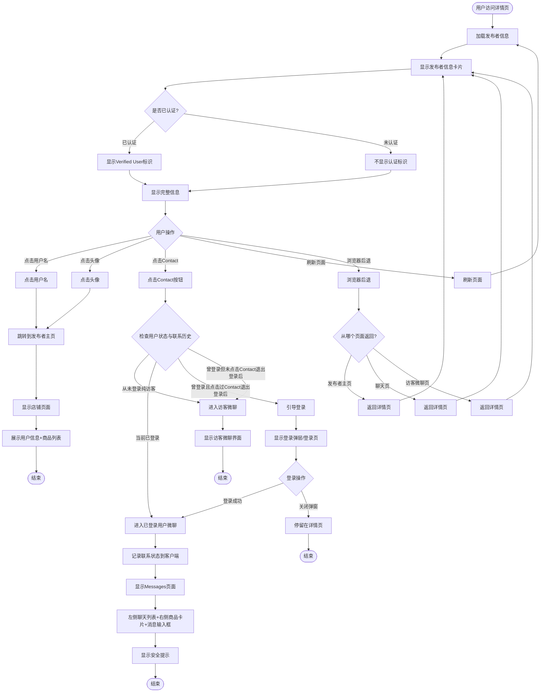

# 详情页发布者信息区域业务流程

> **业务目标**: 在详情页展示发布者信息,建立买卖双方信任,提供联系发布者的快捷入口,促进交易达成

## 1. 完整流程图

> **要求**: 专注于发布者信息区域的详细步骤,不包含跨域交互的复杂逻辑分支(跨域逻辑统一在业务全景文档中展示)

## 2. 详细步骤与观测点

### 步骤1: 发布者信息卡片加载与展示

#### 页面位置
- 详情页右侧
- 发布者信息卡片区域

#### 操作流程
1. 用户访问商品详情页
2. 系统调用 `GET /api/user/[publisherId]` 接口获取发布者信息
3. 前端渲染发布者信息卡片
4. 显示用户名、头像、认证标识(如果已认证)、listings数量、sold数量、Contact按钮

#### 观测点
- ✅ **P0**: 显示发布者用户名(如: OKerSA_mihwjid)
- ✅ **P0**: 显示橙色圆形头像,带OK图标
- ✅ **P0**: 已认证用户显示蓝色盾牌图标+"Verified User"文案
- ✅ **P0**: 显示listings数量(如: 96 listings,不带千分位)
- ✅ **P0**: 显示sold数量(如: 5,558,889 sold,带千分位)
- ✅ **P0**: 显示黑色背景的Contact按钮,白色文字
- ✅ **P1**: 未认证用户不显示"Verified User"标识
- ✅ **P2**: 新用户显示"0 listings"或"1 listing"(仅当前商品)
- ❌ **负向**: 发布者信息加载失败,显示占位符或默认信息

#### 验证方法
- 访问已认证卖家的商品详情页
- 检查发布者信息卡片是否完整展示
- 验证认证标识是否正确显示
- 检查listings和sold数量格式是否正确

#### 关联规则
- [详情页发布者信息区域规则 - 3.1 发布者信息展示规则(已认证用户)](../../业务规则库/详情页规则/详情页发布者信息区域规则.md#31-发布者信息展示规则已认证用户)

---

### 步骤2: 点击用户名跳转到发布者主页

#### 页面位置
- 发布者信息卡片 → 用户名

#### 操作流程
1. 定位发布者用户名(如: OKerSA_mihwjid)
2. 鼠标悬停,用户名出现下划线或颜色变化,光标变为手型
3. 点击用户名
4. 跳转到发布者主页/店铺页
5. URL变更为 `/en/profile/[publisherId]/[category]/`
6. 显示发布者详细信息

#### 观测点
- ✅ **P0**: 点击用户名后跳转到发布者主页
- ✅ **P0**: URL变更为 /en/profile/796370233146021568/services/
- ✅ **P0**: 页面标题包含发布者用户名(如: Local Services – Home, Repair & Everyday Services | OKerSA_mihwjid - OK.com)
- ✅ **P0**: 显示发布者详细信息: 用户名、徽章("Top Seller"+"Verified User")、地址、店铺介绍
- ✅ **P0**: 显示listings数量(如: 96 listings)
- ✅ **P0**: 显示分类Tab: Property/Marketplace/Jobs/Services(激活)/Cars
- ✅ **P0**: 下方展示该用户发布的所有商品卡片
- ✅ **P2**: 鼠标悬停在用户名上,出现下划线或颜色变化
- ❌ **负向**: 发布者主页不存在,显示404页面

#### 验证方法
- 定位用户名,检查是否可点击
- 点击用户名,验证是否跳转到发布者主页
- 检查URL是否正确
- 验证页面标题和内容

#### 关联规则
- [详情页发布者信息区域规则 - 3.4 用户名交互规则](../../业务规则库/详情页规则/详情页发布者信息区域规则.md#34-用户名交互规则)

---

### 步骤3: 点击头像跳转到发布者主页

#### 页面位置
- 发布者信息卡片 → 头像

#### 操作流程
1. 定位发布者头像(橙色圆形图标)
2. 鼠标悬停,头像出现边框高亮或视觉反馈,光标变为手型
3. 点击头像
4. 跳转到发布者主页,行为与点击用户名一致

#### 观测点
- ✅ **P1**: 点击头像后跳转到发布者主页
- ✅ **P1**: URL变更为 /en/profile/[publisherId]/[category]/
- ✅ **P1**: 显示发布者店铺页面内容
- ✅ **P2**: 鼠标悬停在头像上,出现边框高亮或视觉反馈

#### 验证方法
- 定位头像,检查是否可点击
- 点击头像,验证是否跳转到发布者主页
- 对比与点击用户名的行为是否一致

#### 关联规则
- [详情页发布者信息区域规则 - 3.5 头像交互规则](../../业务规则库/详情页规则/详情页发布者信息区域规则.md#35-头像交互规则)

---

### 步骤4: 已登录用户点击Contact跳转聊天页

#### 页面位置
- 发布者信息卡片 → Contact按钮

#### 操作流程
1. 确认用户已登录
2. 定位Contact按钮(黑色背景,白色文字)
3. 鼠标悬停,按钮可能有微小不透明度调整,光标变为手型
4. 点击Contact按钮
5. **系统记录「用户曾联系过此发布者」状态到客户端**(Cookie/localStorage)
6. 跳转到聊天页面(Messages页面)
7. URL变更为 `/biz/en/chat?postId=[postId]&shopId=[shopId]&shopName=[shopName]...`
8. 显示聊天界面

#### 观测点
- ✅ **P0**: 点击Contact按钮后跳转到聊天页面
- ✅ **P0**: URL变更为 /biz/en/chat?postId=6516039766105310&shopId=796370233146021568&shopName=OKerSA_mihwjid...
- ✅ **P0**: 页面标题为"Messages"
- ✅ **P0**: 左侧显示聊天列表,包含与该发布者的历史对话记录(如果有)
- ✅ **P0**: 右侧显示当前商品卡片: 商品名称、地址、价格
- ✅ **P0**: 显示安全提示: "For your safety, please avoid sharing sensitive personal information such as bank details or passwords."
- ✅ **P0**: 底部显示消息输入框: "Input message"
- ✅ **P0**: 客户端状态记录「曾联系过此发布者」标记
- ✅ **P2**: 鼠标悬停在Contact按钮上,保持黑色背景
- ✅ **P1**: 快速连续点击Contact按钮3次,仅触发一次跳转
- ❌ **负向**: 聊天服务不可用,显示错误提示

#### 验证方法
- 使用已登录账号访问详情页
- 点击Contact按钮
- 验证是否跳转到聊天页面
- 检查URL参数是否包含商品和发布者信息
- 验证聊天界面是否完整展示
- 检查客户端状态是否记录联系标记

#### 关联规则
- [详情页发布者信息区域规则 - 3.6 Contact按钮交互规则(已登录用户)](../../业务规则库/详情页规则/详情页发布者信息区域规则.md#36-contact按钮交互规则已登录用户)

---

### 步骤5: 从未登录的纯访客点击Contact进入访客微聊

#### 页面位置
- 发布者信息卡片 → Contact按钮

#### 操作流程
1. 确认用户从未在本设备/本会话登录过(Cookie/storage无登录记录)
2. 点击Contact按钮
3. **直接跳转到访客微聊页面**(不弹登录窗)
4. URL变更为包含 `chat-guest` 的访客微聊地址
5. 显示访客微聊界面

#### 观测点
- ✅ **P0**: 点击Contact按钮后直接跳转到访客微聊页面,不弹登录弹窗
- ✅ **P0**: URL包含 `chat-guest` 关键字(如: /biz/en/chat-guest-server1/?postId=...)
- ✅ **P0**: 页面显示访客微聊相关界面(会话区域、输入框或登录引导等)
- ✅ **P1**: 浏览器后退可返回详情页
- ❌ **负向**: 访客微聊服务不可用,显示错误提示

#### 验证方法
- 使用从未登录过的浏览器/无痕模式访问详情页
- 确认Cookie/localStorage无登录记录
- 点击Contact按钮
- 验证是否直接进入访客微聊页面
- 检查URL是否包含 `chat-guest`

#### 关联规则
- [详情页发布者信息区域规则 - 3.7.1 从未登录（纯访客）](../../业务规则库/详情页规则/详情页发布者信息区域规则.md#371-从未登录纯访客)

---

### 步骤6: 曾登录且点击过Contact，退出登录后再次点击Contact引导登录

#### 页面位置
- 发布者信息卡片 → Contact按钮

#### 操作流程
1. 用户曾在本详情页登录并点击过Contact按钮(已建立联系记录)
2. 在当前详情页执行退出登录
3. 客户端状态保留「曾联系过此发布者」标记
4. 退出登录后仍停留在同一详情页
5. 再次点击Contact按钮
6. **不直接进入访客微聊,而是引导登录**(与纯访客区分)
7. 显示登录弹层/登录页/中间页

#### 观测点
- ✅ **P0**: 点击Contact按钮后**不**直接进入访客微聊
- ✅ **P0**: 出现登录引导(登录弹层、登录页或中间页)
- ✅ **P0**: URL可能包含 `needLogin=true` 参数
- ✅ **P0**: 登录成功后,再次点击Contact应进入已登录用户微聊(与步骤4一致)
- ✅ **P1**: 关闭登录弹窗后停留在详情页
- ❌ **负向**: 联系状态识别失败,降级为纯访客处理(进入访客微聊)

#### 验证方法
- 在详情页完成登录
- 点击Contact按钮(建立联系记录)
- 返回详情页并执行退出登录
- 再次点击Contact按钮
- 验证是否出现登录引导而非直接进入访客微聊
- 登录后验证是否能正常进入已登录用户微聊

#### 业务逻辑说明
这是核心安全逻辑:**保护用户历史会话安全，防止未授权访问**。系统通过客户端状态(Cookie/localStorage)区分「纯访客」和「曾建立联系后退出的用户」。

#### 关联规则
- [详情页发布者信息区域规则 - 3.7.2 曾登录且点击过Contact，退出登录后](../../业务规则库/详情页规则/详情页发布者信息区域规则.md#372-曾登录且点击过contact退出登录后)

---

### 步骤7: 曾登录但未点击Contact，退出登录后点击Contact进入访客微聊

#### 页面位置
- 发布者信息卡片 → Contact按钮

#### 操作流程
1. 用户曾在本详情页登录,但**未点击过Contact按钮**(未建立联系记录)
2. 在当前详情页执行退出登录
3. 客户端状态**无联系标记**
4. 退出登录后仍停留在同一详情页
5. 点击Contact按钮
6. **直接进入访客微聊**(与纯访客行为一致)

#### 观测点
- ✅ **P1**: 点击Contact按钮后直接进入访客微聊页面
- ✅ **P1**: URL包含 `chat-guest` 关键字
- ✅ **P1**: 页面显示访客微聊界面,无需登录引导
- ✅ **P1**: 行为与「从未登录的纯访客」(步骤5)一致

#### 验证方法
- 在详情页完成登录
- **不点击Contact按钮**
- 在当前详情页执行退出登录
- 点击Contact按钮
- 验证是否直接进入访客微聊(不弹登录引导)
- 检查URL是否包含 `chat-guest`

#### 业务逻辑说明
系统**仅在「登录后点击过Contact」时记录联系状态**,「仅登录未点击Contact」不记录,退出登录后按纯访客处理。

#### 关联规则
- [详情页发布者信息区域规则 - 3.7.3 曾登录但未点击Contact，退出登录后](../../业务规则库/详情页规则/详情页发布者信息区域规则.md#373-曾登录但未点击contact退出登录后)

---

### 步骤8: 数据格式化展示

#### 页面位置
- 发布者信息卡片 → listings数量、sold数量

#### 操作流程
1. 系统获取发布者的listings数量和sold数量
2. 前端按规则格式化数字
3. 显示在发布者信息卡片中

#### 观测点
- ✅ **P2**: listings数量显示格式: "[数字] listings"(如: 96 listings),不带千分位
- ✅ **P2**: sold数量显示格式: "[数字] sold"(如: 5,558,889 sold),带千分位逗号分隔
- ✅ **P2**: sold数量大于1000时使用千分位格式
- ✅ **P2**: 数量为0时显示"0 listings"/"0 sold"
- ✅ **P2**: 数量为1时显示"1 listing"(单数形式)

#### 验证方法
- 访问不同发布者的详情页
- 检查listings和sold数量格式
- 验证千分位是否正确使用
- 检查单复数形式是否正确

#### 关联规则
- [详情页发布者信息区域规则 - 3.8 数据格式化规则](../../业务规则库/详情页规则/详情页发布者信息区域规则.md#38-数据格式化规则)

---

### 步骤9: 刷新页面后发布者信息保持

#### 页面位置
- 详情页 → 发布者信息卡片

#### 操作流程
1. 在详情页查看发布者信息卡片
2. 按F5刷新页面
3. 页面重新加载
4. 发布者信息卡片重新展示

#### 观测点
- ✅ **P2**: 页面重新加载后,发布者信息卡片完整展示
- ✅ **P2**: 用户名、头像、认证标识、listings、sold数量均正常显示
- ✅ **P2**: Contact按钮可用
- ✅ **P2**: 客户端状态(联系标记)在刷新后保持

#### 验证方法
- 访问详情页
- 按F5刷新
- 验证发布者信息是否正常展示
- 如果之前建立过联系记录,刷新后再点击Contact应仍触发相应行为

#### 关联规则
- [详情页发布者信息区域规则 - 3.10 会话与状态规则](../../业务规则库/详情页规则/详情页发布者信息区域规则.md#310-会话与状态规则)

---

### 步骤10: 浏览器后退导航

#### 页面位置
- 发布者主页 / 聊天页 / 访客微聊页 → 详情页

#### 操作流程
1. 从详情页点击用户名/头像跳转到发布者主页,或点击Contact跳转到聊天页/访客微聊页
2. 点击浏览器后退按钮
3. 返回到原详情页
4. 发布者信息卡片正常展示
5. 页面滚动位置恢复到跳转前的位置

#### 观测点
- ✅ **P1**: 从发布者主页返回详情页,发布者信息卡片正常展示
- ✅ **P1**: 从聊天页返回详情页,发布者信息卡片正常展示
- ✅ **P1**: 从访客微聊页返回详情页,发布者信息卡片正常展示
- ✅ **P1**: 页面滚动位置恢复到跳转前的位置
- ✅ **P1**: 客户端状态(联系标记)在后退后保持

#### 验证方法
- 从详情页跳转到发布者主页
- 点击浏览器后退按钮
- 验证是否返回详情页
- 检查发布者信息是否正常展示
- 对聊天页和访客微聊页执行相同验证

#### 关联规则
- [详情页发布者信息区域规则 - 3.10 会话与状态规则](../../业务规则库/详情页规则/详情页发布者信息区域规则.md#310-会话与状态规则)

---

## 3. 流程完整性验证清单

### 发布者信息展示
- [ ] 已认证用户显示"Verified User"标识
- [ ] 未认证用户不显示认证标识
- [ ] listings数量格式正确(不带千分位)
- [ ] sold数量格式正确(带千分位)
- [ ] Contact按钮正常显示

### 用户名和头像交互
- [ ] 点击用户名跳转到发布者主页
- [ ] 点击头像跳转到发布者主页
- [ ] 发布者主页显示完整信息

### Contact按钮交互(已登录)
- [ ] 点击Contact跳转到聊天页面
- [ ] 聊天页面显示完整界面
- [ ] 显示安全提示
- [ ] 快速连续点击仅触发一次
- [ ] 系统记录联系状态到客户端

### Contact按钮交互(从未登录的纯访客)
- [ ] 点击Contact直接进入访客微聊
- [ ] URL包含 `chat-guest` 关键字
- [ ] 不弹登录引导

### Contact按钮交互(曾登录且点击过Contact，退出登录后)
- [ ] 点击Contact**不**直接进入访客微聊
- [ ] 出现登录引导(登录弹层/登录页)
- [ ] 登录成功后进入已登录用户微聊

### Contact按钮交互(曾登录但未点击Contact，退出登录后)
- [ ] 点击Contact直接进入访客微聊
- [ ] 行为与纯访客一致
- [ ] URL包含 `chat-guest` 关键字

### 会话与状态
- [ ] 刷新页面后发布者信息正常展示
- [ ] 从发布者主页返回详情页正常
- [ ] 从聊天页返回详情页正常
- [ ] 从访客微聊页返回详情页正常
- [ ] 滚动位置正确恢复
- [ ] 客户端状态(联系标记)跨会话保持

---

## 4. Contact按钮状态决策表

| 用户当前状态 | 历史登录情况 | 是否点击过Contact | 客户端状态标记 | 点击Contact行为 | 目标页面类型 |
|-------------|------------|-----------------|--------------|---------------|------------|
| 未登录 | 从未登录 | N/A | 无 | 进入访客微聊 | chat-guest |
| 已登录 | 当前已登录 | 即将点击 | 点击后记录 | 进入已登录用户微聊 | chat |
| 未登录 | 曾登录 | ✅ 是 | 有联系标记 | 引导登录 | login/needLogin=true |
| 未登录 | 曾登录 | ❌ 否 | 无联系标记 | 进入访客微聊 | chat-guest |

---

## 5. 关联文档

- [通用业务全景](./通用业务全景.md)
- [详情页发布者信息区域规则](../../业务规则库/详情页规则/详情页发布者信息区域规则.md)

---

## 6. 变更历史

| 日期 | 版本 | 变更内容 | 变更人 |
|-----|------|---------|--------|
| 2026-04-27 | v1.0 | 初始版本,基于OK.com-详情页发布者信息区域-测试用例-20260409.md生成 | AI |
| 2026-05-12 | v2.0 | **重大更新**：重构Contact按钮交互逻辑,新增4种场景区分(纯访客/已登录/曾登录已联系退出/曾登录未联系退出),新增客户端状态管理机制,新增联系状态记录与判断流程 | AI |
