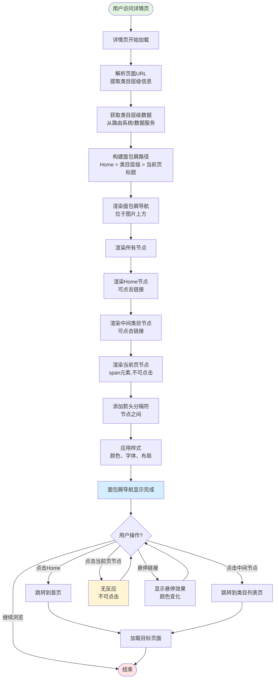

# 详情页面包屑导航业务流程

## 1. 流程概述
- **流程名称**: 详情页面包屑导航
- **起点**: 用户访问详情页
- **终点**: 面包屑导航完整展示,用户可点击跳转
- **预期耗时**: 1-2秒(含页面加载和面包屑渲染)
- **涉及角色**: 访客、登录用户(功能对所有用户开放)
- **核心目标**: 帮助用户理解当前页面位置,提供快速返回上级页面的能力,增强SEO效果

## 2. 业务流程图

## 3. 详细步骤

### 步骤1: 用户访问详情页
**执行方**: 用户  
**操作内容**:
- 从列表页点击帖子卡片进入详情页
- 或直接在浏览器地址栏输入详情页URL

**系统响应**:
- 浏览器导航到详情页URL
- 开始加载详情页内容

**数据变化**: 
- URL变化,进入详情页

**观测点**:
- 页面开始加载
- URL包含类目层级信息(如`/cate-property-for-sale-apartment-unit/`)

**关联测试用例**: TC-BREADCRUMB-F-003

---

### 步骤2: 解析页面URL和类目层级
**执行方**: 系统  
**操作内容**:
- 解析当前页面URL
- 提取类目层级信息(如`property`、`for-sale`、`apartment`)
- 获取当前页面标题

**系统响应**:
- URL解析完成
- 类目层级数据准备完成

**数据变化**: 无

**观测点**:
- URL解析成功
- 类目层级数据正确
- 当前页标题获取成功

**关联测试用例**: TC-BREADCRUMB-A-001, TC-BREADCRUMB-A-002

---

### 步骤3: 构建面包屑路径
**执行方**: 系统  
**操作内容**:
- 根据类目层级数据构建面包屑路径
- 路径格式: `Home > 一级类目 > 二级类目 > ... > 当前页标题`
- 确定节点数量和顺序

**系统响应**:
- 面包屑路径数据结构构建完成
- 每个节点包含: 文本、URL(除最后一个)、是否可点击

**数据变化**: 
- 面包屑路径数据结构生成

**观测点**:
- 路径顺序正确: Home在最前,当前页标题在最后
- 节点数量正确(如Property详情页有5个节点)
- 中间节点的URL正确(指向对应列表页)

**关联测试用例**: TC-BREADCRUMB-A-002

---

### 步骤4: 渲染Home节点
**执行方**: 系统  
**操作内容**:
- 渲染第一个节点"Home"
- 使用`<a>`标签,添加href属性指向首页
- 应用样式class: `Breadcrumb_breadcrumbLink__7juPR`

**系统响应**:
- Home节点显示在面包屑最左侧
- Home链接可点击

**数据变化**: 
- DOM更新,Home节点渲染完成

**观测点**:
- Home节点文本为"Home"
- Home节点为可点击链接
- href属性指向首页(如`https://ae.ok.com/en/city-abu-dhabi/`)

**关联测试用例**: TC-BREADCRUMB-A-002, TC-BREADCRUMB-B-001

---

### 步骤5: 渲染中间类目节点
**执行方**: 系统  
**操作内容**:
- 依次渲染中间类目节点(如"Property"、"For Sale"、"Apartment")
- 每个节点使用`<a>`标签,添加href属性指向对应列表页
- 应用样式class: `Breadcrumb_breadcrumbLink__7juPR`

**系统响应**:
- 中间类目节点按顺序显示
- 所有节点可点击

**数据变化**: 
- DOM更新,中间节点渲染完成

**观测点**:
- 节点文本为类目名称(如"Property"、"For Sale"、"Apartment")
- 节点为可点击链接
- href属性指向对应列表页(如`/cate-property/`、`/cate-buy/`)
- 节点顺序正确,从左到右按层级展示

**关联测试用例**: TC-BREADCRUMB-A-002, TC-BREADCRUMB-B-002, TC-BREADCRUMB-B-003, TC-BREADCRUMB-B-004

---

### 步骤6: 渲染当前页节点
**执行方**: 系统  
**操作内容**:
- 渲染最后一个节点(当前页标题)
- 使用``标签,不添加href属性
- 应用样式class: `Breadcrumb_breadcrumbSpan__B3vYJ`

**系统响应**:
- 当前页节点显示在面包屑最右侧
- 当前页节点不可点击

**数据变化**: 
- DOM更新,当前页节点渲染完成

**观测点**:
- 节点文本为当前页面标题
- 节点为``元素,非链接
- 节点不可点击,cursor为默认样式
- 文本可能应用截断处理(如超长文本显示省略号)

**关联测试用例**: TC-BREADCRUMB-A-003, TC-BREADCRUMB-B-005, TC-BREADCRUMB-C-004

---

### 步骤7: 添加箭头分隔符
**执行方**: 系统  
**操作内容**:
- 在相邻节点之间添加箭头图标">"
- 使用``标签,class: `Breadcrumb_arrow__CBW9C`
- 图片URL: `https://sgj1.ok.com/yongjia/_next/static/media/icon-breadcrumb-right.65c0f951.png`

**系统响应**:
- 箭头图标显示在节点之间
- 最后一个节点后无箭头

**数据变化**: 
- DOM更新,箭头图标渲染完成

**观测点**:
- 箭头数量=节点数量-1(如5个节点有4个箭头)
- 箭头位于相邻节点之间
- 最后一个节点后无箭头

**关联测试用例**: TC-BREADCRUMB-A-004

---

### 步骤8: 应用样式和布局
**执行方**: 系统  
**操作内容**:
- 应用面包屑容器样式(位置、大小、布局)
- 应用节点文本样式(颜色、字体大小、悬停效果)
- 应用响应式布局(移动端、平板端、桌面端)

**系统响应**:
- 面包屑导航样式渲染完成
- 布局合理,视觉清晰

**数据变化**: 
- DOM样式更新

**观测点**:
- 面包屑位于详情页顶部,图片上方(距离顶部约96px)
- 水平布局居中或靠左(left约392px,宽度约1136px)
- 容器高度约62px
- 文本颜色为`rgb(17, 17, 17)`,字体大小14px
- 文本无下划线,悬停时有视觉反馈
- 移动端(375px)下面包屑仍然显示

**关联测试用例**: TC-BREADCRUMB-C-001, TC-BREADCRUMB-C-003, TC-BREADCRUMB-D-001

---

### 步骤9: 用户点击Home节点
**执行方**: 用户  
**操作内容**:
- 点击面包屑第一个节点"Home"

**系统响应**:
- 触发页面跳转
- 跳转到首页URL

**数据变化**: 
- URL变化,进入首页

**观测点**:
- 点击后成功跳转
- 跳转到首页(如`https://ae.ok.com/en/city-abu-dhabi/`)
- 首页内容正常加载

**关联测试用例**: TC-BREADCRUMB-B-001

---

### 步骤10: 用户点击中间类目节点
**执行方**: 用户  
**操作内容**:
- 点击面包屑中间节点(如"Property"、"For Sale"、"Apartment")

**系统响应**:
- 触发页面跳转
- 跳转到对应类目列表页URL

**数据变化**: 
- URL变化,进入类目列表页

**观测点**:
- 点击后成功跳转
- 跳转到对应列表页(如`/cate-property/`、`/cate-buy/`、`/cate-property-for-sale-apartment-unit/`)
- 列表页内容正常加载
- 列表页显示对应类目的帖子

**关联测试用例**: TC-BREADCRUMB-B-002, TC-BREADCRUMB-B-003, TC-BREADCRUMB-B-004

---

### 步骤11: 用户悬停链接节点
**执行方**: 用户  
**操作内容**:
- 将鼠标悬停在面包屑链接节点上

**系统响应**:
- 显示悬停效果(颜色变化或下划线)
- cursor变为pointer

**数据变化**: 无

**观测点**:
- 悬停时链接显示视觉反馈
- 悬停效果流畅,无延迟
- cursor为pointer

**关联测试用例**: TC-BREADCRUMB-C-002

---

### 步骤12: 用户点击当前页节点(异常场景)
**执行方**: 用户  
**操作内容**:
- 尝试点击面包屑最后一个节点(当前页标题)

**系统响应**:
- 无任何反应
- 页面不发生跳转

**数据变化**: 无

**观测点**:
- 点击后无反应
- 页面URL不变
- cursor为默认样式,非pointer
- 节点为``元素,无href属性

**关联测试用例**: TC-BREADCRUMB-B-005

---

## 4. 验证清单

### 4.1 前置条件验证
- [ ] 测试环境可正常访问OK.com(AE站或其他站点)
- [ ] 有可访问的详情页URL
- [ ] 详情页URL包含类目层级信息

### 4.2 核心流程验证
- [ ] 详情页加载完成后面包屑导航显示
- [ ] 面包屑位于页面顶部,图片上方
- [ ] 面包屑节点数量正确(至少3个)
- [ ] 节点顺序正确: Home在最前,当前页标题在最后
- [ ] 除最后一个节点外,所有节点为可点击链接
- [ ] 最后一个节点为``元素,不可点击
- [ ] 节点之间有箭头分隔符,最后节点后无箭头

### 4.3 链接导航验证
- [ ] 点击Home节点跳转到首页
- [ ] 点击中间类目节点跳转到对应列表页
- [ ] 点击当前页节点无反应
- [ ] 所有跳转后页面正常加载
- [ ] 链接支持右键新标签页打开(可选)

### 4.4 视觉样式验证
- [ ] 文本颜色为接近黑色(`rgb(17, 17, 17)`)
- [ ] 字体大小为14px
- [ ] 文本无下划线
- [ ] 悬停时显示视觉反馈
- [ ] cursor样式正确(链接为pointer,span为默认)

### 4.5 响应式布局验证
- [ ] 移动端(375px)下面包屑正常显示
- [ ] 平板端(768px)下面包屑正常显示
- [ ] 桌面端大屏(1920px)下面包屑正常显示
- [ ] 所有设备端链接功能正常

### 4.6 状态保持验证
- [ ] 页面刷新后面包屑正常显示,路径一致
- [ ] 浏览器后退后面包屑正常显示,路径正确
- [ ] 直接访问详情页URL后面包屑正常显示

### 4.7 跨类目一致性验证
- [ ] Property类目详情页面包屑正常
- [ ] Jobs类目详情页面包屑正常(如适用)
- [ ] Cars类目详情页面包屑正常(如适用)
- [ ] 所有类目面包屑结构、样式、交互一致

## 5. 关联文档

### 5.1 规则文档
- [详情页面包屑导航规则](../../业务规则库/详情页规则/详情页面包屑导航规则.md)

### 5.2 测试用例
- [OK.com-详情页面包屑导航-测试用例-20260409.md](../../文本用例/Tiyan/通用详情页/OK.com-详情页面包屑导航-测试用例-20260409.md)

### 5.3 相关业务域
- [通用业务全景](./通用业务全景.md)
- 首页业务流程(Home节点跳转目标)
- 列表页业务流程(类目节点跳转目标)
- 详情页核心信息业务流程(面包屑所在页面)

---

**📝 文档版本**: v1.0  
**📅 生成日期**: 2026-04-27  
**🔄 变更历史**:
- v1.0 (2026-04-27): 初始版本,基于OK.com-详情页面包屑导航-测试用例-20260409.md生成
