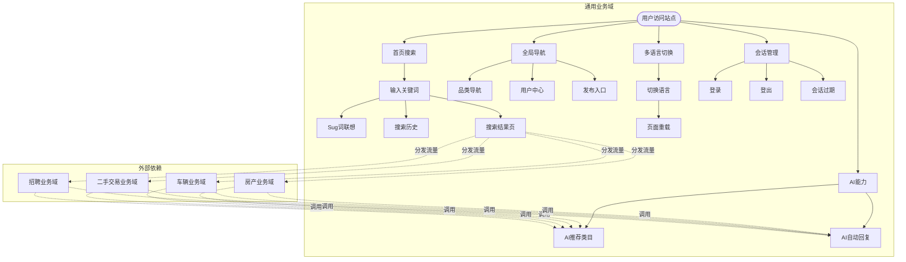
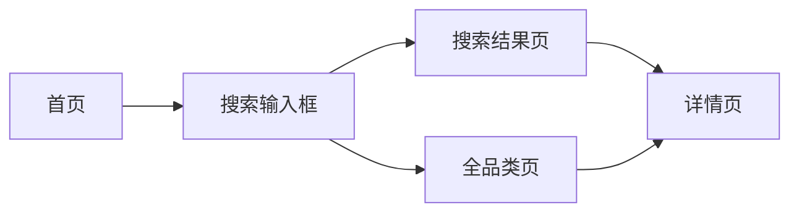

# 通用业务全景

> **业务目标**: 提供全站通用的基础功能支持，包括搜索、导航、多语言、会话管理等

---

## 1. 业务概述

### 1.1 业务定位
- **业务类型**: 全站通用功能模块
- **服务对象**: 所有用户（游客、买家、卖家）
- **核心价值**: 提升用户体验，支撑各业务域的基础功能

### 1.2 核心功能
- 首页搜索（关键词搜索、Sug词联想、搜索历史）
- 全局导航
- 多语言切换
- 会话管理
- 通用组件库

### 1.3 业务范围
- **包含**: 首页搜索、全局导航、多语言、会话、通用组件
- **不包含**: 业务域特定功能（如房产搜索、车辆搜索等）

---

## 2. 用户角色与权限

| 角色 | 权限范围 | 说明 |
|------|----------|------|
| 游客 | 使用所有通用功能 | 无需登录 |
| 买家 | 使用所有通用功能 | 登录后可使用搜索历史 |
| 卖家 | 使用所有通用功能 | 登录后可使用搜索历史 |

---

## 3. 业务流程全景图

---

## 4. 详细流程文档

### 4.1 首页搜索流程
- [首页搜索业务流程](./首页搜索业务流程.md)

---

## 5. 页面拓扑与跳转

### 5.1 页面入口矩阵

| 页面名称 | 页面路径 | 入口位置 | 访问权限 |
|---------|---------|---------|---------|
| 首页 | `/` | 浏览器直接访问 | 所有用户 |
| 搜索结果页 | `/en/city-dubai/cate/?keyword={keyword}` | 首页搜索输入框 | 所有用户 |
| 全品类页 | `/en/city-dubai/cate/` | 首页搜索输入框（空内容搜索）| 所有用户 |

### 5.2 页面跳转流程图

### 5.3 页面关系详解

#### 首页 → 搜索结果页
- **触发条件**: 用户在首页搜索输入框输入关键词，点击Search按钮或按Enter键
- **跳转方式**: 页面跳转（非Ajax）
- **URL格式**: `/en/city-dubai/cate/?keyword={keyword}`
- **参数说明**: `keyword`为用户输入的关键词，需URL编码

#### 首页 → 全品类页
- **触发条件**: 用户在首页搜索输入框未输入内容，点击Search按钮或按Enter键
- **跳转方式**: 页面跳转（非Ajax）
- **URL格式**: `/en/city-dubai/cate/`
- **参数说明**: 无keyword参数

---

## 6. 数据与状态

### 6.1 核心业务数据

| 数据项 | 数据类型 | 存储位置 | 说明 |
|--------|----------|----------|------|
| 搜索历史 | Array<String> | localStorage | 最多10条，时间倒序 |
| 用户会话 | Token | Cookie | 登录态标识 |
| 语言偏好 | String | Cookie | 用户选择的语言 |

### 6.2 用户操作与数据变化

| 操作 | 触发条件 | 数据变化 | UI变化 |
|------|----------|----------|--------|
| 搜索关键词 | 点击Search按钮或按Enter键 | 搜索历史更新（新增或更新到第一位）| 跳转至搜索结果页 |
| 点击Sug词 | 点击Sug词列表中的任意一条 | 搜索历史更新 | 跳转至搜索结果页 |
| 点击历史词 | 点击历史词列表中的任意一条 | 搜索历史更新（已有词更新到第一位）| 跳转至搜索结果页 |
| 清空输入框 | 点击Clear按钮 | 无数据变化 | 输入框清空，底纹词恢复，Sug词面板消失，历史面板展示 |

### 6.3 关键业务数据

#### 搜索历史数据
| 字段名 | 类型 | 说明 | 示例 |
|--------|------|------|------|
| keyword | String | 搜索关键词 | "driver" |
| timestamp | Number | 搜索时间戳 | 1711200000000 |

---

## 7. 业务规则概览

### 7.1 首页搜索规则
- 详见: [首页搜索规则](../../业务规则库/通用规则/首页搜索规则.md)

### 7.2 核心规则摘要
- 输入框底纹词: "Search for anything"（浅灰色）
- Search按钮: 始终可点击，空内容搜索跳转至全品类页
- Sug词: 最多10条，实时联想，点击跳转至搜索结果页
- 搜索历史: 最多10条，时间倒序，localStorage持久化，去重逻辑

---

## 8. 异常与边界

### 8.1 异常场景
| 异常类型 | 触发条件 | 系统行为 | 用户提示 |
|---------|----------|----------|----------|
| 空内容搜索 | 未输入关键词点击Search | 跳转至全品类页 | 无 |
| XSS字符搜索 | 输入`<script>`等特殊字符 | URL编码后正常跳转，不执行脚本 | 无 |
| Sug接口失败 | 网络超时/5xx | 降级处理，不展示sug词 | 无 |
| 网络断网 | 断网状态下搜索 | 页面不崩溃，不白屏 | 无 |

### 8.2 边界条件
| 边界项 | 边界值 | 系统行为 |
|--------|--------|----------|
| 关键词长度 | 200+字符 | 正常处理，无截断 |
| 搜索历史数量 | 10条 | 超过10条时最旧的被挤出 |
| Sug词数量 | 10条 | 最多展示10条 |

---

## 9. 测试观测点

### 9.1 功能测试
- [ ] 输入框底纹词是否正确显示
- [ ] Search按钮是否始终可点击
- [ ] 空内容搜索是否跳转至全品类页
- [ ] 关键词搜索是否跳转至搜索结果页
- [ ] Sug词是否实时展示
- [ ] 搜索历史是否正确展示

### 9.2 异常测试
- [ ] XSS字符是否正确转义
- [ ] Emoji字符是否正确URL编码
- [ ] 超长关键词是否正常处理
- [ ] Sug接口失败是否降级
- [ ] 网络断网是否不崩溃

### 9.3 边界测试
- [ ] 搜索历史超过10条是否挤出最旧的
- [ ] Sug词超过10条是否只展示10条

---

## 10. 已知问题与优化方向

### 10.1 已知问题
- 暂无

### 10.2 优化方向
- Sug词接口性能优化
- 搜索历史去重逻辑优化
- 搜索结果页相关性优化

---

## 11. 关联文档

- [首页搜索业务流程](./首页搜索业务流程.md)
- [首页搜索规则](../../业务规则库/通用规则/首页搜索规则.md)

---

## 12. 变更历史

| 日期 | 版本 | 变更内容 | 变更人 |
|-----|------|---------|--------|
| 2026-03-24 | v1.0 | 初始版本，基于首页搜索业务流程生成 | AI |
