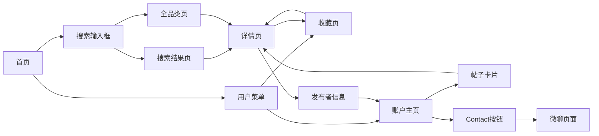

# 通用业务全景

> **业务目标**: 提供全站通用的基础功能支持，包括搜索、导航、多语言、会话管理等

---

## 1. 业务概述

### 1.1 业务定位
- **业务类型**: 全站通用功能模块
- **服务对象**: 所有用户（游客、买家、卖家）
- **核心价值**: 提升用户体验，支撑各业务域的基础功能

### 1.2 核心功能
- 首页搜索（关键词搜索、Sug词联想、搜索历史）
- 收藏页（收藏列表、取消收藏、重新收藏、分页浏览）
- 首页Footer（法律合规入口、用户帮助支持、Cookie管理、应用下载引导）
- 详情页核心信息（价格、标题、地点、时间、描述）
- 详情页发布者信息（发布者基础信息、认证标识、Contact联系、跳转店铺页）
- 详情页分享功能（复制链接到剪贴板、Toast提示、浏览器兼容）
- 详情页面包屑导航（层级展示、快速返回、SEO优化）
- 详情页收藏功能（收藏/取消收藏、登录引导、收藏列表同步）
- 详情页图片区域（单图/多图模式、图片切换、放大预览、缩略图翻页）
- 详情页推荐模块（推荐商品展示、卡片跳转、收藏交互、左右翻页）
- 详情页Location区域（地址展示、Show map、Google Maps地图查看）
- 账户主页（资料卡展示、编辑资料、Contact联系、帖子列表、收藏交互、类目Tab切换）
- 全局导航
- 多语言切换
- 会话管理
- 通用组件库

### 1.3 业务范围
- **包含**: 首页搜索、收藏页、首页Footer、详情页核心信息、详情页发布者信息、详情页分享功能、详情页面包屑导航、详情页收藏功能、详情页图片区域、详情页推荐模块、详情页Location区域、账户主页、全局导航、多语言、会话、通用组件
- **不包含**: 业务域特定功能（如房产搜索、车辆搜索等）

---

## 2. 用户角色与权限

| 角色 | 权限范围 | 说明 |
|------|----------|------|
| 游客 | 使用首页搜索、全局导航、多语言切换 | 无需登录，无法访问收藏页 |
| 买家 | 使用所有通用功能 | 登录后可使用搜索历史、收藏页 |
| 卖家 | 使用所有通用功能 | 登录后可使用搜索历史、收藏页 |

---

## 3. 业务流程全景图

```mermaid
graph TD
    subgraph 外部依赖
        Property[房产业务域]
        Car[车辆业务域]
        Marketplace[二手交易业务域]
        Jobs[招聘业务域]
    end

    subgraph 通用业务域
        Start([用户访问站点]) --> Nav[全局导航]
        Start --> Search[首页搜索]
        Start --> Favorites[收藏页]
        Start --> Footer[首页Footer]
        Start --> Lang[多语言切换]
        Start --> Session[会话管理]
        Start --> AI[AI能力]
        
        Search --> SearchInput[输入关键词]
        SearchInput --> SearchSug[Sug词联想]
        SearchInput --> SearchHistory[搜索历史]
        SearchInput --> SearchResult[搜索结果页]
        
        Favorites --> CheckAuth{是否登录?}
        CheckAuth -->|未登录| ShowLoginGuide[显示登录引导]
        ShowLoginGuide --> LoginFlow[登录流程]
        CheckAuth -->|已登录| ShowFavoritesList[展示收藏列表]
        LoginFlow --> ShowFavoritesList
        ShowFavoritesList --> FavActions[收藏操作]
        FavActions --> RemoveFav[取消收藏]
        FavActions --> AddFav[重新收藏]
        FavActions --> Pagination[分页浏览]
        
        Footer --> FooterLinks[Footer链接]
        FooterLinks --> AboutUs[About Us链接]
        FooterLinks --> Help[Help链接]
        FooterLinks --> CookiePolicy[Cookie Policy链接]
        Footer --> CookieSettings[Cookie Settings]
        CookieSettings --> CookieModal[Cookie设置弹窗]
        CookieModal --> ToggleCookies[切换Cookie开关]
        CookieModal --> SaveCookies[保存Cookie设置]
        Footer --> AppDownload[应用下载引导]
        AppDownload --> AppStore[App Store]
        AppDownload --> GooglePlay[Google Play]
        
        Nav --> NavCategory[品类导航]
        Nav --> NavUser[用户中心]
        NavUser --> AccountProfile[账户主页]
        AccountProfile --> CheckProfileAuth{是否登录?}
        CheckProfileAuth -->|本人| ShowEditProfile[编辑资料入口]
        CheckProfileAuth -->|他人已登录| ShowContactButton[Contact按钮]
        CheckProfileAuth -->|访客| ShowPublicProfile[公开信息]
        AccountProfile --> ShowProfileTabs[类目Tab列表]
        ShowProfileTabs --> LoadPostList[加载帖子列表]
        LoadPostList --> FavoritePost[收藏帖子]
        ShowContactButton --> JumpToIM[跳转微聊]
        Nav --> NavPublish[发布入口]
        
        Lang --> LangSwitch[切换语言]
        LangSwitch --> LangReload[页面重载]
        
        Session --> SessionLogin[登录]
        Session --> SessionLogout[登出]
        Session --> SessionExpire[会话过期]
        
        AI --> AIRecommend[AI推荐类目]
        AI --> AIChat[AI自动回复]
    end
    
    SearchResult -.->|分发流量| Property
    SearchResult -.->|分发流量| Car
    SearchResult -.->|分发流量| Marketplace
    SearchResult -.->|分发流量| Jobs
    
    ShowFavoritesList -.->|点击卡片跳转| Property
    ShowFavoritesList -.->|点击卡片跳转| Car
    ShowFavoritesList -.->|点击卡片跳转| Marketplace
    ShowFavoritesList -.->|点击卡片跳转| Jobs
    
    Property -.->|调用| AIRecommend
    Car -.->|调用| AIRecommend
    Marketplace -.->|调用| AIRecommend
    Jobs -.->|调用| AIRecommend
    
    Property -.->|调用| AIChat
    Car -.->|调用| AIChat
    Marketplace -.->|调用| AIChat
    Jobs -.->|调用| AIChat
```

---

## 4. 详细流程文档

### 4.1 首页搜索流程
- [首页搜索业务流程](./首页搜索业务流程.md)

### 4.2 收藏页流程
- [收藏页业务流程](./收藏页业务流程.md)

### 4.3 首页Footer流程
- [首页Footer业务流程](./首页Footer业务流程.md)

### 4.4 详情页核心信息流程
- [详情页核心信息区域业务流程](./详情页核心信息区域业务流程.md)

### 4.5 详情页发布者信息流程
- [详情页发布者信息区域业务流程](./详情页发布者信息区域业务流程.md)

### 4.6 详情页分享功能流程
- [详情页分享功能业务流程](./详情页分享功能业务流程.md)

### 4.7 详情页面包屑导航流程
- [详情页面包屑导航业务流程](./详情页面包屑导航业务流程.md)

### 4.8 详情页收藏功能流程
- [详情页收藏功能业务流程](./详情页收藏功能业务流程.md)

### 4.9 详情页图片区域流程
- [详情页图片区域业务流程](./详情页图片区域业务流程.md)

### 4.10 详情页推荐模块流程
- [详情页推荐模块业务流程](./详情页推荐模块业务流程.md)

### 4.11 详情页Location区域流程
- [详情页Location区域业务流程](./详情页Location区域业务流程.md)

### 4.12 账户主页流程
- [账户主页业务流程](./账户主页业务流程.md)

---

## 5. 页面拓扑与跳转

### 5.1 页面入口矩阵

| 页面名称 | 页面路径 | 入口位置 | 访问权限 |
|---------|---------|---------|---------|
| 首页 | `/` | 浏览器直接访问 | 所有用户 |
| 搜索结果页 | `/en/city-dubai/cate/?keyword={keyword}` | 首页搜索输入框 | 所有用户 |
| 全品类页 | `/en/city-dubai/cate/` | 首页搜索输入框（空内容搜索）| 所有用户 |
| 收藏页 | `/biz/en/list/favorites` | 用户菜单 → Favourites | 仅登录用户 |
| 账户主页 | `/en/profile/{userId}/` | 用户菜单 → My Profile / 详情页发布者信息 | 所有用户(部分功能需登录) |

### 5.2 页面跳转流程图

### 5.3 页面关系详解

#### 首页 → 搜索结果页
- **触发条件**: 用户在首页搜索输入框输入关键词，点击Search按钮或按Enter键
- **跳转方式**: 页面跳转（非Ajax）
- **URL格式**: `/en/city-dubai/cate/?keyword={keyword}`
- **参数说明**: `keyword`为用户输入的关键词，需URL编码

#### 首页 → 全品类页
- **触发条件**: 用户在首页搜索输入框未输入内容，点击Search按钮或按Enter键
- **跳转方式**: 页面跳转（非Ajax）
- **URL格式**: `/en/city-dubai/cate/`
- **参数说明**: 无keyword参数

#### 首页 → 收藏页
- **触发条件**: 登录用户点击用户菜单中的"Favourites"选项，或直接访问URL
- **跳转方式**: 页面跳转
- **URL格式**: `/biz/en/list/favorites`
- **参数说明**: 无参数
- **权限要求**: 必须登录，访客访问会显示登录引导卡片

#### 收藏页 → 详情页
- **触发条件**: 用户点击收藏列表中的帖子卡片（非过期帖子）
- **跳转方式**: 页面跳转（非新标签页）
- **URL格式**: `/en/city-{city}/cate-{category}/{title}-{postId}/`
- **参数说明**: 包含城市、类目、标题、帖子ID
- **特殊规则**: 过期帖子不可点击，不跳转详情页

#### 详情页 → 收藏页
- **触发条件**: 用户在详情页点击浏览器后退按钮
- **跳转方式**: 浏览器历史记录后退
- **URL格式**: `/biz/en/list/favorites`
- **状态保持**: 登录状态保持，收藏列表保持滚动位置

---

## 6. 数据与状态

### 6.1 核心业务数据

| 数据项 | 数据类型 | 存储位置 | 说明 |
|--------|----------|----------|------|
| 搜索历史 | Array<String> | localStorage | 最多10条，时间倒序 |
| 用户会话 | Token | Cookie | 登录态标识 |
| 语言偏好 | String | Cookie | 用户选择的语言 |
| 收藏列表 | Array<Post> | 服务端数据库 | 用户收藏的帖子列表 |
| 收藏状态 | Boolean | 服务端数据库 | 单个帖子的收藏状态 |

### 6.2 用户操作与数据变化

| 操作 | 触发条件 | 数据变化 | UI变化 |
|------|----------|----------|--------|
| 搜索关键词 | 点击Search按钮或按Enter键 | 搜索历史更新（新增或更新到第一位）| 跳转至搜索结果页 |
| 点击Sug词 | 点击Sug词列表中的任意一条 | 搜索历史更新 | 跳转至搜索结果页 |
| 点击历史词 | 点击历史词列表中的任意一条 | 搜索历史更新（已有词更新到第一位）| 跳转至搜索结果页 |
| 清空输入框 | 点击Clear按钮 | 无数据变化 | 输入框清空，底纹词恢复，Sug词面板消失，历史面板展示 |
| 取消收藏 | 点击收藏列表中的心形图标 | 收藏列表移除该帖子 | 卡片立即从列表中移除，后续卡片补位 |
| 重新收藏 | 在详情页点击Favourites按钮 | 收藏列表新增该帖子 | 按钮图标变为实心，显示toast提示 |
| 分页浏览 | 点击Next/Prev/页码 | 无数据变化 | 加载指定页的收藏列表 |
| 退出登录 | 点击用户菜单中的Log Out | 清除登录态 | 页面刷新，显示访客状态 |

### 6.3 关键业务数据

#### 搜索历史数据
| 字段名 | 类型 | 说明 | 示例 |
|--------|------|------|------|
| keyword | String | 搜索关键词 | "driver" |
| timestamp | Number | 搜索时间戳 | 1711200000000 |

---

## 7. 业务规则概览

### 7.1 首页搜索规则
- 详见: [首页搜索规则](../../业务规则库/首页规则/首页搜索规则.md)

### 7.2 收藏页规则
- 详见: [收藏页规则](../../业务规则库/收藏页规则/收藏页规则.md)

### 7.3 首页Footer规则
- 详见: [首页Footer规则](../../业务规则库/首页规则/首页Footer规则.md)

### 7.4 详情页核心信息规则
- 详见: [详情页核心信息区域规则](../../业务规则库/详情页规则/详情页核心信息区域规则.md)

### 7.5 详情页发布者信息规则
- 详见: [详情页发布者信息区域规则](../../业务规则库/详情页规则/详情页发布者信息区域规则.md)

### 7.6 详情页分享功能规则
- 详见: [详情页分享功能规则](../../业务规则库/详情页规则/详情页分享功能规则.md)

### 7.7 详情页面包屑导航规则
- 详见: [详情页面包屑导航规则](../../业务规则库/详情页规则/详情页面包屑导航规则.md)

### 7.8 详情页收藏功能规则
- 详见: [详情页收藏功能规则](../../业务规则库/详情页规则/详情页收藏功能规则.md)

### 7.9 详情页图片区域规则
- 详见: [详情页图片区域规则](../../业务规则库/详情页规则/详情页图片区域规则.md)

### 7.10 详情页推荐模块规则
- 详见: [详情页推荐模块规则](../../业务规则库/详情页规则/详情页推荐模块规则.md)

### 7.11 详情页Location区域规则
- 详见: [详情页Location区域规则](../../业务规则库/详情页规则/详情页Location区域规则.md)

### 7.12 账户主页规则
- 详见: [账户主页规则](../../业务规则库/账户主页规则/账户主页规则.md)

### 7.13 核心规则摘要

#### 首页搜索
- 输入框底纹词: "Search for anything"（浅灰色）
- Search按钮: 始终可点击，空内容搜索跳转至全品类页
- Sug词: 最多10条，实时联想，点击跳转至搜索结果页
- 搜索历史: 最多10条，时间倒序，localStorage持久化，去重逻辑

#### 收藏页
- 访问控制: 访客访问显示登录引导，必须登录才能查看列表
- 列表展示: 4列网格布局，卡片包含图片、标题、价格、实心心形图标
- 取消收藏: 点击心形图标立即移除，无二次确认，无toast提示
- 重新收藏: 在详情页点击Favourites按钮，显示"Added to favourites" toast
- 分页规则: 第1页Prev禁用，最后一页Next禁用，页码高亮显示
- 空列表: 显示空状态提示 + Refresh按钮，点击跳转首页

#### 首页Footer
- Footer位置: 所有页面底部，固定在最底部
- About Us & Help: 所有链接新标签页打开（target="_blank"）
- Cookie管理: 必要Cookie不可关闭，可选Cookie可关闭，Accept All一键开启
- Cookie持久化: 设置保存后刷新页面仍保持，切换城市后仍保持
- 应用下载: App Store和Google Play按钮跳转到对应应用商店
- 法律合规: 满足GDPR要求，提供Terms、Privacy、Cookie Policy入口

#### 详情页核心信息
- 价格区域: 包含货币符号"$",≥1000时有千分位,免费帖子显示"Free"
- 标题区域: 必填,长度5-200字符,与列表页一致,清晰可见
- 地点区域: 必填,位于标题下方、时间上方,纯文本不可点击,格式规范(City, State)
- 发布时间: 必填,相对时间(X hours ago)或绝对时间(Mar 20, 2026)
- 描述区域: 必填,至少10个字符,超长时有"Read more"展开按钮
- 类别限制: 适用Community/Services/Marketplace/Cars/Others,排除Jobs/Property
- 数据一致性: 列表页与详情页的价格、标题、地点、时间必须一致

#### 详情页发布者信息
- 信息展示: 用户名、头像、认证标识(Verified User)、listings数量、sold数量、Contact按钮
- 认证标识: 已认证用户显示蓝色盾牌+"Verified User"，未认证用户不显示
- 数据格式: listings不带千分位，sold带千分位(如: 5,558,889 sold)
- Contact按钮: 已登录跳转聊天页，未登录弹出登录弹窗
- 跳转店铺: 点击用户名或头像跳转到发布者主页
- 防重处理: 快速连续点击Contact仅触发一次

#### 详情页分享功能
- Share按钮: 位于"Sell Similar"和"Favourites"右侧，对所有用户开放(访客、登录用户)
- 复制链接: path路径与原始URL一致，可追加分享追踪参数(如utm_source、share_from)
- Toast提示: "Link copied"显示在页面顶部，2-3秒后淡出消失
- 浏览器兼容: 支持Chrome、Safari，老旧浏览器回退到降级方案(execCommand copy)
- 安全性: 复制的URL不包含用户Token、Session ID等敏感信息
- 健壮性: 网络断开时复制功能仍正常工作(本地剪贴板操作)

#### 详情页面包屑导航
- 位置展示: 位于详情页顶部,图片上方,距离顶部约96px
- 层级结构: `Home > 一级类目 > 二级类目 > ... > 当前页标题`,至少3个节点
- 链接规则: 除最后一个节点外,所有节点均为可点击链接
- 当前页节点: 最后节点为``元素,不可点击,文本为当前页标题
- 分隔符: 节点之间使用箭头图标">",最后节点后无箭头
- 响应式: 移动端(375px)、平板端(768px)、桌面端(1920px)均正常显示
- SEO优化: 增强页面结构化数据,提升搜索引擎友好度

#### 详情页收藏功能
- 按钮展示: 位于图片下方操作区域,心形图标+"Favourites"文字
- 访客状态: 点击收藏触发登录弹窗,登录成功后自动收藏
- 登录用户: 直接收藏/取消收藏,图标状态切换(空心↔实心)
- 状态保持: 页面刷新、退出再进入后收藏状态保持
- 列表同步: 收藏后帖子出现在收藏列表,取消收藏后从列表移除
- 防抖处理: 快速连续点击有防抖,最终状态稳定

#### 详情页图片区域
- 单图模式: 仅展示1张主图,无缩略图区域和切换箭头,加载失败显示占位图
- 多图模式: 展示主图+缩略图列表,默认第一张,缩略图高亮与主图同步
- 图片切换: 点击缩略图或左/右箭头切换主图,支持循环切换(第一张←→最后一张)
- 放大预览: 点击主图打开大图弹层,显示高清图+遮罩+关闭按钮+导航箭头
- 大图模式: 左/右箭头循环切换,缩略图高亮同步,ESC/遮罩/关闭按钮关闭
- 缩略图翻页: 图片≥8张时显示翻页箭头,每次逐张滚动,支持循环翻页,选中图片始终可见

#### 详情页推荐模块
- 模块位置: 详情页底部,Description/Location之后,Footer之前,标题"You may also like"
- 商品展示: 可见4张,总计最多6张,横向排列,流式滚动,适用非招聘/非房产类目
- 卡片构成: 商品主图+标题+价格+Free Delivery标签+收藏图标(右上角)
- 跳转行为: 点击卡片当前标签页跳转,新详情页延续推荐链路,可后退返回
- 收藏功能: 已登录点击图标切换状态(空心↔实心),访客点击触发登录弹窗
- 列表导航: 左右箭头翻页,初始左箭头禁用,滚动到末尾右箭头禁用,滚动流畅

#### 详情页Location区域
- 模块位置: Description等详情内容之后,卡片尺寸宽667px高228px,标题"Location"
- 地址展示: 显示地址文案(高21px),与主信息区地址完全一致,必须非空
- Show map区域: 预览区高145px,按钮文案"Show map",宽157px高44px
- 地图模态: 点击Show map打开全屏模态,渲染Google Maps,初始化2-5秒
- 地图关闭: 点击左上角关闭图标关闭,淡出动画约1秒,Escape键不关闭
- 可重复打开: 关闭后可再次点击Show map打开地图

#### 账户主页
- URL格式: `/en/profile/{userId}/`,Jobs子路径`/en/profile/{userId}/jobs/`
- document.title: `OKer_* – Posts covering 类目列表 - OK.com`
- 资料卡(本人): 展示名(OKer_前缀)、Top Seller徽章、城市、简介、帖子数、编辑图标
- 资料卡(他人): 展示名、徽章、城市、简介、帖子数、Contact按钮(黑色,聊天气泡图标)
- 类目Tab: Services/Marketplace/Property/Shop/Community/Jobs/Cars,默认Services
- 帖子列表: 栅格布局,卡片含图片、标题、地点、价格、收藏图标(心形)
- 收藏功能: 已登录直接切换状态(空心↔实心),访客需登录引导
- Contact功能: 已登录跳转微聊页面,访客需登录引导
- 编辑资料: 仅本人可见编辑入口,跳转编辑资料页
- 隐私保护: 不暴露手机号、邮箱、精确地址

---

## 8. 异常与边界

### 8.1 异常场景
| 异常类型 | 触发条件 | 系统行为 | 用户提示 |
|---------|----------|----------|----------|
| 空内容搜索 | 未输入关键词点击Search | 跳转至全品类页 | 无 |
| XSS字符搜索 | 输入`<script>`等特殊字符 | URL编码后正常跳转，不执行脚本 | 无 |
| Sug接口失败 | 网络超时/5xx | 降级处理，不展示sug词 | 无 |
| 网络断网 | 断网状态下搜索 | 页面不崩溃，不白屏 | 无 |
| 访客访问收藏页 | 未登录用户访问收藏页 | 显示登录引导卡片 | "Log in to view more content" |
| 会话过期 | 登录态过期后操作 | 自动弹出登录弹窗 | 无 |
| 空收藏列表 | 账号无收藏数据 | 显示空状态提示 + Refresh按钮 | 空状态提示 |
| 过期帖子点击 | 点击过期帖子卡片 | 不跳转，停留在当前页 | 无 |
| 非法userId访问 | 访问不存在的userId | 返回404页面或错误页 | "页面不存在" |
| 账户主页会话过期 | 登录态过期后操作收藏/Contact | 跳转统一登录页 | 无 |
| 收藏失败 | 网络异常或服务不可用 | Toast提示 | "收藏失败" |
| Contact跳转失败 | 微聊服务不可用 | Toast提示,留在当前页 | "联系失败" |
| Cookie弹窗打开失败 | JS错误或网络异常 | 降级处理，不阻塞主流程 | 无 |
| 第三方链接404 | Footer链接目标页面不存在 | 显示404错误页面 | "页面不存在" |
| 应用商店链接错误 | 应用下载链接配置错误 | 无法跳转或显示错误 | "无法跳转到应用商店" |
| 发布者信息加载失败 | 网络异常或接口错误 | 显示占位符或默认信息 | 无 |
| 未登录点击Contact | 未登录用户点击发布者Contact按钮 | 弹出登录弹窗，不跳转 | "Welcome to OK.com AE" |
| 聊天服务不可用 | 聊天服务异常 | 显示错误提示 | "聊天功能暂时不可用" |
| 剪贴板权限被拒 | 用户拒绝剪贴板访问权限 | 显示错误提示或使用降级方案 | "无法复制链接，请允许剪贴板权限" |
| HTTP环境复制失败 | HTTP协议下Clipboard API受限 | 使用降级方案(execCommand copy) | 无 |
| 老旧浏览器不支持 | 浏览器不支持Clipboard API | 使用降级方案或显示不支持提示 | "您的浏览器不支持此功能" |
| 图片加载失败 | 图片URL无效或网络异常 | 显示占位图或"Image not available" | 无 |
| 图片过多加载慢 | 多图模式图片数量过多 | 懒加载优化,只加载可见区域 | 加载中占位符 |
| 大图预览打开失败 | JS错误或资源加载失败 | 降级处理,保留在详情页 | 无 |
| 推荐模块不展示 | 后端推荐算法未返回推荐商品 | 推荐模块不展示,直接显示Footer | 无 |
| 推荐商品图片加载失败 | 图片URL无效或网络异常 | 显示占位图 | 无 |
| 推荐收藏失败 | 网络异常或收藏服务不可用 | 图标状态不变 | Toast提示"收藏失败,请稍后重试" |
| 推荐登录弹窗打开失败 | JS错误或组件加载失败 | 降级处理,不阻塞主流程 | 无 |
| Location地址为空 | 后端未返回地址数据 | 不显示Location模块或显示占位文案 | 无 |
| Location地图加载失败 | Google Maps服务不可用 | 显示地图加载失败提示 | "地图加载失败" |
| Location地址不一致 | 主信息区与Location区地址不一致 | 数据异常 | 需修复,不应出现 |
| Location模态打开失败 | JS错误或组件加载失败 | 降级处理,不阻塞主流程 | 无 |

### 8.2 边界条件
| 边界项 | 边界值 | 系统行为 |
|--------|--------|----------|
| 关键词长度 | 200+字符 | 正常处理，无截断 |
| 搜索历史数量 | 10条 | 超过10条时最旧的被挤出 |
| Sug词数量 | 10条 | 最多展示10条 |
| 收藏列表每页数量 | 约20张卡片 | 4列×5行布局 |
| 收藏列表分页 | 多页 | 底部显示分页器 |
| Cookie类型数量 | 至少3种 | 必要Cookie、分析Cookie、营销Cookie |
| Footer链接数量 | 10+个链接 | About Us 2个、Help 6个、Cookie 1个、应用下载2个 |
| 发布者listings数量 | 不限 | 不带千分位格式 |
| 发布者sold数量 | 不限 | 带千分位格式(如: 5,558,889) |
| Toast显示时长 | 2-3秒 | 自动淡出消失 |
| 快速点击Share | 连续点击 | 只显示1个Toast或多个Toast排列整齐 |
| 分享URL长度 | 标准详情页URL | 包含协议、域名、path路径及可选的追踪参数 |
| 图片数量 | 1张或多张 | 1张→单图模式,2+张→多图模式 |
| 账户主页帖子数 | 不限 | 动态数字+listing(s)文案 |
| 账户主页类目Tab数量 | 7个 | Services/Marketplace/Property/Shop/Community/Jobs/Cars |
| 账户主页空列表 | 无帖子 | 显示"There's nothing here." |
| 账户主页userId长度 | 标准ID | 如796152584505038400 |
| 图片加载数量 | 不限 | 单图模式1张,多图模式同时加载主图+所有缩略图 |
| 缩略图可见数量 | 7张(大图模式,7+图片时) | 超过7张时显示翻页箭头 |
| 图片尺寸 | 不限 | 自动适配容器,保持原始比例 |
| 大图预览关闭方式 | 3种 | 关闭按钮、ESC键、点击遮罩 |
| 推荐商品可见数 | 4张(桌面端) | 受屏幕宽度限制,横向排列 |
| 推荐商品总数 | 最多6张 | 后端推荐算法返回 |
| 推荐商品跳转 | 当前标签页 | 非新标签页打开 |
| 推荐列表滚动 | 每次约1张卡片宽度 | 平滑过渡动画 |
| 推荐箭头禁用 | 边界时禁用 | 左箭头在起点禁用,右箭头在末尾禁用 |
| Location卡片尺寸 | 宽667px,高228px | 视口1440px,相对主内容列左侧对齐 |
| Location地址高度 | 21px | 宽度与主内容列一致(667px) |
| Show map预览区 | 高145px,宽667px | 固定尺寸 |
| Show map按钮尺寸 | 宽157px,高44px | 位于预览区中部偏下 |
| 地图初始化时间 | 2-5秒 | Google Maps渲染时间 |
| 地图关闭动画 | 约1秒 | 淡出动画 |
| Location地图关闭方式 | 1种(点击关闭图标) | Escape键不关闭 |

---

## 9. 测试观测点

### 9.1 功能测试
- [ ] 输入框底纹词是否正确显示
- [ ] Search按钮是否始终可点击
- [ ] 空内容搜索是否跳转至全品类页
- [ ] 关键词搜索是否跳转至搜索结果页
- [ ] Sug词是否实时展示
- [ ] 搜索历史是否正确展示
- [ ] 访客访问收藏页是否显示登录引导
- [ ] 登录流程是否正常（邮箱→密码→登录成功）
- [ ] 收藏列表是否正确展示（4列网格布局）
- [ ] 点击帖子卡片是否跳转到详情页
- [ ] 取消收藏是否立即移除卡片
- [ ] 重新收藏是否显示toast提示
- [ ] 分页按钮是否正常工作（Next/Prev/页码）
- [ ] 退出登录是否清除登录态
- [ ] Footer区域是否在所有页面底部展示
- [ ] About Us和Help链接是否新标签页打开
- [ ] Cookie Settings弹窗是否正常打开
- [ ] 必要Cookie是否不可关闭
- [ ] 可选Cookie是否可关闭并保存
- [ ] 应用下载按钮是否正确跳转到应用商店
- [ ] 详情页发布者信息是否完整展示
- [ ] 已认证用户是否显示Verified User标识
- [ ] Contact按钮是否正确跳转(已登录到聊天页,未登录弹窗)
- [ ] 点击用户名或头像是否跳转到发布者主页
- [ ] listings和sold数量格式是否正确
- [ ] Share按钮是否正确展示(位于Sell Similar和Favourites右侧)
- [ ] 点击Share按钮是否成功复制链接到剪贴板
- [ ] 复制的URL path路径是否与原始URL一致
- [ ] Toast提示"Link copied"是否正常显示并自动消失
- [ ] 复制的链接是否可正常访问且内容一致
- [ ] 访客和登录用户分享功能是否一致
- [ ] 单图详情页是否正确展示单张主图
- [ ] 单图模式是否无缩略图区域和切换箭头
- [ ] 多图详情页是否同时展示主图和缩略图列表
- [ ] 默认是否展示第一张图片为主图
- [ ] 第一个缩略图是否默认高亮
- [ ] 缩略图数量是否与实际图片数一致
- [ ] 点击缩略图是否立即切换主图并同步高亮
- [ ] 左/右箭头是否支持循环切换图片
- [ ] 点击主图是否打开放大预览弹层
- [ ] 大图模式是否显示高清图+遮罩+关闭按钮
- [ ] 大图模式左/右箭头是否支持循环切换
- [ ] 大图模式缩略图高亮是否与主图同步
- [ ] 大图模式是否支持3种关闭方式(关闭按钮/ESC/遮罩)
- [ ] 关闭大图后是否返回详情页并保持状态
- [ ] 图片≥8张时是否显示缩略图翻页箭头
- [ ] 缩略图翻页是否逐张滚动且支持循环
- [ ] 推荐模块是否在详情页底部正常展示(非招聘/非房产类目)
- [ ] 推荐模块标题"You may also like"是否清晰可见
- [ ] 推荐商品是否展示4张可见卡片(桌面端)
- [ ] 推荐卡片是否包含完整信息(图片/标题/价格/标签/收藏图标)
- [ ] 点击推荐卡片是否在当前标签页跳转到商品详情页
- [ ] 新详情页是否正常加载且包含推荐模块
- [ ] 已登录点击推荐收藏图标是否切换状态(空心↔实心)
- [ ] 访客点击推荐收藏图标是否弹出登录弹窗
- [ ] 推荐列表右箭头是否正常翻页
- [ ] 推荐列表左箭头是否正常返回
- [ ] 推荐右箭头滚动到末尾是否禁用
- [ ] 推荐左箭头滚动到起点是否禁用
- [ ] 推荐商品总数是否为最多6张
- [ ] 推荐商品是否与当前商品类目相关
- [ ] Location卡片是否在Description之后区域展示
- [ ] Location标题"Location"是否清晰可见
- [ ] Location地址文案是否非空且清晰展示
- [ ] Location地址是否与主信息区地址完全一致
- [ ] Show map区域和按钮是否可见
- [ ] Show map按钮文案是否为"Show map"
- [ ] 点击Show map是否打开全屏地图模态
- [ ] 地图模态是否正常渲染Google Maps
- [ ] 地图模态左上角是否有关闭图标
- [ ] 点击关闭图标是否关闭地图模态
- [ ] 关闭后是否可再次打开地图

### 9.2 异常测试
- [ ] XSS字符是否正确转义
- [ ] Emoji字符是否正确URL编码
- [ ] 超长关键词是否正常处理
- [ ] Sug接口失败是否降级
- [ ] 网络断网是否不崩溃
- [ ] 访客访问收藏页是否正确拦截
- [ ] 会话过期是否自动弹出登录弹窗
- [ ] 空收藏列表是否显示空状态提示
- [ ] 过期帖子点击是否不跳转
- [ ] Cookie弹窗打开失败是否降级处理
- [ ] Footer链接404是否显示错误页面
- [ ] 应用商店链接错误是否有友好提示
- [ ] Cookie保存失败是否有错误提示
- [ ] 发布者信息加载失败是否显示占位符
- [ ] 快速连续点击Contact是否防重处理
- [ ] 剪贴板权限被拒是否显示错误提示或使用降级方案
- [ ] HTTP环境下分享功能是否使用降级方案
- [ ] 老旧浏览器是否使用降级方案或显示不支持提示
- [ ] 网络断开时点击Share是否仍可正常复制
- [ ] 快速连续点击Share是否正常处理(不卡顿)
- [ ] 图片加载失败是否显示占位图
- [ ] 大图预览打开失败是否降级处理
- [ ] 单图加载失败是否显示"Image not available"
- [ ] 多图模式图片过多是否懒加载优化
- [ ] 推荐模块不展示是否直接显示Footer(部分详情页)
- [ ] 推荐商品图片加载失败是否显示占位图
- [ ] 推荐收藏失败是否有错误提示
- [ ] 推荐登录弹窗打开失败是否降级处理
- [ ] Location地址为空是否不显示模块或显示占位文案
- [ ] Location地图加载失败是否有错误提示
- [ ] Location地址不一致是否记录为数据异常
- [ ] Location模态打开失败是否降级处理
- [ ] 非法userId访问是否返回404页面
- [ ] 账户主页会话过期是否跳转登录页
- [ ] 账户主页收藏失败是否有错误提示
- [ ] Contact跳转失败是否有错误提示
- [ ] 编辑跳转失败是否有错误提示
- [ ] 账户主页帖子列表加载失败是否有错误提示或重试按钮

### 9.3 边界测试
- [ ] 搜索历史超过10条是否挤出最旧的
- [ ] Sug词超过10条是否只展示10条
- [ ] 收藏列表第1页Prev按钮是否禁用
- [ ] 收藏列表最后一页Next按钮是否禁用
- [ ] 翻页后数据是否不重复
- [ ] Footer链接是否全部可点击
- [ ] Cookie Information是否包含必要字段
- [ ] 城市切换后Cookie设置是否保持
- [ ] 发布者信息数据格式是否正确(千分位)
- [ ] Toast显示2-3秒后是否自动消失
- [ ] 快速点击Share时Toast是否只显示1个或排列整齐
- [ ] 分享URL是否包含正确的协议、域名和path路径
- [ ] Chrome和Safari浏览器是否都支持分享功能
- [ ] 复制的URL是否不包含敏感信息(Token、Session ID)
- [ ] 单图模式图片是否适配容器并保持比例
- [ ] 多图模式所有图片是否成功加载且清晰
- [ ] 主图切换是否流畅无卡顿
- [ ] 图片≥8张时缩略图翻页是否逐张滚动
- [ ] 大图模式关闭后滚动位置是否保持
- [ ] 缩略图高亮是否始终与主图一致
- [ ] 当前选中缩略图是否始终在可见区域内
- [ ] 推荐商品可见数是否为4张(桌面端)
- [ ] 推荐商品总数是否最多6张
- [ ] 推荐列表滚动是否平滑流畅
- [ ] 推荐箭头禁用状态是否正确(起点/末尾)
- [ ] 推荐卡片跳转是否为当前标签页跳转
- [ ] 推荐收藏状态是否正确同步到收藏夹
- [ ] 推荐模块埋点是否正常触发
- [ ] Location卡片尺寸是否正确(宽667px,高228px)
- [ ] Location地址高度是否为21px
- [ ] Show map预览区尺寸是否正确(高145px,宽667px)
- [ ] Show map按钮尺寸是否正确(宽157px,高44px)
- [ ] 地图初始化时间是否在2-5秒内
- [ ] 地图关闭动画是否约1秒
- [ ] Location地图Escape键是否不关闭模态
- [ ] Location地址一致性是否验证通过
- [ ] 账户主页帖子数是否动态更新
- [ ] 账户主页类目Tab数量是否为7个
- [ ] 账户主页空列表是否显示"There's nothing here."
- [ ] 账户主页userId长度是否符合标准
- [ ] 账户主页本人/他人/访客权限是否正确区分
- [ ] 账户主页Contact按钮是否仅在他人主页显示
- [ ] 账户主页编辑图标是否仅在本人主页显示
- [ ] 账户主页Jobs子路径是否默认选中Jobs Tab
- [ ] 账户主页Tab切换是否加载对应类目帖子
- [ ] 账户主页帖子卡片收藏图标是否针对性操作

---

## 10. 已知问题与优化方向

### 10.1 已知问题
- 暂无

### 10.2 优化方向
- Sug词接口性能优化
- 搜索历史去重逻辑优化
- 搜索结果页相关性优化

---

## 11. 关联文档

- [首页搜索业务流程](./首页搜索业务流程.md)
- [首页搜索规则](../../业务规则库/首页规则/首页搜索规则.md)
- [收藏页业务流程](./收藏页业务流程.md)
- [收藏页规则](../../业务规则库/收藏页规则/收藏页规则.md)
- [首页Footer业务流程](./首页Footer业务流程.md)
- [首页Footer规则](../../业务规则库/首页规则/首页Footer规则.md)
- [详情页核心信息区域业务流程](./详情页核心信息区域业务流程.md)
- [详情页核心信息区域规则](../../业务规则库/详情页规则/详情页核心信息区域规则.md)
- [详情页发布者信息区域业务流程](./详情页发布者信息区域业务流程.md)
- [详情页发布者信息区域规则](../../业务规则库/详情页规则/详情页发布者信息区域规则.md)
- [详情页分享功能业务流程](./详情页分享功能业务流程.md)
- [详情页分享功能规则](../../业务规则库/详情页规则/详情页分享功能规则.md)
- [详情页面包屑导航业务流程](./详情页面包屑导航业务流程.md)
- [详情页面包屑导航规则](../../业务规则库/详情页规则/详情页面包屑导航规则.md)
- [详情页收藏功能业务流程](./详情页收藏功能业务流程.md)
- [详情页收藏功能规则](../../业务规则库/详情页规则/详情页收藏功能规则.md)
- [详情页图片区域业务流程](./详情页图片区域业务流程.md)
- [详情页图片区域规则](../../业务规则库/详情页规则/详情页图片区域规则.md)
- [详情页推荐模块业务流程](./详情页推荐模块业务流程.md)
- [详情页推荐模块规则](../../业务规则库/详情页规则/详情页推荐模块规则.md)
- [详情页Location区域业务流程](./详情页Location区域业务流程.md)
- [详情页Location区域规则](../../业务规则库/详情页规则/详情页Location区域规则.md)
- [账户主页业务流程](./账户主页业务流程.md)
- [账户主页规则](../../业务规则库/账户主页规则/账户主页规则.md)

---

## 12. 变更历史

| 日期 | 版本 | 变更内容 | 变更人 |
|-----|------|---------|--------|
| 2026-03-24 | v1.0 | 初始版本，基于首页搜索业务流程生成 | AI |
| 2026-04-23 | v1.1 | 新增收藏页业务流程，更新全景图和业务规则索引 | AI |
| 2026-04-27 | v1.2 | 新增首页Footer业务流程，更新全景图、业务规则索引和测试观测点 | AI |
| 2026-04-27 | v1.3 | 新增详情页发布者信息业务流程，更新业务规则索引和测试观测点 | AI |
| 2026-04-27 | v1.4 | 新增详情页分享功能业务流程，更新业务规则索引、异常场景、边界条件和测试观测点 | AI |
| 2026-04-27 | v1.5 | 新增详情页核心信息业务流程，重构业务规则库目录结构(首页规则/收藏页规则/详情页规则/AI能力规则)，更新所有规则链接 | AI |
| 2026-04-27 | v1.6 | 新增详情页面包屑导航业务流程，更新业务规则索引和核心规则摘要 | AI |
| 2026-04-27 | v1.7 | 新增详情页收藏功能业务流程，更新业务规则索引和核心规则摘要 | AI |
| 2026-04-27 | v1.8 | 新增详情页图片区域业务流程(单图/多图模式、图片切换、放大预览、缩略图翻页)，更新业务规则索引、异常场景、边界条件和测试观测点 | AI |
| 2026-04-27 | v1.9 | 新增详情页推荐模块业务流程(推荐商品展示、卡片跳转、收藏交互、左右翻页)，更新业务规则索引、异常场景、边界条件和测试观测点 | AI |
| 2026-04-27 | v1.10 | 新增详情页Location区域业务流程(地址展示、Show map、Google Maps地图查看)，更新业务规则索引、异常场景、边界条件和测试观测点 | AI |
| 2026-04-27 | v1.11 | 新增账户主页业务流程(资料卡展示、编辑资料、Contact联系、帖子列表、收藏交互、类目Tab切换)，新增账户主页规则目录，更新页面入口矩阵、页面跳转流程图、业务规则索引、异常场景、边界条件和测试观测点 | AI |
