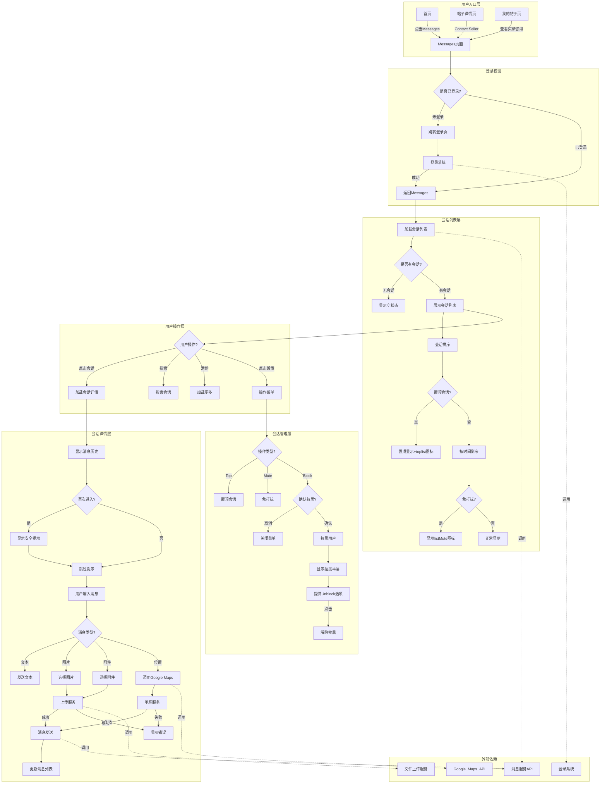
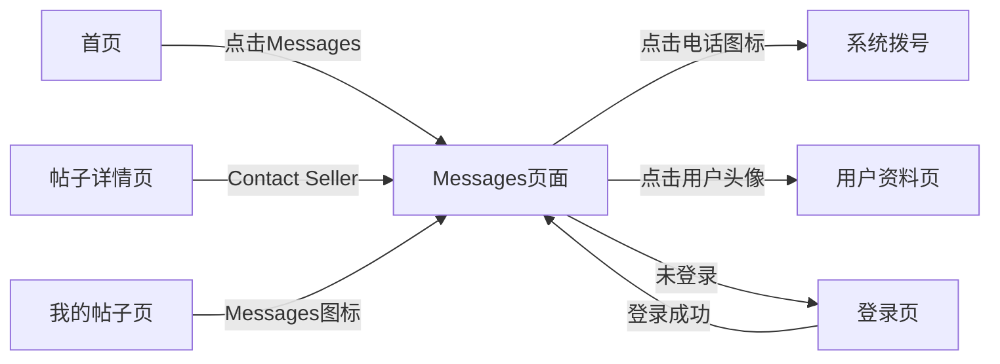
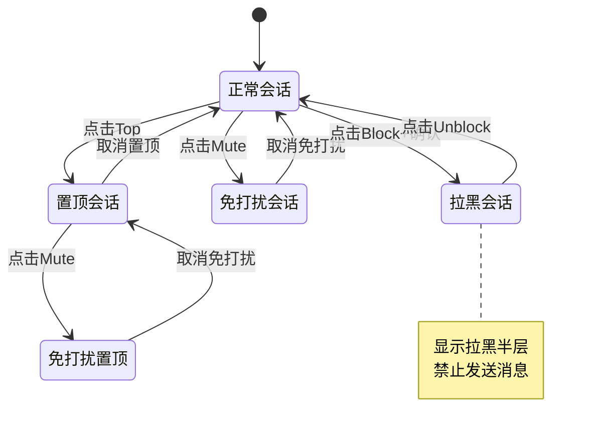

# Messages消息中心业务全景

## 1. 业务定位

### 业务价值
- **即时沟通枢纽**：连接买卖双方，促进交易沟通，提升平台活跃度和成交转化率
- **多模态消息支持**：支持文本、图片、附件、地理位置等多种消息类型，满足不同场景沟通需求
- **智能会话管理**：提供置顶、免打扰、拉黑等管理功能，提升用户沟通效率

### 目标用户
- **卖家（Seller）**：接收买家咨询，快速响应，管理多个会话
- **买家（Buyer）**：向卖家发起咨询，询问商品/服务详情，协商交易
- **平台用户**：所有登录用户均可使用消息功能

---

## 2. 业务范围

### 功能覆盖
- **会话列表管理**：展示、搜索、滑动加载会话
- **消息收发**：文本、图片、附件、地理位置
- **会话操作**：置顶、免打扰、拉黑/解除拉黑
- **用户交互**：电话呼叫、查看用户信息
- **安全提示**：防诈骗警示

### 地域覆盖
- UAE站（ae.ok.com）
- 支持英语（en-AE）

### 用户角色
- Seller（卖家）
- Buyer（买家）

---

## 3. 业务流程全景图

> **要求**：全景图必须详细展示跨域交互与依赖的逻辑分支。

---

## 4. 核心业务流程概览

### 4.1 会话列表加载流程

- **业务目标**：展示用户所有会话，按规则排序和标识
- **核心步骤**：
  1. 用户进入Messages页面
  2. 调用消息服务API获取会话列表
  3. 按时间倒序排列，置顶会话优先显示
  4. 标识置顶图标、免打扰图标、未读气泡
- **关键观测点**：
  - 会话列表不为空
  - 排序正确（置顶>时间倒序）
  - 图标显示正确
- **详细流程文档**：[Messages消息中心业务流程.md](./Messages消息中心业务流程.md)

### 4.2 消息发送流程

- **业务目标**：支持多种消息类型的发送
- **核心步骤**：
  1. 用户输入消息内容或选择文件
  2. Send按钮状态从disabled变为enabled
  3. 点击Send或按Enter发送
  4. 上传文件（如果是图片/附件）
  5. 调用消息服务API发送
  6. 消息显示在列表末尾
- **关键观测点**：
  - Send按钮状态正确切换
  - 文件上传成功
  - 消息发送成功并显示
- **详细流程文档**：[Messages消息中心业务流程.md](./Messages消息中心业务流程.md)

### 4.3 会话管理流程

- **业务目标**：提供置顶、免打扰、拉黑功能
- **核心步骤**：
  1. 点击设置图标
  2. 选择操作类型（Top/Mute/Block）
  3. 执行操作（拉黑需二次确认）
  4. 更新会话状态和UI标识
- **关键观测点**：
  - 操作菜单正确显示
  - 会话状态正确更新
  - 图标正确显示
- **详细流程文档**：[Messages消息中心业务流程.md](./Messages消息中心业务流程.md)

---

## 5. 页面拓扑关系

### 5.1 页面入口矩阵

| 页面 | 入口1 | 入口2 | 入口3 |
|------|-------|-------|-------|
| **Messages页面** | 首页导航栏"Messages"链接 | 帖子详情页"Contact Seller"按钮 | 我的帖子页"Messages"图标 |

### 5.2 页面跳转流程图

### 5.3 页面关系详解

#### 首页 → Messages页面
- **入口**：导航栏"Messages"链接
- **目标**：进入消息中心，查看所有会话
- **参数**：无
- **前置条件**：需已登录

#### 帖子详情页 → Messages页面
- **入口**："Contact Seller"按钮
- **目标**：发起与卖家的会话
- **参数**：sellerId, postId（可能包含上下文）
- **前置条件**：需已登录

#### Messages页面 → 登录页
- **入口**：自动跳转（检测到未登录）
- **目标**：用户登录
- **参数**：redirect_url=/chat
- **前置条件**：Session失效或未登录

---

## 6. 业务数据流转

### 6.1 会话状态流转图

### 6.2 用户操作与数据变化

| 操作 | 数据变化 | 前台展示变化 | 涉及页面 |
|------|---------|-------------|---------|
| 点击Messages链接 | 无 | 进入Messages页面，加载会话列表 | 首页→Messages |
| 点击会话 | 更新已读状态（可能） | 显示会话详情，未读气泡消失 | Messages |
| 发送文本消息 | 新增消息记录 | 消息显示在列表末尾 | Messages |
| 发送图片消息 | 上传图片+新增消息记录 | 图片消息显示在列表末尾 | Messages |
| 置顶会话 | 更新会话属性`is_top=true` | 会话移至列表顶部，显示toplist图标 | Messages |
| 免打扰会话 | 更新会话属性`is_muted=true` | 显示listMute图标 | Messages |
| 拉黑用户 | 更新会话属性`is_blocked=true` | 显示拉黑半层+Unblock按钮 | Messages |
| 搜索会话 | 无 | 过滤显示匹配会话 | Messages |

### 6.3 关键业务数据

| 字段 | 类型 | 必填 | 说明 |
|------|------|------|------|
| conversation_id | string | ✅ | 会话唯一标识 |
| user_id | string | ✅ | 对方用户ID |
| user_name | string | ✅ | 对方用户昵称 |
| user_avatar | string | ✅ | 对方用户头像URL |
| last_message | string | ✅ | 最后一条消息内容 |
| last_message_time | timestamp | ✅ | 最后消息时间 |
| unread_count | int | ❌ | 未读消息数 |
| is_top | boolean | ❌ | 是否置顶 |
| is_muted | boolean | ❌ | 是否免打扰 |
| is_blocked | boolean | ❌ | 是否拉黑 |
| message_id | string | ✅ | 消息唯一标识 |
| message_type | enum | ✅ | 消息类型（text/image/file/location） |
| message_content | string/url | ✅ | 消息内容或资源URL |
| send_time | timestamp | ✅ | 发送时间 |
| sender_id | string | ✅ | 发送者ID |

---

## 7. 关键业务规则索引

- [R001-R007: 会话列表规则](../../业务规则库/通用规则/Messages消息中心规则.md#31-会话列表规则)
- [R101-R111: 消息发送规则](../../业务规则库/通用规则/Messages消息中心规则.md#32-消息发送规则)
- [R201-R207: 会话操作规则](../../业务规则库/通用规则/Messages消息中心规则.md#33-会话操作规则)
- [R301-R303: 搜索筛选规则](../../业务规则库/通用规则/Messages消息中心规则.md#34-搜索和筛选规则)
- [R401-R404: 安全规则](../../业务规则库/通用规则/Messages消息中心规则.md#35-安全规则)

---

## 8. 业务FAQ

### Q1: 会话列表如何排序？
**A**: 会话按以下优先级排序：
1. 置顶会话（is_top=true）优先显示在最前
2. 其余会话按最后消息时间倒序排列（最新的在前）

### Q2: 拉黑用户后对方还能发消息吗？
**A**: 产品规则待确认。通常拉黑后：
- 拉黑方看到拉黑半层，无法发送消息
- 对方可能仍可发送，但拉黑方不接收

### Q3: 消息是否支持撤回？
**A**: 当前测试用例中未发现撤回功能，产品待确认是否需要。

### Q4: 会话列表最多显示多少条？
**A**: 支持滑动加载更多，理论上无上限，但需考虑性能优化（建议懒加载+虚拟滚动）。

### Q5: 未读消息气泡如何清除？
**A**: 当前规则不明确，推测点击会话后自动标记已读并清除气泡。

---

## 9. 业务指标（可选）

| 指标 | 定义 | 目标值 | 当前值 |
|------|------|--------|--------|
| 消息响应率 | 24小时内回复的会话比例 | >80% | - |
| 平均响应时间 | 卖家首次回复的平均时长 | <2小时 | - |
| 会话转化率 | 从会话到成交的转化率 | >15% | - |
| 拉黑率 | 被拉黑的会话比例 | <5% | - |
| 消息发送成功率 | 发送成功的消息比例 | >99% | - |

---

## 10. 已知问题与风险

### 产品问题
1. **搜索功能深度不足** → 仅支持用户名搜索，不支持消息内容全文搜索
2. **消息撤回功能缺失** → 无法撤回已发送消息
3. **未读标识逻辑不明确** → 未读气泡的计数规则和清除时机需明确
4. **拉黑双向效果不明** → 拉黑后对方是否知晓、是否仍可发送消息

### 技术风险
1. **大量会话性能问题** → 会话列表超过100条时可能卡顿
   - 建议：懒加载 + 虚拟滚动
2. **文件上传大小未限制** → 前端未见明确的文件大小校验
   - 建议：图片<5MB，附件<20MB
3. **消息发送失败无重试** → 网络波动时消息可能丢失
   - 建议：实现指数退避重试机制
4. **跨设备消息同步延迟** → WebSocket长连接可能不稳定
   - 建议：增加心跳机制和断线重连

---

## 11. 关联文本用例与自动化脚本（校验索引）

| 资产 | 仓库内路径（相对于 qa-agent 根目录） |
|------|----------------------------------------|
| Messages 功能探索文本用例 | `bundled/knowledge_base/文本用例/Tiyan/消息中心/OK-Messages-功能探索-测试用例-20260306.md` |
| 免登录微聊文本用例 | `bundled/knowledge_base/文本用例/Tiyan/消息中心/免登录微聊功能探索-测试用例-20260429.md` |
| Messages 主回归脚本（TC001 等） | `bundled/skills/ok_autotest_ui_skill/bundled/ok_autotest_ui_pc/test_cases/体验/消息中心+发布模块/test_messages_complete.py` |
| 免登录微聊核心脚本 | `bundled/skills/ok_autotest_ui_skill/bundled/ok_autotest_ui_pc/test_cases/体验/消息中心+发布模块/test_guest_chat_from_md_20260506.py` |
| 免登录微聊历史完整脚本 | `test_guest_chat_complete.py`（仓库根目录，未纳入上述 `test_cases`） |

> **说明**：若目录名为 `消息中心 `（末尾空格）系历史路径，与 `消息中心/` 视为同一业务目录时需以实际检出为准。

---

## 12. 变更历史

| 日期 | 版本 | 变更内容 | 变更人 |
|------|------|---------|--------|
| 2026-04-27 | v1.0 | 创建Messages消息中心业务全景文档 | AI Assistant |
| 2026-05-08 | v1.1 | 同步免登录微聊核心回归范围：以 TC001-TC015 为稳定主链路，复杂跨页登录后深交互暂缓 | QA Agent |
| 2026-05-10 | v1.2 | 补充关联文本用例与脚本索引，便于与自动化对照校验 | QA Agent |
