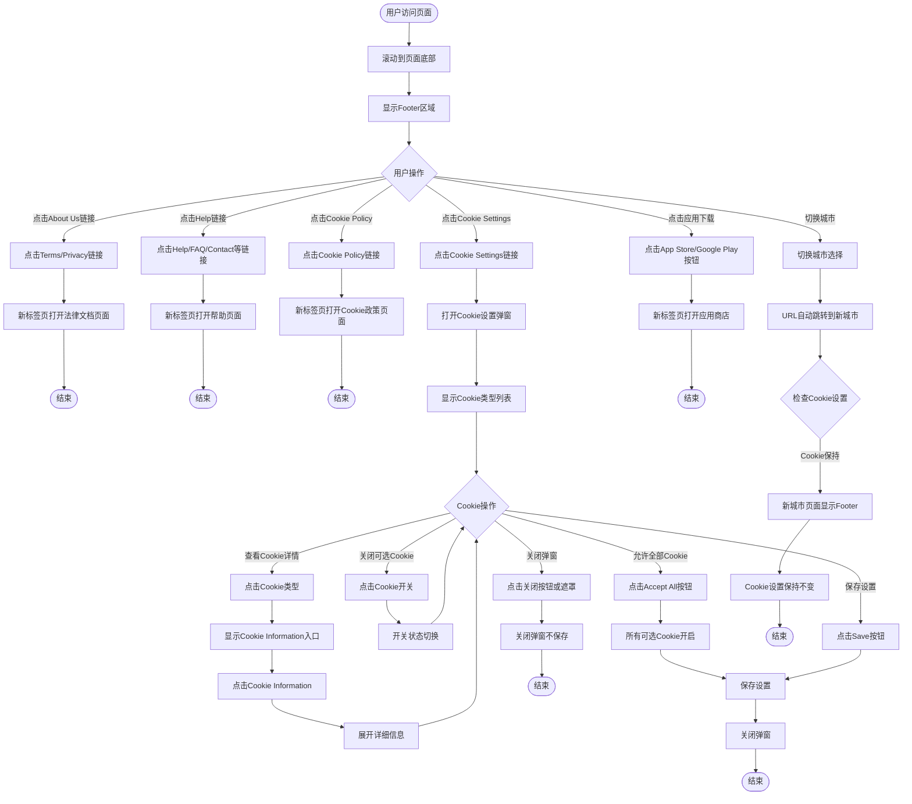

# 首页Footer业务流程

> **业务目标**: 提供全站通用的法律合规入口、用户帮助支持、隐私控制和应用下载引导,确保用户权益和法律合规

## 1. 完整流程图

> **要求**: 专注于Footer域内的详细步骤,不包含跨域交互的复杂逻辑分支（跨域逻辑统一在业务全景文档中展示）

## 2. 详细步骤与观测点

### 步骤1: Footer区域基础展示

#### 页面位置
- 所有页面底部
- 固定位于页面最底部,下方无其他内容

#### 操作流程
1. 用户访问任意页面
2. 滚动到页面底部
3. 系统显示Footer区域

#### 观测点
- ✅ **P0**: Footer区域可见
- ✅ **P0**: 包含5个区块: About Us、Help、Cookie、Our Apps、版权信息
- ✅ **P0**: 版权信息显示"© 2025 Servanan International Pte. Ltd."
- ✅ **P1**: Footer位于页面最底部,不被其他内容遮挡

#### 验证方法
- 访问首页,滚动到底部,验证Footer是否完整展示
- 检查所有区块标题和内容是否清晰
- 验证版权信息年份和公司名称是否正确

#### 关联规则
- [首页Footer规则 - 3.1 Footer基础展示规则](../../业务规则库/通用规则/首页Footer规则.md#31-footer基础展示规则)

---

### 步骤2: About Us 链接跳转

#### 页面位置
- Footer区域 → About Us区块

#### 操作流程
1. 定位About Us区块下的链接（Terms of Use、Privacy Policy）
2. 检查链接的href属性
3. 点击链接
4. 新标签页打开目标页面
5. 目标页面加载成功

#### 观测点
- ✅ **P0**: Terms of Use链接href指向正确的服务条款页面
- ✅ **P0**: 点击Terms of Use后在新标签页打开（target="_blank"）
- ✅ **P0**: 新页面标题包含"Terms"或"服务条款"
- ✅ **P0**: Privacy Policy链接href指向正确的隐私政策页面
- ✅ **P0**: 点击Privacy Policy后在新标签页打开（target="_blank"）
- ✅ **P0**: 新页面标题包含"Privacy"或"隐私政策"
- ❌ **负向**: 链接不存在时,显示404页面

#### 验证方法
- 定位Terms of Use链接,检查href属性
- 点击链接,验证是否在新标签页打开
- 检查目标页面标题和内容
- 对Privacy Policy链接执行相同验证

#### 关联规则
- [首页Footer规则 - 3.2 About Us 区块规则](../../业务规则库/通用规则/首页Footer规则.md#32-about-us-区块规则)

---

### 步骤3: Help 相关链接跳转

#### 页面位置
- Footer区域 → Help区块

#### 操作流程
1. 定位Help区块下的链接（Help、Contact Us、FAQ、Support and feedback、Return Policy、Refund Policy）
2. 检查链接的href属性
3. 点击链接
4. 新标签页打开目标页面
5. 目标页面加载成功,显示相应内容

#### 观测点
- ✅ **P0**: Help链接跳转到帮助中心页面,新标签页打开
- ✅ **P0**: Contact Us链接跳转到联系页面,显示联系表单或客服信息
- ✅ **P1**: FAQ链接跳转到常见问题页面,显示问题列表或折叠面板
- ✅ **P1**: Support and feedback链接跳转到支持反馈页面
- ✅ **P1**: Return Policy链接跳转到退货政策页面
- ✅ **P1**: Refund Policy链接跳转到退款政策页面
- ❌ **负向**: 链接不可访问时,显示错误页面

#### 验证方法
- 逐个定位Help区块的6个链接
- 检查每个链接的href属性
- 点击链接,验证是否在新标签页打开
- 检查目标页面内容是否正确

#### 关联规则
- [首页Footer规则 - 3.3 Help 区块规则](../../业务规则库/通用规则/首页Footer规则.md#33-help-区块规则)

---

### 步骤4: Cookie Policy链接跳转

#### 页面位置
- Footer区域 → Cookie区块

#### 操作流程
1. 定位Cookie区块下的"Cookie Policy"链接
2. 检查链接的href属性
3. 点击链接
4. 新标签页打开Cookie政策页面

#### 观测点
- ✅ **P0**: Cookie Policy链接href指向Cookie政策页面
- ✅ **P0**: 点击后在新标签页打开（target="_blank"）
- ✅ **P0**: 新页面标题包含"Cookie"或"Cookie政策"
- ✅ **P0**: 新页面显示Cookie使用说明

#### 验证方法
- 定位Cookie Policy链接,检查href属性
- 点击链接,验证是否在新标签页打开
- 检查目标页面标题和内容

#### 关联规则
- [首页Footer规则 - 3.4 Cookie 区块规则](../../业务规则库/通用规则/首页Footer规则.md#34-cookie-区块规则)

---

### 步骤5: Cookie Settings弹窗打开与设置

#### 页面位置
- Footer区域 → Cookie区块 → Cookie Settings弹窗

#### 操作流程
1. 定位Cookie区块下的"Cookie Settings"链接
2. 点击链接
3. 弹窗打开,显示Cookie设置界面
4. 显示多个Cookie类型选项（必要Cookie、分析Cookie、营销Cookie）
5. 每个Cookie类型有开关和描述

#### 观测点
- ✅ **P0**: 点击Cookie Settings后弹窗打开
- ✅ **P0**: 弹窗标题为"Cookie Settings"或"Cookie 设置"
- ✅ **P0**: 弹窗内显示多个Cookie类型选项
- ✅ **P0**: 每个Cookie类型有描述和开关
- ✅ **P0**: 必要Cookie（Strictly Necessary Cookies）开关为禁用状态,无法关闭
- ✅ **P0**: 可选Cookie（Analytics Cookies、Marketing Cookies）开关可点击
- ❌ **负向**: Cookie弹窗无法打开时,降级处理

#### 验证方法
- 点击Cookie Settings链接
- 验证弹窗是否正确打开
- 检查弹窗标题和内容
- 尝试点击必要Cookie的开关,验证是否禁用
- 尝试点击可选Cookie的开关,验证是否可切换

#### 关联规则
- [首页Footer规则 - 3.4 Cookie 区块规则](../../业务规则库/通用规则/首页Footer规则.md#34-cookie-区块规则)
- [首页Footer规则 - 3.5 Cookie 设置详细规则](../../业务规则库/通用规则/首页Footer规则.md#35-cookie-设置详细规则)

---

### 步骤6: Cookie 开关切换与保存

#### 页面位置
- Cookie Settings弹窗

#### 操作流程
1. 在Cookie Settings弹窗中,定位可选Cookie开关（如Analytics Cookies）
2. 点击开关,切换状态（开启/关闭）
3. 观察开关状态变化
4. 点击"Save"或"Accept All"按钮保存设置
5. 弹窗关闭
6. 刷新页面,重新打开Cookie Settings
7. 验证之前的设置是否保持

#### 观测点
- ✅ **P0**: 点击可选Cookie开关后,状态切换（开启/关闭）
- ✅ **P0**: 点击"Accept All"后,所有可选Cookie开关切换为开启
- ✅ **P0**: 点击"Save"或"Accept All"后,弹窗关闭
- ✅ **P0**: 刷新页面后,重新打开Cookie Settings,之前的设置保持不变
- ❌ **负向**: Cookie保存失败时,刷新后设置不保持

#### 验证方法
- 点击Analytics Cookies开关,观察状态变化
- 点击Save按钮,验证弹窗是否关闭
- 刷新页面,重新打开Cookie Settings
- 验证Analytics Cookies状态是否与之前一致

#### 关联规则
- [首页Footer规则 - 3.5 Cookie 设置详细规则](../../业务规则库/通用规则/首页Footer规则.md#35-cookie-设置详细规则)

---

### 步骤7: Cookie Information 查看

#### 页面位置
- Cookie Settings弹窗 → Cookie类型展开

#### 操作流程
1. 在Cookie Settings弹窗中,定位某个Cookie类型（如Strictly Necessary Cookies）
2. 点击Cookie类型（或展开图标）
3. 出现"Cookie Information"入口或链接
4. 点击"Cookie Information"
5. 展开或弹出详细信息
6. 查看Cookie名称、用途、有效期、提供方等信息

#### 观测点
- ✅ **P1**: 点击Cookie类型后,出现"Cookie Information"入口
- ✅ **P1**: 点击"Cookie Information"后,展开详细信息
- ✅ **P1**: 详细信息包含: Cookie名称、用途、有效期、提供方
- ✅ **P1**: 信息清晰易读
- ✅ **P1**: 所有Cookie类型（必要、分析、营销）均有Cookie Information入口

#### 验证方法
- 点击Strictly Necessary Cookies
- 验证是否出现Cookie Information入口
- 点击Cookie Information
- 检查详细信息是否包含必要字段
- 对其他Cookie类型执行相同验证

#### 关联规则
- [首页Footer规则 - 3.5 Cookie 设置详细规则](../../业务规则库/通用规则/首页Footer规则.md#35-cookie-设置详细规则)

---

### 步骤8: 应用下载引导

#### 页面位置
- Footer区域 → Our Apps区块

#### 操作流程
1. 定位Our Apps区块下的应用下载按钮（App Store、Google Play）
2. 检查按钮的href属性
3. 点击按钮
4. 新标签页打开应用商店页面
5. 验证应用商店页面加载成功

#### 观测点
- ✅ **P1**: App Store按钮href指向正确的iOS应用商店页面
- ✅ **P1**: 点击App Store按钮后,新标签页打开应用商店
- ✅ **P1**: Google Play按钮href指向正确的Android应用商店页面
- ✅ **P1**: 点击Google Play按钮后,新标签页打开应用商店
- ✅ **P2**: 按钮显示对应平台的官方图标（App Store图标、Google Play图标）
- ❌ **负向**: 应用商店链接错误时,无法跳转或显示错误页面

#### 验证方法
- 定位App Store按钮,检查href属性
- 点击按钮,验证是否在新标签页打开应用商店
- 检查应用商店页面是否显示正确的应用
- 对Google Play按钮执行相同验证

#### 关联规则
- [首页Footer规则 - 3.6 Our Apps 区块规则](../../业务规则库/通用规则/首页Footer规则.md#36-our-apps-区块规则)

---

### 步骤9: 城市切换与Cookie持久化

#### 页面位置
- 任意页面 → 城市选择器 → Footer区域

#### 操作流程
1. 在当前页面,定位城市选择器（通常在页面顶部）
2. 选择不同的城市（如从Dubai切换到Ajman）
3. 观察URL变化
4. 滚动到页面底部,观察Footer区域
5. 打开Cookie Settings,检查之前设置的Cookie状态
6. 验证Cookie设置是否保持

#### 观测点
- ✅ **P0**: 切换城市后,URL自动跳转到新城市页面（如从/city-dubai/变为/city-ajman/）
- ✅ **P0**: 切换城市后,打开Cookie Settings,之前关闭的Cookie（如Analytics Cookies）仍为关闭状态
- ✅ **P1**: 切换城市后,Footer内容一致（链接、按钮、文案相同）
- ✅ **P1**: 多次切换城市后,Cookie设置仍保持稳定
- ✅ **P2**: 清除浏览器Cookie后,城市选择重置为默认,不再自动跳转

#### 验证方法
- 在Cookie Settings中关闭Analytics Cookies,保存设置
- 切换城市为Ajman
- 验证URL是否变为/city-ajman/
- 重新打开Cookie Settings
- 验证Analytics Cookies是否仍为关闭状态

#### 关联规则
- [首页Footer规则 - 3.7 城市切换与Cookie持久化规则](../../业务规则库/通用规则/首页Footer规则.md#37-城市切换与cookie持久化规则)

---

## 3. 流程完整性验证清单

### Footer基础展示
- [ ] Footer区域可见,位于页面最底部
- [ ] 包含5个区块: About Us、Help、Cookie、Our Apps、版权信息
- [ ] 版权信息显示正确

### About Us 链接
- [ ] Terms of Use链接正确跳转,新标签页打开
- [ ] Privacy Policy链接正确跳转,新标签页打开

### Help 链接
- [ ] Help链接正确跳转
- [ ] Contact Us链接正确跳转
- [ ] FAQ链接正确跳转
- [ ] Support and feedback链接正确跳转
- [ ] Return Policy链接正确跳转
- [ ] Refund Policy链接正确跳转

### Cookie 管理
- [ ] Cookie Policy链接正确跳转,新标签页打开
- [ ] Cookie Settings弹窗正确打开
- [ ] 必要Cookie不可关闭
- [ ] 可选Cookie可关闭
- [ ] 点击Accept All后,所有可选Cookie开启
- [ ] Cookie设置保存后刷新页面仍保持
- [ ] Cookie Information入口正确展示
- [ ] Cookie详细信息包含必要字段

### 应用下载
- [ ] App Store按钮正确跳转,新标签页打开
- [ ] Google Play按钮正确跳转,新标签页打开
- [ ] 按钮图标正确显示

### 城市切换
- [ ] 切换城市后,URL自动跳转
- [ ] 切换城市后,Cookie设置保持
- [ ] 切换城市后,Footer内容一致
- [ ] 多次切换城市后,Cookie设置稳定

---

## 4. 关联文档

- [通用业务全景](./通用业务全景.md)
- [首页Footer规则](../../业务规则库/通用规则/首页Footer规则.md)

---

## 5. 变更历史

| 日期 | 版本 | 变更内容 | 变更人 |
|-----|------|---------|--------|
| 2026-04-27 | v1.0 | 初始版本,基于OK.com-首页底部公共区域-测试用例-20260402.md生成 | AI |
