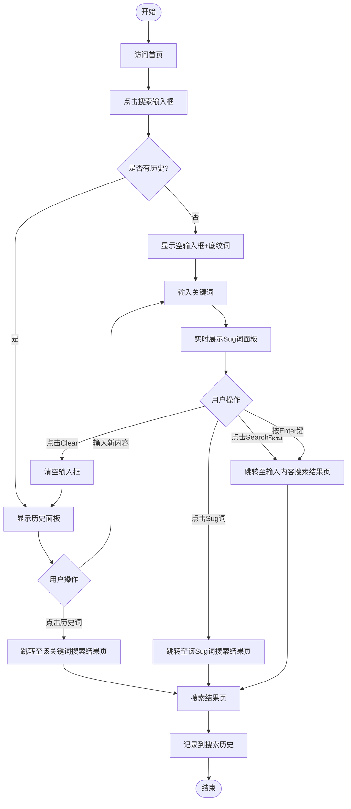

# 首页搜索业务流程

> **业务目标**: 让用户通过关键词快速找到目标内容

---

## 1. 完整流程图

---

## 2. 详细步骤与观测点

### 步骤1: 打开搜索输入框
**页面位置**: 首页顶部搜索区域

**操作**:
1. 访问首页
2. 点击搜索输入框

**观测点**:
- ✅ 输入框获得焦点
- ✅ 未聚焦时显示底纹词"Search for anything"（浅灰色）
- ✅ 聚焦后无内容时底纹词仍展示
- ✅ 有历史记录时展示历史面板
- ✅ 无历史记录时不展示任何面板

**验证方法**:
- 点击输入框，观察是否获得焦点
- 观察底纹词是否正确显示
- 观察是否展示历史面板

**关联规则**: [首页搜索规则.md - 3.1 输入框规则](../../../业务规则库/通用规则/首页搜索规则.md#31-输入框规则)

---

### 步骤2: 查看搜索历史（如有）
**页面位置**: 搜索输入框下拉面板

**操作**:
1. 点击输入框（聚焦，不输入内容）
2. 观察历史面板内容

**观测点**:
- ✅ 历史面板标题显示"Recent Searches"
- ✅ 历史词列表展示在标题下方
- ✅ 每条历史词左侧有历史图标
- ✅ 历史词按时间倒序排列（最新在第一位）
- ✅ 最多展示10条历史词
- ✅ 刷新页面后历史记录保留（localStorage持久化）

**验证方法**:
- 点击输入框，观察历史面板是否展示
- 验证历史词排序是否正确
- 验证历史词数量是否不超过10条
- 刷新页面，验证历史是否保留

**关联规则**: [首页搜索规则.md - 3.5 搜索历史规则](../../../业务规则库/通用规则/首页搜索规则.md#35-搜索历史规则)

---

### 步骤3: 输入关键词并查看Sug词
**页面位置**: 搜索输入框

**操作**:
1. 在输入框输入关键词（如"driver"）
2. 等待约1秒

**观测点**:
- ✅ 输入内容后底纹词消失
- ✅ 输入框右侧显示Clear（×）按钮
- ✅ 输入框下方展示Sug词下拉面板
- ✅ Sug词列表与输入内容相关
- ✅ Sug词最多展示10条
- ✅ Sug词随输入内容实时更新
- ✅ 长文案Sug词单行截断展示（省略号）
- ❌ 无匹配Sug词时面板不展示任何条目（空列表）
- ✅ 清空输入框后Sug词面板消失，历史面板重新展示

**验证方法**:
- 输入关键词，观察Sug词是否展示
- 验证Sug词数量是否不超过10条
- 验证Sug词是否随输入实时更新
- 输入无匹配关键词，验证面板是否为空

**关联规则**: [首页搜索规则.md - 3.4 Sug词规则](../../../业务规则库/通用规则/首页搜索规则.md#34-sug词规则)

---

### 步骤4: 点击Sug词或历史词跳转
**页面位置**: Sug词面板或历史面板

**操作**:
1. 点击Sug词列表中的任意一条
2. 或点击历史词列表中的任意一条

**观测点**:
- ✅ 点击后跳转至该关键词的搜索结果页
- ✅ URL格式: `https://ae.58v5.cn/en/city-dubai/cate/?keyword={关键词}`
- ✅ URL中keyword参数与点击的词一致
- ✅ 搜索结果页正常展示
- ✅ 点击的词被记入搜索历史（更新到第一位）

**验证方法**:
- 点击Sug词，验证URL是否正确
- 点击历史词，验证URL是否正确
- 返回首页，验证历史是否更新

**关联规则**: [首页搜索规则.md - 3.4 Sug词规则](../../../业务规则库/通用规则/首页搜索规则.md#34-sug词规则)

---

### 步骤5: 点击Search按钮或按Enter键搜索
**页面位置**: 搜索输入框

**操作**:
1. 输入关键词（如"job"）
2. 点击Search按钮或按Enter键

**观测点**:
- ✅ 跳转至搜索结果页
- ✅ URL格式: `https://ae.58v5.cn/en/city-dubai/cate/?keyword={关键词}`
- ✅ URL中keyword参数与输入内容一致
- ✅ 特殊字符正确URL编码（`<script>`→`%3Cscript%3E`）
- ✅ Emoji字符正确URL编码
- ✅ 空格正确编码为`%20`或`+`
- ✅ 空内容搜索跳转至全品类页（无keyword参数）
- ✅ 搜索结果页正常展示

**验证方法**:
- 输入关键词，点击Search按钮，验证URL是否正确
- 按Enter键，验证是否跳转
- 输入特殊字符，验证是否正确编码
- 空内容搜索，验证是否跳转至全品类页

**关联规则**: [首页搜索规则.md - 3.2 Search按钮规则](../../../业务规则库/通用规则/首页搜索规则.md#32-search按钮规则)

---

### 步骤6: 清空输入框
**页面位置**: 搜索输入框

**操作**:
1. 输入内容后点击Clear（×）按钮

**观测点**:
- ✅ 输入框内容清空为空字符串
- ✅ 底纹词"Search for anything"重新显示
- ✅ Clear按钮消失
- ✅ Sug词面板消失
- ✅ 历史面板重新展示（如有历史）

**验证方法**:
- 输入内容，点击Clear按钮
- 验证输入框是否清空
- 验证底纹词是否重新显示
- 验证Clear按钮是否消失

**关联规则**: [首页搜索规则.md - 3.1 输入框规则](../../../业务规则库/通用规则/首页搜索规则.md#31-输入框规则)

---

## 3. 流程完整性验证清单

### 输入框基础功能
- [ ] 未聚焦时是否显示底纹词"Search for anything"
- [ ] 聚焦后无内容时底纹词是否仍展示
- [ ] 输入内容后底纹词是否消失
- [ ] 清空后底纹词是否重新显示
- [ ] 失焦且无内容时底纹词是否重新显示

### Search按钮功能
- [ ] Search按钮文案是否为"Search"
- [ ] 有/无内容时Search按钮是否均可点击
- [ ] 输入关键词点击Search是否跳转搜索结果页
- [ ] 空内容点击Search是否跳转全品类页
- [ ] 按Enter键是否等同于点击Search按钮
- [ ] 快速连续点击Search是否不产生重复跳转

### Clear按钮功能
- [ ] 有内容时Clear按钮是否显示
- [ ] 无内容时Clear按钮是否隐藏
- [ ] 点击Clear是否清空输入框
- [ ] 清空后Clear按钮是否消失

### 关键词处理
- [ ] 空格关键词是否正确URL编码
- [ ] 特殊HTML字符是否正确转义不执行XSS
- [ ] Emoji字符是否正确URL编码
- [ ] 超长关键词（200字符）是否正常处理
- [ ] 仅空格内容搜索是否不报错
- [ ] 中文/阿拉伯语关键词是否正确编码

### Sug词功能
- [ ] 输入关键词后是否展示Sug词面板
- [ ] 未输入内容时是否不展示Sug词面板
- [ ] Sug词是否随输入内容实时更新
- [ ] Sug词是否最多展示10条
- [ ] 点击Sug词是否跳转对应搜索结果页
- [ ] 点击Sug词后是否记入搜索历史
- [ ] 清空输入框后Sug词面板是否消失
- [ ] 无匹配Sug词时面板是否为空列表
- [ ] 长文案Sug词是否单行截断展示
- [ ] 输入特殊字符是否不报错

### 搜索历史功能
- [ ] 首次访问无历史时是否不展示"Recent Searches"
- [ ] 有历史时聚焦输入框是否展示"Recent Searches"标题
- [ ] 历史词是否按时间倒序排列
- [ ] 历史词是否最多展示10条
- [ ] 超过10条时最旧的是否被挤出
- [ ] 点击历史词是否跳转对应搜索结果页
- [ ] 重复搜索同一关键词历史是否不重复
- [ ] 重复搜索时已有词是否更新到第一位
- [ ] 输入内容后历史面板是否被Sug词面板替换
- [ ] 清空输入框后历史面板是否重新展示

### 会话与状态
- [ ] 刷新页面后历史记录是否保留
- [ ] 浏览器后退返回首页后输入框是否清空

### 健壮性
- [ ] 网络超时/断网时是否不崩溃
- [ ] Sug接口5xx时是否降级处理

---

## 4. 关联文档

- [通用业务全景](./通用业务全景.md)
- [首页搜索规则.md](../../../业务规则库/通用规则/首页搜索规则.md)

---

## 5. 变更历史

| 日期 | 版本 | 变更内容 | 变更人 |
|-----|------|---------|--------|
| 2026-03-24 | v1.0 | 初始版本，基于OK-AE-首页搜索输入框测试用例(38条)生成 | AI |
