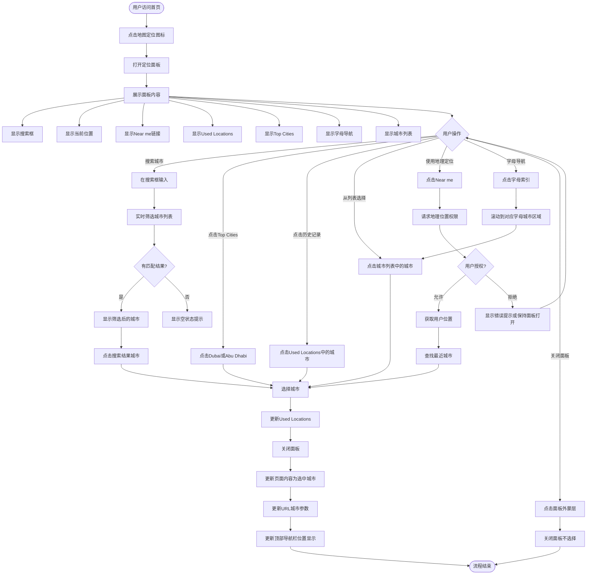

# 首页定位面板业务流程

## 1. 业务概述
首页定位面板是用户快速切换城市地区的核心工具,支持通过搜索、热门城市、历史记录、完整城市列表和地理定位等多种方式选择城市,为用户提供精准的本地化内容。

## 2. 业务目标
- **用户目标**: 快速准确地切换到目标城市,查看该城市的本地化内容
- **平台目标**: 提升内容相关性,改善用户体验,提高本地化服务质量

## 3. 涉及角色
- **所有用户(访客/买家/卖家)**: 都可以使用定位面板选择城市,权限一致

## 4. 核心流程图

## 5. 详细步骤说明

### 步骤1: 用户访问首页并点击地图定位图标
- **触发条件**: 用户访问OK.com首页(https://ae.ok.com),页面加载完成
- **用户操作**: 点击顶部导航栏的地图定位图标(map pin icon)
- **系统响应**: 准备打开定位面板

### 步骤2: 打开定位面板
- **面板形式**: 模态面板覆盖在页面上方,带半透明蒙层
- **加载速度**: 面板在1秒内完全加载并显示
- **面板内容**: 同时展示多个功能区域

### 步骤3: 展示面板内容
面板包含以下区域(从上到下):
1. **搜索框**: placeholder="Search City",位于面板顶部
2. **当前位置**: 显示当前选中的城市(如"Abu Dhabi"),带定位图标
3. **Near me**: 地理定位链接
4. **Used Locations**: 最近使用的城市历史记录(最多10个)
5. **Top Cities**: 显示Dubai和Abu Dhabi两个热门城市
6. **字母导航**: A, D, F, R, S, U(仅显示有对应城市的字母)
7. **城市列表**: 按字母分组的完整城市列表

### 步骤4: 搜索城市流程
1. **用户输入**: 在搜索框中输入城市名称(如"Sharjah")
2. **实时筛选**: 每次输入字符后,系统在300ms内更新搜索结果
3. **搜索匹配**: 
   - 支持部分匹配,从城市名称开头匹配
   - 不区分大小写
   - 接受特殊字符但进行XSS防护
4. **显示结果**:
   - 有匹配: 显示筛选后的城市列表,Top Cities保持可见
   - 无匹配: 显示空状态提示"No cities found"
5. **选择城市**: 用户点击搜索结果中的城市

### 步骤5: 从Top Cities选择
1. **显示位置**: Top Cities位于搜索框下方,Used Locations之后
2. **显示城市**: Dubai和Abu Dhabi两个固定热门城市
3. **点击行为**: 用户点击任一热门城市按钮

### 步骤6: 从Used Locations选择
1. **历史记录**: 显示用户最近选择过的城市(最多10个)
2. **排序规则**: 按时间倒序,最近使用排最前
3. **去重逻辑**: 同一城市只显示一次,重复选择更新时间戳
4. **点击行为**: 用户点击历史记录中的任一城市

### 步骤7: 从城市列表选择
1. **列表结构**: 城市按字母分组,每组有字母标题(如"A", "D")
2. **滚动浏览**: 用户滚动查看完整城市列表
3. **字母导航**: 用户可点击字母索引快速跳转到对应字母区域
4. **点击行为**: 用户点击列表中的任一城市

### 步骤8: 使用Near me地理定位
1. **点击Near me**: 用户点击"Near me"链接
2. **权限请求**: 浏览器弹出地理位置权限请求弹窗
3. **用户授权**:
   - **允许**: 系统获取用户位置,自动查找最近城市,直接选中该城市
   - **拒绝**: 面板保持打开,显示错误提示"Location access denied"或无提示
4. **不支持**: 浏览器不支持Geolocation API时,"Near me"链接不显示或置灰

### 步骤9: 选择城市后的处理
1. **更新历史记录**: 选中的城市添加到Used Locations,存储到LocalStorage
2. **关闭面板**: 面板立即关闭,蒙层消失
3. **更新页面内容**: 页面内容刷新为选中城市的商品/服务/工作等本地化内容
4. **更新URL**: 页面URL更新包含城市参数(待验证)
5. **更新顶部导航**: 顶部导航栏当前位置显示更新为选中城市(待验证)

### 步骤10: 用户取消操作
1. **点击蒙层**: 用户点击面板外的灰色蒙层区域
2. **关闭面板**: 面板关闭,蒙层消失
3. **保持状态**: 当前选中的城市保持不变,页面不更新

## 6. 异常分支

### 6.1 搜索无结果
- **场景**: 用户搜索不存在的城市(如"XYZ123NotExist")
- **处理**: 显示空状态提示,城市列表为空,Top Cities保持可见

### 6.2 地理定位失败
- **场景**: 用户允许定位但系统无法获取位置
- **处理**: 显示错误提示"Unable to get location",面板保持打开

### 6.3 浏览器不支持定位
- **场景**: 浏览器不支持Geolocation API
- **处理**: "Near me"链接不显示或置灰,不可点击

### 6.4 城市数据加载失败
- **场景**: 网络异常或服务不可用,城市数据加载失败
- **处理**: 显示"Loading failed, please retry"提示,提供重试按钮

### 6.5 特殊字符输入
- **场景**: 用户输入XSS攻击代码(如``)
- **处理**: XSS防护,不执行JavaScript代码,搜索结果为空,页面不崩溃

### 6.6 超长文本输入
- **场景**: 用户输入≥200字符的超长文本
- **处理**: 接受输入,不报错,页面不崩溃,搜索结果为空

### 6.7 Emoji输入
- **场景**: 用户输入Emoji(如"🎉🏙️Dubai")
- **处理**: 接受输入,不报错,搜索结果为空

### 6.8 Used Locations超过限制
- **场景**: 用户选择超过10个不同城市
- **处理**: Used Locations最多显示10个,超出则移除最旧记录

## 7. 关联流程
- **首页搜索流程**: 城市切换影响搜索结果范围
- **首页导航流程**: 顶部导航栏显示当前位置
- **内容展示流程**: 城市切换触发内容更新
- **用户偏好流程**: Used Locations记录用户操作历史

## 8. 变更历史

| 日期 | 版本 | 变更内容 | 变更人 |
|-----|------|---------|--------|
| 2026-04-28 | v1.0 | 初始版本,基于OK.com-定位面板-测试用例-20260228-实测版-2026-03-09.md生成 | AI |
