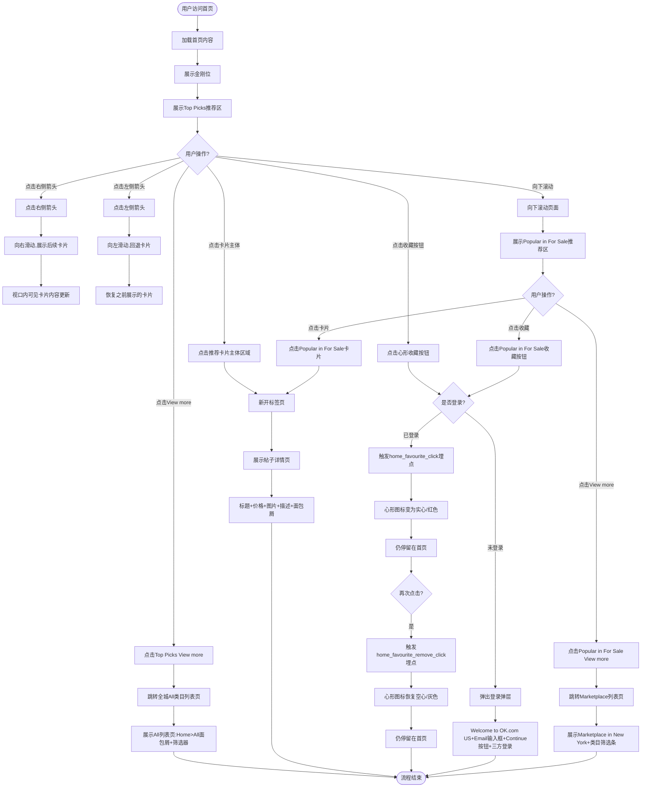

# 首页推荐卡片模块业务流程

## 1. 业务概述
首页推荐卡片模块位于首页金刚位正下方,通过横滑卡片展示个性化推荐内容,包括多个推荐区(Top Picks、Popular in For Sale等)。用户可以浏览推荐卡片、点击查看详情、收藏感兴趣的帖子,是首页内容分发和用户留存的关键功能。

## 2. 业务目标
- **用户目标**: 快速发现感兴趣的商品和服务,提升浏览效率
- **平台目标**: 通过个性化推荐提升用户停留时长、点击率和转化率,增加平台GMV

## 3. 涉及角色
- **访客(visitor)**: 未登录用户,可浏览推荐内容,点击收藏会触发登录引导
- **买家(buyer)**: 已登录用户,可浏览推荐内容并直接收藏

## 4. 核心流程图

## 5. 详细步骤说明

### 步骤1: 用户访问首页并加载推荐模块
- **触发条件**: 用户访问城市首页(如`https://us.ok.com/en/city-new-york1/`)
- **页面加载**: 首页内容完整加载,包括金刚位和推荐模块
- **推荐区展示**: 金刚位下方展示第一个推荐区"Top Picks"

### 步骤2: Top Picks推荐区展示
- **区块标题**: 左侧显示"Top Picks",右侧显示"View more"链接
- **横滑箭头**: 右侧显示左右箭头图标(类名含Recommend_itemIconLeft/Recommend_itemIconRight)
- **卡片内容**: 横向排列多张推荐卡片,包含图片、标题、价格、收藏按钮
- **访客和买家**: 均展示推荐模块,但推荐内容可能不同(算法个性化)

### 步骤3: 点击Top Picks View more跳转全城All类目列表页
1. **点击区域**: 用户点击"Top Picks | View more"链接
2. **跳转方式**: 
   - 左键点击:当前标签页跳转
   - 中键点击:当前标签页打开
3. **目标URL**: `https://us.ok.com/en/city-new-york1/cate/`
4. **落地页标题**: "New York Classifieds Website - OK"
5. **落地页内容**:
   - 面包屑:"Home > All"
   - 筛选器:Best Match/Filter/Category/New York/Price
   - 商品卡片网格

### 步骤4: 点击右侧箭头向右滑动查看更多推荐
1. **点击区域**: 用户点击Top Picks区域右侧箭头图标(Recommend_itemIconRight)
2. **滑动效果**: 视口内可见卡片内容向右切换
3. **内容更新**: 首屏可见卡片由原卡片组合变为后续卡片组合
4. **示例**: 首卡由"Beautiful Maincoon…"变为"Elmer's Color Rush…"

### 步骤5: 点击左侧箭头向左滑动回退卡片
1. **点击区域**: 用户点击Top Picks区域左侧箭头图标(Recommend_itemIconLeft)
2. **滑动效果**: 视口内可见卡片内容向左切换
3. **内容更新**: 恢复接近右箭头前的卡片展示
4. **支持**: 支持多次左右切换

### 步骤6: 点击推荐卡片主体区域查看详情
1. **点击区域**: 用户点击推荐卡片的主体区域(非心形收藏按钮)
2. **跳转方式**: 新开浏览器标签页(target="_blank")
3. **目标页面**: 帖子详情页,URL格式为`/cate-xxx/[slug]/`
4. **详情页内容**:
   - 标题、价格、图片、描述等完整信息
   - 面包屑:"Home > [类目] > [子类目]"
5. **数据一致性**: 详情页价格与卡片价格一致,价格格式(单位、周期)保持一致

### 步骤7: 已登录用户点击收藏按钮
1. **点击区域**: 用户点击推荐卡片图片区域内的心形收藏按钮(.list-components-item-favorite)
2. **埋点触发**: 触发home_favourite_click埋点
3. **图标变化**: 心形图标从空心变为实心,颜色从灰色变为红色
4. **页面行为**: 仍停留在首页,不跳转详情页
5. **Toast提示**: 无强制Toast,以埋点与交互为准

#### 再次点击取消收藏:
1. **点击区域**: 用户再次点击同一卡片的心形收藏按钮
2. **埋点触发**: 触发home_favourite_remove_click埋点
3. **图标变化**: 心形图标从实心变为空心,颜色从红色变为灰色
4. **页面行为**: 仍停留在首页

### 步骤8: 访客点击收藏按钮触发登录引导
1. **点击区域**: 访客点击推荐卡片的心形收藏按钮
2. **弹层展示**: 弹出登录欢迎弹层
3. **弹层内容**:
   - 标题:"Welcome to OK.com US"
   - 副标题:"Free to post. Easy to find."
   - 输入框:"Email or phone number"
   - 按钮:"Continue"(初始禁用态)
   - 三方登录:Google/Facebook/Apple图标
4. **后续流程**: 用户登录后可正常收藏

### 步骤9: 向下滚动查看Popular in For Sale推荐区
1. **滚动操作**: 用户向下滚动首页
2. **推荐区展示**: 展示第二个推荐区"Popular in For Sale"
3. **区块结构**: 与Top Picks相同,包含标题、View more、左右箭头、横滑卡片
4. **功能一致**: 支持View more跳转、横滑切换、卡片点击、收藏操作

### 步骤10: 点击Popular in For Sale View more跳转Marketplace列表页
1. **点击区域**: 用户点击"Popular in For Sale | View more"链接
2. **目标URL**: `https://us.ok.com/en/city-new-york1/cate-marketplace/`
3. **落地页标题**: "Marketplace in New York"
4. **落地页内容**: 展示Marketplace类目筛选条和商品列表

## 6. 异常分支

### 6.1 推荐内容加载失败
- **场景**: 推荐服务不可用或网络异常
- **处理**: 不展示推荐模块或显示占位符,不阻塞首页其他功能

### 6.2 收藏失败
- **场景**: 收藏服务不可用
- **处理**: 图标状态不变,Toast提示"收藏失败,请稍后重试"

### 6.3 登录弹层打开失败
- **场景**: JS错误或组件加载失败
- **处理**: 降级处理,不阻塞主流程

### 6.4 详情页跳转失败
- **场景**: 目标页面不存在或网络异常
- **处理**: 显示404或错误提示

### 6.5 View more跳转失败
- **场景**: 目标列表页不存在
- **处理**: 显示404或错误提示

## 7. 关联流程
- **首页金刚位流程**: 推荐模块位于金刚位正下方,是首页内容分发的补充
- **收藏页流程**: 推荐卡片收藏后同步到收藏页
- **详情页流程**: 推荐卡片点击跳转到详情页
- **登录流程**: 访客点击收藏触发登录引导
- **Marketplace列表页流程**: Popular in For Sale推荐区引流到Marketplace列表页
- **All类目列表页流程**: Top Picks推荐区引流到全城All类目列表页

## 8. 变更历史

| 日期 | 版本 | 变更内容 | 变更人 |
|-----|------|---------|--------|
| 2026-04-28 | v1.0 | 初始版本,基于OK.com-纽约首页推荐卡片模块-测试用例-20260324.md生成 | AI |
