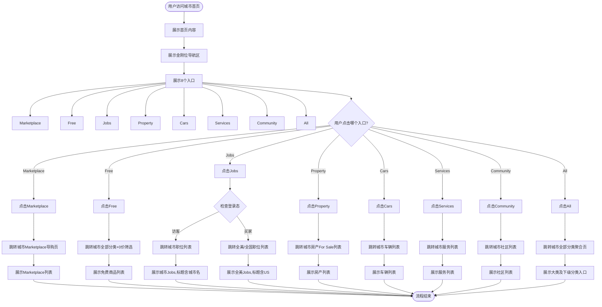

# 首页金刚位导航区业务流程

## 1. 业务概述
首页金刚位导航区是首页首屏的核心业务入口,位于搜索框下方,以图标+文案形式提供8个快速导航入口(Marketplace、Free、Jobs、Property、Cars、Services、Community、All),引导用户快速进入各业务分类,是首页流量分发的关键枢纽。

## 2. 业务目标
- **用户目标**: 快速找到目标业务分类,进入对应列表或导购页
- **平台目标**: 高效分发首页流量到各业务线,提升用户转化率

## 3. 涉及角色
- **访客(visitor)**: 未登录用户,所有金刚位入口均可见可点击,Jobs入口进入城市职位列表
- **买家(buyer)**: 已登录用户,金刚位功能基本一致,但Jobs入口进入全美/全国职位列表

## 4. 核心流程图

## 5. 详细步骤说明

### 步骤1: 用户访问城市首页
- **触发条件**: 用户访问城市首页URL(如`https://us.ok.com/en/city-new-york1/`)
- **页面加载**: 首页内容完整加载,包括搜索框、金刚位、Top Picks等模块
- **视口**: 实测基于1440×900宽屏视口

### 步骤2: 展示金刚位导航区
- **位置**: 首页首屏搜索框下方
- **入口数量**: 固定8个
- **入口顺序**: Marketplace→Free→Jobs→Property→Cars→Services→Community→All
- **入口样式**: 每个入口包含图标和重复可读名称(如"Marketplace Marketplace")
- **可见性**: 所有入口对访客和买家均可见可点击

### 步骤3: 用户点击Marketplace
1. **点击区域**: 用户点击"Marketplace Marketplace"图标或文案区域
2. **跳转URL**: `/en/city-{city}/cate-marketplace/?iconSource=marketplace`
3. **落地页标题**: "{数量} Marketplace in the {城市}: The Ultimate Buyers Guide (2026) | ok.com"
4. **页面内容**: 
   - h1为"Marketplace"
   - 导航区包含"Home"链接(指向城市首页)
   - 主内容区展示"Marketplace in {城市}"和"Best Match"等列表控件
5. **登录态**: 访客和买家行为一致

### 步骤4: 用户点击Free
1. **点击区域**: 用户点击"Free Free"图标或文案区域
2. **跳转URL**: `/en/city-{city}/cate/?lowestPrice=0&highestPrice=0`
3. **落地页标题**: "{城市} Classifieds Website - OK"
4. **页面内容**:
   - h1为"All"
   - 可见"Filter"文案(筛选区域)
   - 价格筛选参数lowestPrice=0&highestPrice=0表示免费商品
5. **登录态**: 访客和买家行为一致

### 步骤5: 用户点击Jobs(登录态差异)

#### 访客点击Jobs:
1. **点击区域**: 用户点击"Jobs Jobs"图标或文案区域
2. **跳转URL**: `/en/city-{city}/cate-jobs/?iconSource=jobs`(包含城市参数)
3. **落地页标题**: "{数量}K+ Jobs in the {城市}: The Ultimate Buyers Guide (2026) | ok.com"
4. **页面内容**:
   - h1为"Jobs"
   - 导航区"Home"链接指向城市首页(`/en/city-{city}/`)
   - 可见搜索框
5. **示例**: 纽约首页点击Jobs→"12K+ Jobs in the New York"

#### 买家点击Jobs:
1. **点击区域**: 用户点击"Jobs Jobs"图标或文案区域
2. **跳转URL**: `/en/city/cate-jobs/?iconSource=jobs`(不包含城市参数)
3. **落地页标题**: "{数量}K+ Jobs in the US: The Ultimate Buyers Guide (2026) | ok.com"
4. **页面内容**:
   - h1为"Jobs"
   - 导航区"Home"链接指向国家首页(`/en/`)
   - 可见搜索框
5. **示例**: 纽约首页点击Jobs→"159K+ Jobs in the US"

#### Jobs入口特殊说明:
- **href属性**: 访客态金刚位Jobs的href可能展示为`/en/city/cate-jobs/`(全美路径)
- **实际点击行为**: 访客点击后进入城市职位列表(不是全美列表)
- **直接访问href**: 若直接在地址栏打开该href,会进入全美列表
- **自动化建议**: 使用click+落地URL校验,不依赖href断言

### 步骤6: 用户点击Property
1. **点击区域**: 用户点击"Property Property"图标或文案区域
2. **跳转URL**: `/en/city-{city}/cate-property/?iconSource=buy`
3. **落地页标题**: "{数量} For Sale in {城市} lowest at ${价格}+ | ok.com"
4. **页面内容**:
   - h1为"For Sale"
   - 面包屑: Home→Property→For Sale
5. **登录态**: 访客和买家行为一致

### 步骤7: 用户点击Cars
1. **点击区域**: 用户点击"Cars Cars"图标或文案区域
2. **跳转URL**: `/en/city-{city}/cate-cars/?iconSource=cars`
3. **落地页标题**: "{数量} Cars in the {城市}: The Ultimate Buyers Guide (2026) | ok.com"
4. **页面内容**: h1为"Cars"
5. **登录态**: 访客和买家行为一致

### 步骤8: 用户点击Services
1. **点击区域**: 用户点击"Services Services"图标或文案区域
2. **跳转URL**: `/en/city-{city}/cate-services/?iconSource=services`
3. **落地页标题**: "{城市} Services Business Information - OK"
4. **页面内容**: h1为"Services"
5. **登录态**: 访客和买家行为一致

### 步骤9: 用户点击Community
1. **点击区域**: 用户点击"Community Community"图标或文案区域
2. **跳转URL**: `/en/city-{city}/cate-community/?iconSource=community`
3. **落地页标题**: "{数量} Community in the {城市}: The Ultimate Buyers Guide (2026) | ok.com"
4. **页面内容**: h1为"Community"
5. **登录态**: 访客和买家行为一致

### 步骤10: 用户点击All
1. **点击区域**: 用户点击"All All"图标或文案区域
2. **跳转URL**: `/en/city-{city}/listpage/`
3. **落地页标题**: "{城市} Classified Information Website - OK"
4. **页面内容**: 展示Marketplace、Jobs等大类及下级分类(如Collectibles & Art、Accounting等)
5. **登录态**: 访客和买家行为一致

## 6. 异常分支

### 6.1 目标页面不存在
- **场景**: 点击金刚位后目标分类页不存在
- **处理**: 显示404页面"Page not found"

### 6.2 网络异常
- **场景**: 点击金刚位后页面加载失败
- **处理**: 显示"Failed to load"错误提示,提供重试按钮

### 6.3 登录状态失效
- **场景**: 买家会话过期后点击金刚位
- **处理**: 跳转登录页,登录后返回目标页面

### 6.4 城市定位失败
- **场景**: 无法获取当前城市信息
- **处理**: 降级到国家级首页或默认城市

## 7. 关联流程
- **首页搜索流程**: 金刚位与搜索框同处首屏,提供不同的导航方式
- **首页定位流程**: 城市切换影响金刚位跳转的目标城市
- **登录流程**: 登录态影响Jobs入口的跳转逻辑
- **分类列表流程**: 金刚位是进入各分类列表的主要入口
- **All分类聚合流程**: All入口提供更完整的分类导航

## 8. 变更历史

| 日期 | 版本 | 变更内容 | 变更人 |
|-----|------|---------|--------|
| 2026-04-28 | v1.0 | 初始版本,基于OK.com-金刚位导航区-测试用例-20260324.md生成 | AI |
