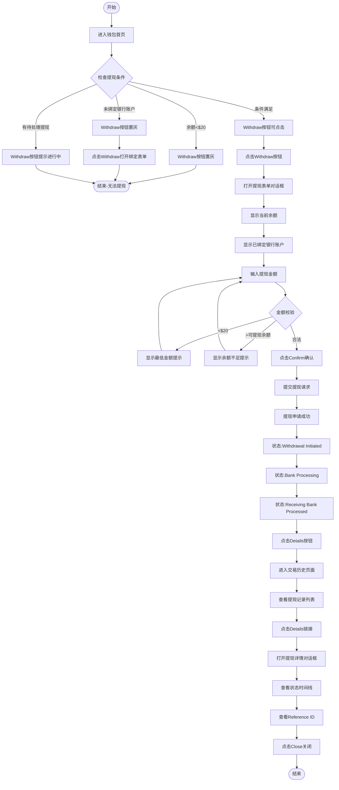

# 提现业务流程

> **业务目标**: 让用户能够安全快速地将钱包余额提现到已绑定的银行账户

---

## 1. 完整流程图

---

## 2. 详细步骤与观测点

### 步骤1: 检查Withdraw按钮状态
**页面位置**: 钱包首页 > Withdraw按钮

**操作**:
1. 登录并进入钱包首页
2. 点击眼睛图标查看当前余额
3. 查看Withdraw按钮状态

**观测点**:
- ✅ 余额≥$20 且 已绑定银行账户 且 无待处理提现：Withdraw按钮为可点击状态（深色）
- ✅ 余额<$20：Withdraw按钮置灰（灰色，包含CSS类`AmountArea_disable__DvFFP`），点击无反应或提示"Minimum withdrawal amount is $20"
- ✅ 未绑定银行账户：Withdraw按钮置灰（灰色），点击打开"Bind Bank Account"对话框
- ✅ 有待处理提现：Withdraw按钮提示"Withdrawal in progress, please try later"

**验证方法**:
- 余额≥$20且已绑定银行账户且无待处理提现时，验证按钮是否可点击
- 余额<$20时，验证按钮是否置灰
- 未绑定银行账户时，验证点击是否打开绑定表单
- 有待处理提现时，验证是否显示进行中提示

**关联规则**: [提现规则.md - 3.1 Withdraw按钮状态规则](../../../业务规则库/钱包模块/提现规则.md#31-withdraw按钮状态规则)

---

### 步骤2: 打开提现表单
**页面位置**: 钱包首页

**操作**:
1. 确认提现条件满足（余额≥$20、已绑定银行账户、无待处理提现）
2. 点击Withdraw按钮
3. 观察提现表单对话框

**观测点**:
- ✅ 打开提现表单对话框
- ✅ 对话框标题为"Withdraw to Bank Account"
- ✅ 显示提现金额输入框（Withdraw amount）
- ✅ 显示已绑定的银行账户（后四位，只读）
- ✅ 显示Confirm确认按钮
- ✅ 显示X关闭按钮

**验证方法**:
- 点击Withdraw按钮，验证是否打开提现表单
- 验证对话框标题是否正确
- 验证是否显示金额输入框和银行账户信息

**关联规则**: [提现规则.md - 3.3 提现表单规则](../../../业务规则库/钱包模块/提现规则.md#33-提现表单规则)

---

### 步骤3: 输入提现金额
**页面位置**: 提现表单对话框

**操作**:
1. 在Withdraw amount字段输入提现金额
2. 测试不同金额场景：
   - 输入$20.00（最低金额）
   - 输入$10.00（低于最低金额）
   - 输入超过可提现余额的金额
   - 输入合法金额（如$50.00）

**观测点**:
- ✅ 金额输入框支持手动输入
- ✅ 金额输入框支持复制粘贴
- ✅ 金额自动格式化为2位小数
- ✅ 输入非法字符时自动过滤
- ❌ 输入<$20：显示错误提示"Minimum withdrawal amount is $20"
- ❌ 输入>可提现余额：显示错误提示"Insufficient balance"
- ✅ 输入合法金额：无错误提示，可点击Confirm

**验证方法**:
- 输入$20.00，验证是否可提交
- 输入$10.00，验证是否显示最低金额提示
- 输入超额金额，验证是否显示余额不足提示
- 输入合法金额，验证是否可正常提交

**关联规则**: [提现规则.md - 3.2 提现金额规则](../../../业务规则库/钱包模块/提现规则.md#32-提现金额规则)

---

### 步骤4: 确认提现
**页面位置**: 提现表单对话框

**操作**:
1. 输入合法提现金额（如$20.00）
2. 点击Confirm确认按钮
3. 观察提交结果

**观测点**:
- ✅ 点击Confirm后提交提现请求
- ✅ 对话框关闭
- ✅ 显示成功提示（Toast或Alert）："Withdrawal submitted successfully"
- ✅ 钱包余额相应减少
- ✅ Withdraw按钮变为置灰或提示"Withdrawal in progress, please try later"

**验证方法**:
- 点击Confirm，验证是否提交成功
- 验证对话框是否关闭
- 验证是否显示成功提示
- 刷新页面，验证余额是否减少

**关联规则**: [提现规则.md - 2.1 主流程](../../../业务规则库/钱包模块/提现规则.md#21-主流程)

---

### 步骤5: 查看提现状态时间线
**页面位置**: 钱包首页

**操作**:
1. 提现申请提交成功后
2. 观察提现状态变化（通过刷新页面或进入Details页面）

**观测点**:
- ✅ 初始状态：Withdrawal Initiated（提现申请已提交）
- ✅ 几秒后：Bank Processing（银行处理中）
- ⚪ 最终状态：Receiving Bank Processed（收款银行已处理，0-3个工作日）

**验证方法**:
- 提交提现后立即查看，验证状态是否为Withdrawal Initiated
- 等待几秒后刷新，验证状态是否变为Bank Processing
- 等待银行处理完成，验证状态是否变为Receiving Bank Processed

**关联规则**: [提现规则.md - 3.4 提现状态流转规则](../../../业务规则库/钱包模块/提现规则.md#34-提现状态流转规则)

---

### 步骤6: 进入交易历史页面
**页面位置**: 钱包首页

**操作**:
1. 点击钱包首页的Details按钮
2. 观察交易历史页面

**观测点**:
- ✅ 页面跳转至交易历史页面（https://aepub.58v5.cn/biz/en/wallet/details）
- ✅ 页面标题显示"Transaction History"或类似标题
- ✅ 显示提现记录列表
- ✅ 记录按时间倒序排列（最新的在最上方）

**验证方法**:
- 点击Details按钮，验证是否跳转到交易历史页面
- 验证URL是否正确
- 验证是否显示提现记录列表

**关联规则**: [提现规则.md - 3.5 交易历史规则](../../../业务规则库/钱包模块/提现规则.md#35-交易历史规则)

---

### 步骤7: 查看提现记录
**页面位置**: 交易历史页面

**操作**:
1. 查看提现记录列表
2. 观察每条记录的显示内容

**观测点**:
- ✅ 每条记录显示：提现金额（如`-$20.00`，负数表示支出）+ 状态（Bank Processing / Receiving Bank Processed）+ 时间（YYYY-MM-DD HH:mm:ss）+ Details链接
- ✅ 记录按时间倒序排列
- ✅ Details链接可点击

**验证方法**:
- 验证提现记录是否显示
- 验证金额格式是否正确（负数）
- 验证状态是否正确
- 验证时间格式是否正确
- 验证Details链接是否可点击

**关联规则**: [提现规则.md - 3.5 交易历史规则](../../../业务规则库/钱包模块/提现规则.md#35-交易历史规则)

---

### 步骤8: 查看提现详情
**页面位置**: 交易历史页面

**操作**:
1. 点击某条提现记录的Details链接
2. 观察提现详情对话框

**观测点**:
- ✅ 打开提现详情对话框
- ✅ 对话框标题为"Withdraw to Bank Account"
- ✅ 显示提现金额（如`$20.00`）
- ✅ 显示提现状态时间线：
  - ✅ Withdrawal Initiated + 时间戳（如2026-03-05 12:33:24）
  - ✅ Bank Processing + 时间戳（如2026-03-05 12:33:27）
  - ⚪ Receiving Bank Processed（最终状态，无时间戳）
- ✅ 已完成的状态节点显示✅图标
- ✅ 未完成的状态节点显示⚪空心圆圈
- ✅ 显示提现到的银行账户（后四位，如`************7854`）
- ✅ 显示Reference ID（如`2029414945641771008`）
- ✅ 显示Help链接
- ✅ 显示Close关闭按钮

**验证方法**:
- 点击Details链接，验证是否打开详情对话框
- 验证对话框标题是否正确
- 验证提现金额是否正确
- 验证状态时间线是否完整
- 验证Reference ID是否显示
- 验证Help链接和Close按钮是否可点击

**关联规则**: [提现规则.md - 3.6 提现详情规则](../../../业务规则库/钱包模块/提现规则.md#36-提现详情规则)

---

## 3. 流程完整性验证清单

### Withdraw按钮状态
- [ ] 余额≥$20且已绑定银行账户且无待处理提现时按钮是否可点击
- [ ] 余额<$20时按钮是否置灰
- [ ] 余额<$20时按钮是否包含CSS类`AmountArea_disable__DvFFP`
- [ ] 余额<$20时点击是否无反应或提示最低金额
- [ ] 未绑定银行账户时按钮是否置灰
- [ ] 未绑定银行账户时点击是否打开绑定表单
- [ ] 有待处理提现时按钮是否提示"Withdrawal in progress, please try later"

### 提现表单
- [ ] 点击Withdraw按钮是否打开提现表单
- [ ] 对话框标题是否为"Withdraw to Bank Account"
- [ ] 是否显示Withdraw amount输入框
- [ ] 是否显示已绑定的银行账户（后四位）
- [ ] 是否显示Confirm确认按钮
- [ ] 是否显示X关闭按钮

### 提现金额输入
- [ ] 金额输入框是否支持手动输入
- [ ] 金额输入框是否支持复制粘贴
- [ ] 金额是否自动格式化为2位小数
- [ ] 输入非法字符是否自动过滤
- [ ] 输入<$20是否显示最低金额提示
- [ ] 输入>可提现余额是否显示余额不足提示
- [ ] 输入合法金额是否可点击Confirm

### 提现提交
- [ ] 点击Confirm是否提交提现请求
- [ ] 对话框是否关闭
- [ ] 是否显示成功提示
- [ ] 钱包余额是否相应减少
- [ ] Withdraw按钮是否变为置灰或提示进行中

### 提现状态流转
- [ ] 初始状态是否为Withdrawal Initiated
- [ ] 几秒后状态是否变为Bank Processing
- [ ] 最终状态是否为Receiving Bank Processed
- [ ] 已完成状态是否显示✅图标+时间戳
- [ ] 未完成状态是否显示⚪空心圆圈

### 交易历史
- [ ] 点击Details按钮是否跳转到交易历史页面
- [ ] URL是否为/biz/en/wallet/details
- [ ] 是否显示提现记录列表
- [ ] 记录是否按时间倒序排列
- [ ] 每条记录是否显示金额+状态+时间+Details链接
- [ ] 金额格式是否为负数（如-$20.00）
- [ ] Details链接是否可点击

### 提现详情
- [ ] 点击Details链接是否打开详情对话框
- [ ] 对话框标题是否为"Withdraw to Bank Account"
- [ ] 是否显示提现金额
- [ ] 是否显示状态时间线
- [ ] 状态时间线是否包含3个状态节点
- [ ] 已完成状态是否显示✅图标+时间戳
- [ ] 未完成状态是否显示⚪空心圆圈
- [ ] 是否显示银行账户后四位
- [ ] 是否显示Reference ID
- [ ] Reference ID是否可复制
- [ ] 是否显示Help链接
- [ ] 是否显示Close关闭按钮
- [ ] 点击Close是否关闭对话框

### 余额显示
- [ ] 默认状态余额是否为隐藏显示`****`
- [ ] 点击眼睛图标是否显示实际余额和汇率
- [ ] 再次点击眼睛图标是否恢复隐藏
- [ ] 余额显示格式是否为`$金额`
- [ ] 汇率转换格式是否为`≈ 货币代码 金额`

---

## 4. 关联文档

- [钱包业务全景](./钱包业务全景.md)
- [提现规则.md](../../业务规则库/钱包模块/提现规则.md)
- [银行账户管理业务流程](./银行账户管理业务流程.md)

---

## 5. 变更历史

| 日期 | 版本 | 变更内容 | 变更人 |
|-----|------|---------|--------|
| 2026-03-24 | v1.0 | 初始版本，基于Wallet_BankAccount_Withdrawal测试用例（48条）生成 | AI |
