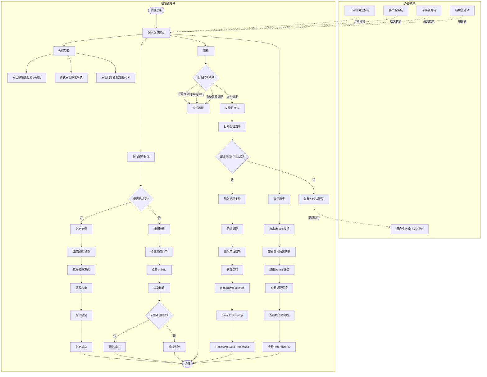
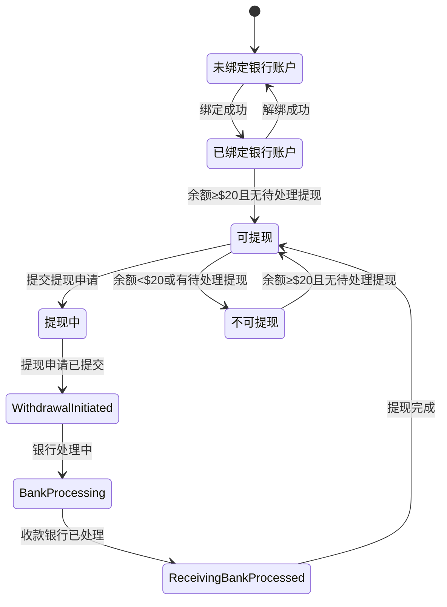

# 钱包业务全景

> **业务目标**: 为卖家/发布者提供安全便捷的资金管理服务，支持余额查看、银行账户管理、提现等核心功能

---

## 1. 业务概述

### 1.1 业务定位
- **业务类型**: 资金管理模块
- **服务对象**: 卖家/发布者（有收入需要提现）
- **核心价值**: 安全管理收入，快速提现到银行账户

### 1.2 核心功能
- 余额显示与隐藏
- 银行账户绑定/解绑
- 提现到银行账户
- 交易历史查询
- 提现详情查看

### 1.3 业务范围
- **包含**: 余额管理、银行账户管理、提现、交易历史
- **不包含**: 充值（通过其他方式）、退款、争议处理

---

## 2. 用户角色与权限

| 角色 | 权限范围 | 说明 |
|------|----------|------|
| 卖家/发布者 | 查看余额、绑定/解绑银行账户、提现、查看交易历史 | 需要登录 |
| 游客 | 无权限 | 需要登录后访问 |

---

## 3. 业务流程全景图

---

## 4. 核心业务流程概览

### 4.1 银行账户管理流程
**业务目标**: 让用户能够安全便捷地绑定和管理银行账户

**核心步骤**:
1. 查看银行账户状态（已绑定/未绑定）
2. 未绑定时点击"+ Add Bank Account"打开绑定表单
3. 选择国家/地区和货币
4. 选择转账方式（ACH/Fedwire/FedNow/SWIFT）
5. 填写银行账户信息（routing number、账号、持卡人姓名等）
6. 填写联系信息（邮箱、地址）
7. 提交绑定
8. 已绑定时可通过三点菜单解绑（需二次确认）

**关键观测点**:
- ✅ 已绑定时显示账号后四位+三点菜单
- ✅ 未绑定时显示"+ Add Bank Account"按钮
- ✅ 绑定表单字段完整且校验正确
- ✅ 有待处理提现时禁止解绑

**详细流程文档**: [银行账户管理业务流程](./银行账户管理业务流程.md)

---

### 4.2 提现流程
**业务目标**: 让用户能够安全快速地将钱包余额提现到已绑定的银行账户

**核心步骤**:
1. 检查提现条件（余额≥$20、已绑定银行账户、无待处理提现）
2. 点击Withdraw按钮打开提现表单
3. 输入提现金额（最低$20）
4. 确认提现
5. 提现申请提交成功
6. 提现状态流转：Withdrawal Initiated → Bank Processing → Receiving Bank Processed
7. 查看交易历史
8. 查看提现详情（状态时间线、Reference ID）

**关键观测点**:
- ✅ 余额≥$20且已绑定银行账户且无待处理提现时Withdraw按钮可点击
- ✅ 余额<$20时Withdraw按钮置灰
- ✅ 提现金额≥$20且≤可提现余额
- ✅ 提现状态正确流转
- ✅ 交易历史按时间倒序显示

**详细流程文档**: [提现业务流程](./提现业务流程.md)

---

### 4.3 余额显示流程
**业务目标**: 保护用户隐私，同时方便查看余额

**核心步骤**:
1. 默认状态余额隐藏显示`****`
2. 点击眼睛图标显示实际余额和汇率转换
3. 再次点击眼睛图标恢复隐藏

**关键观测点**:
- ✅ 默认状态余额为隐藏
- ✅ 点击眼睛图标显示实际余额（如`$4,934.84`）
- ✅ 显示汇率转换（如`≈ AED 17928.24`）
- ✅ 再次点击恢复隐藏

**详细规则文档**: [充值规则.md - 3.1 余额显示规则](../../业务规则库/钱包模块/充值规则.md#31-余额显示规则)

---

## 5. 页面拓扑与跳转

### 5.1 页面入口矩阵

| 页面名称 | 页面路径 | 入口位置 | 访问权限 |
|---------|---------|---------|---------|
| 钱包首页 | /biz/en/wallet/home | 导航菜单 > Wallet | 卖家/发布者（需登录） |
| 交易历史页 | /biz/en/wallet/details | 钱包首页 > Details按钮 | 卖家/发布者（需登录） |

### 5.2 页面跳转流程图

### 5.3 页面关系详解

#### 钱包首页 → 交易历史页
- **触发条件**: 用户点击钱包首页的Details按钮
- **跳转方式**: 页面跳转
- **URL格式**: `/biz/en/wallet/details`
- **参数说明**: 无参数
- **权限要求**: 需要登录
- **数据传递**: 无

#### 交易历史页 → 钱包首页
- **触发条件**: 用户点击浏览器后退按钮或导航菜单
- **跳转方式**: 页面跳转或浏览器后退
- **URL格式**: `/biz/en/wallet/home`
- **参数说明**: 无参数
- **权限要求**: 需要登录
- **数据传递**: 无

---

## 6. 业务数据流转

### 6.1 状态流转

### 6.2 用户操作与数据变化

| 操作 | 触发条件 | 数据变化 | UI变化 |
|-----|---------|---------|--------|
| 绑定银行账户 | 点击"+ Add Bank Account"并提交表单 | 银行账户信息保存到数据库 | Bank Account区域显示账号后四位+三点菜单 |
| 解绑银行账户 | 点击三点菜单>Unbind>Confirm | 银行账户信息从数据库删除 | Bank Account区域显示"+ Add Bank Account"按钮 |
| 提现 | 点击Withdraw并提交提现表单 | 钱包余额减少，创建提现记录 | 余额更新，Withdraw按钮置灰或提示进行中 |
| 显示余额 | 点击眼睛图标 | 无数据变化 | 余额从`****`变为实际金额+汇率转换 |
| 隐藏余额 | 再次点击眼睛图标 | 无数据变化 | 余额从实际金额变为`****` |

### 6.3 关键业务数据

#### 银行账户数据
| 字段名 | 类型 | 必填 | 说明 | 示例 |
|--------|------|-----|------|------|
| country | String | 是 | 国家/地区 | United States of America |
| currency | String | 是 | 货币 | USD |
| transfer_method | String | 是 | 转账方式 | ACH |
| routing_number | String | 是 | routing number | 121000248 |
| account_number | String | 是 | 银行账号 | 5354563134257854 |
| account_holder_name | String | 是 | 持卡人姓名 | Mastercard |
| email | String | 是 | 邮箱 | wangyongli@58.com |
| address | String | 是 | 地址 | 19238 Stonehue |
| city | String | 是 | 城市 | New York |

#### 提现记录数据
| 字段名 | 类型 | 必填 | 说明 | 示例 |
|--------|------|-----|------|------|
| amount | Decimal | 是 | 提现金额 | 20.00 |
| currency | String | 是 | 货币 | USD |
| status | String | 是 | 提现状态 | Bank Processing |
| reference_id | String | 是 | Reference ID | 2029414945641771008 |
| bank_account | String | 是 | 银行账户后四位 | ************7854 |
| created_at | DateTime | 是 | 创建时间 | 2026-03-05 12:33:24 |
| updated_at | DateTime | 是 | 更新时间 | 2026-03-05 12:33:27 |

#### 余额数据
| 字段名 | 类型 | 必填 | 说明 | 示例 |
|--------|------|-----|------|------|
| balance | Decimal | 是 | 钱包余额 | 4934.84 |
| currency | String | 是 | 货币 | USD |
| exchange_rate | Decimal | 否 | 汇率 | 3.63 |
| converted_amount | Decimal | 否 | 汇率转换金额 | 17928.24 |
| converted_currency | String | 否 | 转换后货币 | AED |

---

## 7. 关键业务规则索引

### 7.1 银行账户规则
- [银行账户显示规则](../../业务规则库/钱包模块/银行账户规则.md#31-银行账户显示规则)
- [解绑规则](../../业务规则库/钱包模块/银行账户规则.md#32-解绑规则)
- [绑定表单规则](../../业务规则库/钱包模块/银行账户规则.md#33-绑定表单规则)
- [转账方式规则](../../业务规则库/钱包模块/银行账户规则.md#34-转账方式规则)
- [字段校验规则](../../业务规则库/钱包模块/银行账户规则.md#35-字段校验规则)

### 7.2 提现规则
- [Withdraw按钮状态规则](../../业务规则库/钱包模块/提现规则.md#31-withdraw按钮状态规则)
- [提现金额规则](../../业务规则库/钱包模块/提现规则.md#32-提现金额规则)
- [提现表单规则](../../业务规则库/钱包模块/提现规则.md#33-提现表单规则)
- [提现状态流转规则](../../业务规则库/钱包模块/提现规则.md#34-提现状态流转规则)
- [交易历史规则](../../业务规则库/钱包模块/提现规则.md#35-交易历史规则)
- [提现详情规则](../../业务规则库/钱包模块/提现规则.md#36-提现详情规则)

### 7.3 余额显示规则
- [余额显示规则](../../业务规则库/钱包模块/充值规则.md#31-余额显示规则)

---

## 8. 业务FAQ

### Q1: 最低提现金额是多少？
A: 最低提现金额为$20.00，低于此金额无法提现。

### Q2: 提现多久到账？
A: 根据转账方式不同，到账时间为0-3个工作日：
- ACH: 0-2个工作日
- Fedwire: 0-1个工作日
- FedNow: 0-1个工作日
- SWIFT: 0-3个工作日

### Q3: 可以同时有多笔待处理提现吗？
A: 不可以，一次只能有一笔待处理提现。有待处理提现时，Withdraw按钮会提示"Withdrawal in progress, please try later"。

### Q4: 有待处理提现时可以解绑银行账户吗？
A: 不可以，有待处理提现时禁止解绑银行账户，会显示错误提示"Cannot unbind bank account with pending withdrawal"。

### Q5: 提现手续费是多少？
A: 根据转账方式不同，手续费不同：
- ACH: 3.00 USD
- Fedwire: 15.00 USD
- FedNow: 3.00 USD
- SWIFT: 25.00 USD (OUR) or 15.00 USD (SHA)

### Q6: 如何查看提现状态？
A: 点击钱包首页的Details按钮进入交易历史页面，点击提现记录的Details链接查看详细状态时间线。

### Q7: Reference ID有什么用？
A: Reference ID用于查询提现状态或联系客服时提供，可以在提现详情对话框中复制。

### Q8: 余额为什么默认隐藏？
A: 为了保护用户隐私，余额默认隐藏显示为`****`，需要点击眼睛图标才能查看实际余额。

### Q9: 可以绑定多个银行账户吗？
A: 当前版本仅支持绑定一个银行账户，如需更换需先解绑再绑定新账户。

### Q10: 提现失败怎么办？
A: 如果提现失败，请检查：1) 银行账户信息是否正确；2) 余额是否充足；3) 是否有待处理提现。如仍有问题，请联系客服并提供Reference ID。

---

## 9. 业务指标

### 9.1 核心指标
- 提现成功率：提现成功笔数 / 提现申请总笔数
- 平均提现金额：提现总金额 / 提现笔数
- 银行账户绑定率：已绑定银行账户用户数 / 总用户数
- 提现到账时长：从提现申请到Receiving Bank Processed的平均时长

### 9.2 漏斗指标
1. 进入钱包首页用户数
2. 点击Withdraw按钮用户数
3. 打开提现表单用户数
4. 提交提现申请用户数
5. 提现成功用户数

---

## 10. 已知问题与风险

### 10.1 产品待确认问题
- 暂无

### 10.2 技术风险
- 提现接口依赖Airwallex支付服务，如服务不可用会影响提现功能
- 银行账户绑定表单在iframe中加载，可能存在跨域问题

### 10.3 测试过程中发现的问题
- 暂无

---

## 11. 变更历史

| 日期 | 版本 | 变更内容 | 变更人 |
|-----|------|---------|--------|
| 2026-03-24 | v1.0 | 初始版本，基于Wallet_BankAccount_Withdrawal测试用例（48条）生成 | AI |
