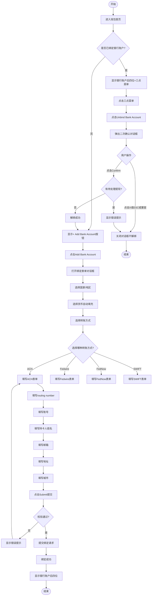

# 银行账户管理业务流程

> **业务目标**: 让用户能够安全便捷地绑定和管理银行账户，为提现功能提供基础支持

---

## 1. 完整流程图

---

## 2. 详细步骤与观测点

### 步骤1: 查看银行账户显示状态
**页面位置**: 钱包首页 > Bank Account区域

**操作**:
1. 登录并进入钱包首页（https://aepub.58v5.cn/biz/en/wallet/home）
2. 查看Bank Account区域

**观测点**:
- ✅ 已绑定状态：显示银行卡图标 + 账号后四位（如`************7854`）+ 三点菜单图标
- ✅ 未绑定状态：显示`+ Add Bank Account`按钮/链接
- ✅ 按钮/链接可点击

**验证方法**:
- 已绑定账户时，验证是否显示账号后四位
- 未绑定账户时，验证是否显示添加按钮
- 验证三点菜单图标是否可点击

**关联规则**: [银行账户规则.md - 3.1 银行账户显示规则](../../../业务规则库/钱包模块/银行账户规则.md#31-银行账户显示规则)

---

### 步骤2: 解绑银行账户（二次确认）
**页面位置**: 钱包首页 > Bank Account区域

**操作**:
1. 点击银行账户右侧的三点菜单图标
2. 点击"Unbind Bank Account"
3. 观察二次确认对话框

**观测点**:
- ✅ 点击三点菜单后显示"Unbind Bank Account"选项
- ✅ 点击后弹出确认对话框
- ✅ 对话框标题为"Unbind"
- ✅ 对话框内容为"Are you sure to unbind the bank account?"
- ✅ 显示"Confirm"按钮
- ✅ 显示X关闭按钮

**验证方法**:
- 点击三点菜单，验证是否显示解绑选项
- 点击解绑选项，验证是否弹出确认对话框
- 验证对话框标题和内容是否正确

**关联规则**: [银行账户规则.md - 3.2 解绑规则](../../../业务规则库/钱包模块/银行账户规则.md#32-解绑规则)

---

### 步骤3: 确认解绑或取消
**页面位置**: 解绑确认对话框

**操作**:
1. 在确认对话框中选择操作：
   - 点击"Confirm"按钮
   - 或点击X按钮
   - 或按ESC键
   - 或点击蒙层区域

**观测点**:
- ✅ 点击Confirm且无待处理提现：对话框关闭，解绑成功，显示"+ Add Bank Account"按钮
- ✅ 点击Confirm但有待处理提现：显示错误提示"Cannot unbind bank account with pending withdrawal"
- ✅ 点击X按钮：对话框关闭，银行账户仍保持绑定状态
- ✅ 按ESC键：对话框关闭，银行账户仍保持绑定状态
- ✅ 点击蒙层：对话框关闭，银行账户仍保持绑定状态

**验证方法**:
- 无待处理提现时点击Confirm，验证是否解绑成功
- 有待处理提现时点击Confirm，验证是否显示错误提示
- 点击X、ESC、蒙层，验证是否取消解绑

**关联规则**: [银行账户规则.md - 3.2 解绑规则](../../../业务规则库/钱包模块/银行账户规则.md#32-解绑规则)

---

### 步骤4: 打开绑定银行账户表单
**页面位置**: 钱包首页 > Bank Account区域

**操作**:
1. 点击"+ Add Bank Account"按钮
2. 观察绑定表单对话框

**观测点**:
- ✅ 打开银行账户绑定表单对话框
- ✅ 对话框标题为"Bind Bank Account"
- ✅ 副标题为"Bank account"
- ✅ 显示初始字段：
  - Account country / region（下拉框，占位符："Select recipient's bank country / region"）
  - Account currency（下拉框，占位符："Select recipient's bank account currency"）
- ✅ 显示Submit提交按钮
- ✅ 显示右上角X关闭按钮
- ✅ 表单内容在iframe中加载

**验证方法**:
- 点击添加按钮，验证是否打开绑定表单
- 验证对话框标题和副标题是否正确
- 验证初始字段是否显示

**关联规则**: [银行账户规则.md - 3.3 绑定表单规则](../../../业务规则库/钱包模块/银行账户规则.md#33-绑定表单规则)

---

### 步骤5: 选择国家和货币
**页面位置**: 绑定银行账户表单对话框

**操作**:
1. 点击"Account country / region"下拉框
2. 从列表中选择"United States of America"
3. 观察"Account currency"字段变化

**观测点**:
- ✅ "Account country / region"显示"United States of America"
- ✅ "Account currency"自动填充为"USD"（带美国国旗图标）
- ✅ 自动展开"Transfer method"区域

**验证方法**:
- 选择美国，验证货币是否自动填充为USD
- 验证是否自动展开转账方式选择区域

**关联规则**: [银行账户规则.md - 3.3 绑定表单规则](../../../业务规则库/钱包模块/银行账户规则.md#33-绑定表单规则)

---

### 步骤6: 选择转账方式
**页面位置**: 绑定银行账户表单 > Transfer method区域

**操作**:
1. 查看Transfer method区域显示的转账方式选项
2. 选择一种转账方式（如ACH）

**观测点**:
- ✅ 显示多个转账方式选项：
  1. ACH：描述"Local bank transfer with a limit of 15,000,000.00 USD"，Transfer fee: 3.00 USD，Speed: 0 - 2 business days
  2. Fedwire：描述"Real-time bank transfer"，Transfer fee: 15.00 USD，Speed: 0 - 1 business days
  3. FedNow：描述"Real-time bank transfer with a limit of 500,000.00 USD"，Transfer fee: 3.00 USD，Speed: 0 - 1 business days
  4. SWIFT：描述"International bank transfer"，Transfer fee: 25.00 USD (OUR) or 15.00 USD (SHA)，Speed: 0 - 3 business days
- ✅ 每个选项右侧显示"Select"按钮

**验证方法**:
- 验证是否显示所有转账方式选项
- 验证每个选项的描述、费用、速度是否正确
- 点击Select按钮，验证是否展开对应的表单

**关联规则**: [银行账户规则.md - 3.4 转账方式规则](../../../业务规则库/钱包模块/银行账户规则.md#34-转账方式规则)

---

### 步骤7: 填写ACH表单
**页面位置**: 绑定银行账户表单 > ACH表单

**操作**:
1. 在"ACH routing number"字段输入数字（如"121000"）
2. 在"Bank account number"字段输入"5354563134257854"
3. 在"Name of account holder"字段输入"Mastercard"
4. 在"Nickname Optional"字段输入"liwenfeng01test"（可选）
5. 在"Email address"字段输入"wangyongli@58.com"
6. 在"Country or region"下拉框选择"United States of America"
7. 在"Address"字段输入至少3个字母（如"ayi"）
8. 从地址自动补全列表中选择一个地址
9. 确认"City"字段已填写（自动填充或手动输入）

**观测点**:
- ✅ ACH routing number输入后显示匹配的银行选项列表（自动补全）
- ✅ Address输入3个字母后显示地址自动补全列表
- ✅ 选择地址后City字段自动填充（如果地址包含城市信息）
- ✅ City未自动填充时可手动输入
- ✅ 所有必填字段均已填写

**验证方法**:
- 输入routing number，验证是否显示银行列表
- 输入地址，验证是否显示自动补全列表
- 选择地址，验证City是否自动填充
- 验证所有必填字段是否可正常输入

**关联规则**: [银行账户规则.md - 3.4 转账方式规则](../../../业务规则库/钱包模块/银行账户规则.md#34-转账方式规则)

---

### 步骤8: 提交绑定
**页面位置**: 绑定银行账户表单

**操作**:
1. 填写完所有必填字段
2. 点击Submit提交按钮
3. 观察提交结果

**观测点**:
- ✅ 所有字段校验通过：对话框关闭，显示成功提示（Toast或Alert），Bank Account区域显示新绑定的银行账户后四位
- ❌ Bank account number为空：提交被阻止，显示"This field is required"
- ❌ Name of account holder为空：提交被阻止，显示必填提示
- ❌ Email address格式错误：提交被阻止，显示"Invalid email format"
- ✅ 快速连续点击提交：仅触发一次提交请求，提交按钮进入loading或禁用状态

**验证方法**:
- 填写完整合法信息提交，验证是否绑定成功
- 必填字段为空提交，验证是否显示错误提示
- 邮箱格式错误提交，验证是否显示格式错误提示
- 快速连续点击提交，验证是否防重复提交

**关联规则**: [银行账户规则.md - 3.5 字段校验规则](../../../业务规则库/钱包模块/银行账户规则.md#35-字段校验规则)

---

## 3. 流程完整性验证清单

### 银行账户显示
- [ ] 已绑定时是否显示账号后四位
- [ ] 已绑定时是否显示三点菜单图标
- [ ] 未绑定时是否显示"+ Add Bank Account"按钮
- [ ] 按钮/链接是否可点击

### 解绑流程
- [ ] 点击三点菜单是否显示"Unbind Bank Account"选项
- [ ] 点击解绑是否弹出二次确认对话框
- [ ] 对话框标题是否为"Unbind"
- [ ] 对话框内容是否为"Are you sure to unbind the bank account?"
- [ ] 是否显示Confirm按钮和X关闭按钮
- [ ] 点击Confirm且无待处理提现是否解绑成功
- [ ] 点击Confirm但有待处理提现是否显示错误提示
- [ ] 点击X按钮是否关闭对话框且不解绑
- [ ] 按ESC键是否关闭对话框且不解绑
- [ ] 点击蒙层是否关闭对话框且不解绑
- [ ] 解绑成功后是否显示"+ Add Bank Account"按钮

### 绑定流程
- [ ] 点击"+ Add Bank Account"是否打开绑定表单
- [ ] 对话框标题是否为"Bind Bank Account"
- [ ] 副标题是否为"Bank account"
- [ ] 是否显示Account country / region下拉框
- [ ] 是否显示Account currency下拉框
- [ ] 是否显示Submit提交按钮
- [ ] 是否显示右上角X关闭按钮
- [ ] 表单内容是否在iframe中加载

### 国家和货币选择
- [ ] 选择United States of America是否自动填充USD
- [ ] 货币是否带国旗图标
- [ ] 是否自动展开Transfer method区域

### 转账方式选择
- [ ] 是否显示ACH选项
- [ ] 是否显示Fedwire选项
- [ ] 是否显示FedNow选项
- [ ] 是否显示SWIFT选项
- [ ] 每个选项是否显示描述、费用、速度
- [ ] 每个选项右侧是否显示Select按钮
- [ ] 点击Select是否展开对应表单

### ACH表单填写
- [ ] ACH routing number输入后是否显示银行列表
- [ ] Bank account number字段是否可正常输入
- [ ] Name of account holder字段是否可正常输入
- [ ] Nickname Optional字段是否可选
- [ ] Email address字段是否可正常输入
- [ ] Country or region下拉框是否可选择
- [ ] Address输入3个字母后是否显示自动补全列表
- [ ] 选择地址后City是否自动填充
- [ ] City未自动填充时是否可手动输入

### 字段校验
- [ ] Bank account number为空提交是否显示必填提示
- [ ] Name of account holder为空提交是否显示必填提示
- [ ] Email address格式错误提交是否显示格式错误提示
- [ ] 所有必填字段填写后是否可提交

### 防重复提交
- [ ] 快速连续点击提交是否仅触发一次
- [ ] 提交按钮是否进入loading或禁用状态
- [ ] 是否不会创建重复的银行账户绑定

### 绑定成功
- [ ] 对话框是否关闭
- [ ] 是否显示成功提示
- [ ] Bank Account区域是否显示新绑定的银行账户后四位
- [ ] 是否显示三点菜单图标

---

## 4. 关联文档

- [钱包业务全景](./钱包业务全景.md)
- [银行账户规则.md](../../业务规则库/钱包模块/银行账户规则.md)
- [提现业务流程](./提现业务流程.md)

---

## 5. 变更历史

| 日期 | 版本 | 变更内容 | 变更人 |
|-----|------|---------|--------|
| 2026-03-24 | v1.0 | 初始版本，基于Wallet_BankAccount_Withdrawal测试用例（48条）生成 | AI |
