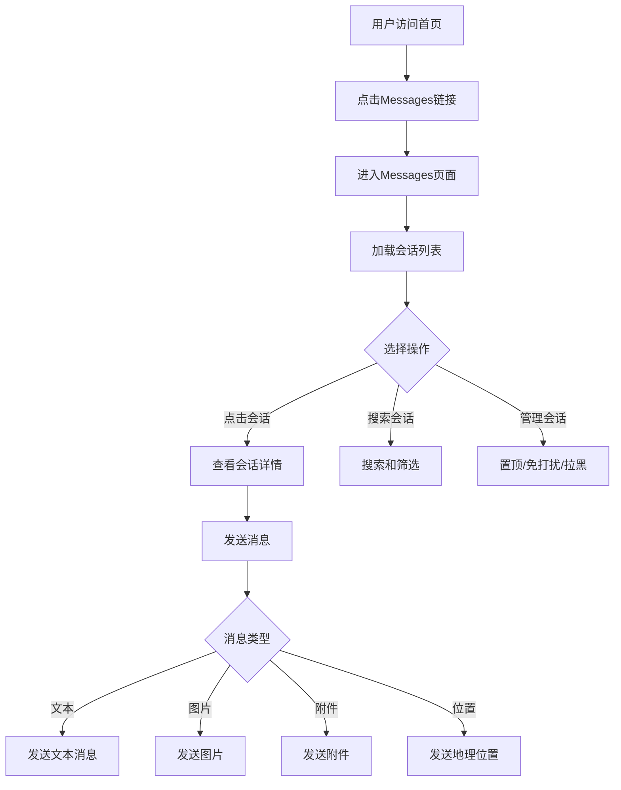

# Messages消息中心规则

## 1. 功能概述

### 业务价值
- **即时沟通平台**：为买卖双方提供实时消息沟通能力，促进交易达成
- **会话管理**：统一管理所有聊天会话，支持多种消息类型（文本、图片、附件、位置）
- **高效交互**：提供搜索、筛选、置顶、免打扰等功能，提升沟通效率

### 用户角色
- **卖家（Seller）**：接收买家咨询，回复消息，管理会话
- **买家（Buyer）**：向卖家发起咨询，发送消息
- **双方用户**：均可发送文本、图片、附件、位置信息

### 入口位置
- **主入口**：首页导航栏"Messages"链接
- **目标页面**：`https://aepub.ok.com/biz/en/chat`
- **前置条件**：用户需登录

---

## 2. 核心流程

### 主流程

### 异常流程
- **Session失效** → 跳转登录页 → 重新登录 → 返回Messages页面
- **网络断开** → 显示连接失败提示 → 自动重试或手动刷新
- **发送失败** → 显示发送失败标识 → 支持重新发送
- **拉黑后沟通** → 显示拉黑半层提示 → 提供Unblock选项

---

## 3. 业务规则

### 3.1 会话列表规则

| 规则ID | 规则描述 | 优先级 | 验证用例 |
|--------|---------|--------|---------|
| R001 | 会话按时间倒序排列（最新消息在最前） | P0 | TC002, TC026 |
| R002 | 置顶会话显示在列表最前方，标记toplist@2x.png图标 | P1 | TC011, TC027 |
| R003 | 免打扰会话显示listMute@2x.png图标 | P1 | TC012, TC028 |
| R004 | 会话项必须包含：头像、用户名、最后消息预览、时间戳 | P0 | TC002 |
| R005 | 未读消息显示红色气泡标识（数字或dot） | P1 | TC025 |
| R006 | 会话列表支持向下滑动加载更多 | P1 | TC023 |
| R007 | 点击会话后，详情页用户昵称必须与会话列表一致 | P0 | TC002 |

### 3.2 消息发送规则

| 规则ID | 规则描述 | 优先级 | 验证用例 |
|--------|---------|--------|---------|
| R101 | Send按钮初始状态为disabled | P1 | TC034 |
| R102 | 输入框有文字时，Send按钮变为enabled | P1 | TC035 |
| R103 | 清空输入框后，Send按钮恢复disabled | P1 | TC035 |
| R104 | 支持发送文本消息（包括多行文本） | P0 | TC014, TC021 |
| R105 | 支持发送图片（jpg/png/jpeg格式） | P0 | TC031, TC032 |
| R106 | 支持发送附件（9种格式：pdf/doc/docx/xls/xlsx/ppt/pptx/txt/zip） | P1 | TC029, TC030 |
| R107 | 支持发送地理位置（Google Maps） | P2 | TC033 |
| R108 | 空消息不允许发送 | P1 | TC018 |
| R109 | 超长消息（>10000字符）应截断或提示 | P2 | TC019 |
| R110 | 特殊字符消息正常发送 | P1 | TC020 |
| R111 | URL消息自动识别为链接 | P1 | TC014A |

### 3.3 会话操作规则

| 规则ID | 规则描述 | 优先级 | 验证用例 |
|--------|---------|--------|---------|
| R201 | 点击电话图标触发拨号操作（tel:链接） | P1 | TC009 |
| R202 | 点击设置图标显示操作菜单（Block/Mute/Top） | P0 | TC010 |
| R203 | 置顶会话：点击Top → 会话移至列表顶部 + 显示toplist图标 | P1 | TC011 |
| R204 | 免打扰会话：点击Mute → 显示listMute图标 | P1 | TC012 |
| R205 | 拉黑会话：点击Block → 二次确认 → 显示拉黑半层 + Unblock按钮 | P0 | TC013 |
| R206 | 拉黑取消：点击Cancel → 取消拉黑操作 | P1 | TC013 |
| R207 | 解除拉黑：点击Unblock → 恢复正常会话 | P1 | TC013 |

### 3.4 搜索和筛选规则

| 规则ID | 规则描述 | 优先级 | 验证用例 |
|--------|---------|--------|---------|
| R301 | 支持按用户名搜索会话 | P1 | TC005 |
| R302 | 搜索结果实时显示（输入时动态过滤） | P1 | TC005 |
| R303 | 无匹配结果时显示空状态提示 | P2 | TC005 |

### 3.5 安全规则

| 规则ID | 规则描述 | 优先级 | 验证用例 |
|--------|---------|--------|---------|
| R401 | 首次进入会话显示安全提示半层 | P1 | TC008 |
| R402 | 安全提示内容包含防诈骗警示 | P1 | TC008 |
| R403 | 用户可关闭安全提示（下次仍会显示） | P2 | TC008 |
| R404 | 拉黑用户后禁止继续发送消息 | P0 | TC013 |

---

## 4. 错误处理

### 4.1 错误码定义

| 错误码 | 错误场景 | 错误信息 | 处理方式 |
|--------|---------|---------|---------|
| E001 | 未登录访问 | "Please login first" | 跳转登录页 |
| E002 | 会话列表为空 | "No conversations" | 显示空状态页 |
| E003 | 消息发送失败 | "Failed to send" | 显示重试按钮 |
| E004 | 网络连接失败 | "Network error" | 提示检查网络 |
| E005 | 文件上传失败 | "Upload failed" | 提示文件格式或大小 |
| E006 | 会话已被对方拉黑 | "You are blocked" | 显示拉黑提示 |

### 4.2 错误提示文案

| 场景 | 文案 | 语言 |
|------|------|------|
| 发送空消息 | "Message cannot be empty" | en |
| 发送超长消息 | "Message too long (max 10000 characters)" | en |
| 文件格式不支持 | "File format not supported" | en |
| 文件大小超限 | "File size exceeds limit" | en |
| 网络异常 | "Network error, please try again" | en |

---

## 5. 依赖模块

### 上游依赖（谁调用我）
- **首页导航**：用户从首页点击Messages链接进入
- **帖子详情页**：买家点击"Contact Seller"按钮发起会话
- **我的帖子页**：卖家点击帖子上的"Messages"查看买家咨询

### 下游依赖（我调用谁）
- **登录系统**：验证用户身份，获取Session
- **用户信息服务**：获取用户头像、昵称
- **消息服务**：发送/接收消息，存储会话记录
- **文件上传服务**：处理图片、附件上传
- **Google Maps API**：发送地理位置时调用

### 跨域交互说明
1. **与帖子发布模块交互**：用户可以从Messages跳转到相关帖子详情页
2. **与用户信息模块交互**：显示对方用户资料、头像
3. **与通知系统交互**：新消息触发桌面通知或推送通知

---

## 6. 已知问题

### 产品待确认问题
- **搜索功能深度**：当前仅支持用户名搜索，是否需要支持消息内容全文搜索？
- **消息撤回功能**：是否需要支持已发送消息的撤回？
- **会话归档功能**：是否需要支持会话归档以清理界面？
- **未读标识逻辑**：未读气泡的计数规则和清除时机需明确

### 技术风险
1. **大量会话加载性能** → 会话列表超过100条时可能出现卡顿
   - 缓解：懒加载 + 虚拟滚动
2. **消息发送失败重试机制** → 目前未见明确的自动重试策略
   - 缓解：需增加指数退避重试
3. **文件上传大小限制** → 未明确图片和附件的大小上限
   - 缓解：需在前端增加文件大小校验
4. **跨域消息同步** → 多设备登录时消息同步可能延迟
   - 缓解：需WebSocket长连接实时推送
5. **拉黑状态同步** → 拉黑操作是否实时同步到对方（影响对方发送）
   - 缓解：需明确拉黑双向效果

---

## 7. 变更历史

| 日期 | 版本 | 变更内容 | 变更人 |
|------|------|---------|--------|
| 2026-04-27 | v1.0 | 创建Messages消息中心业务规则文档 | AI Assistant |
