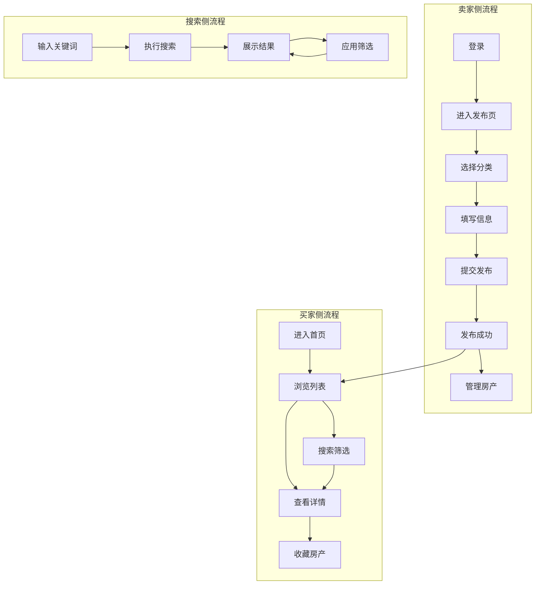
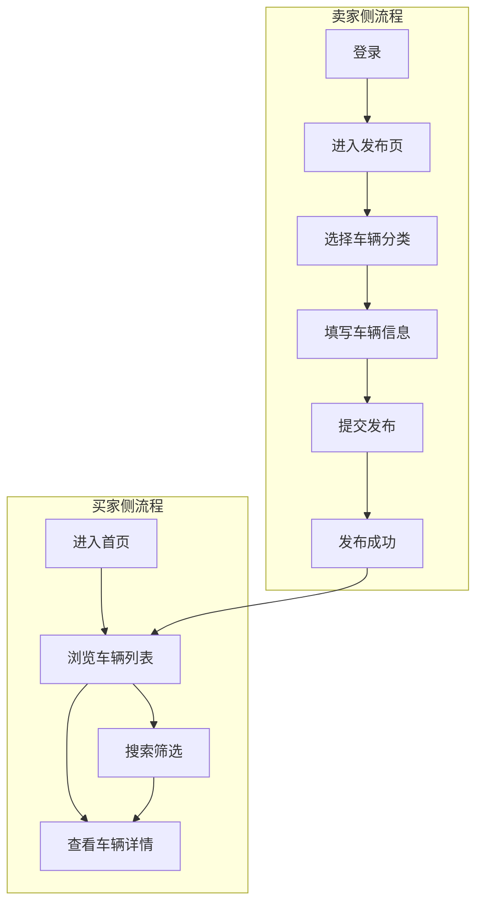
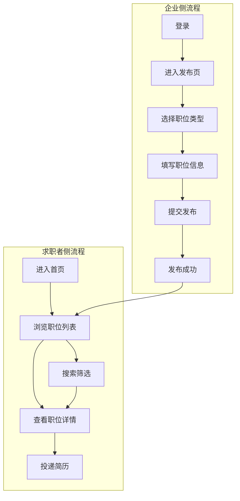
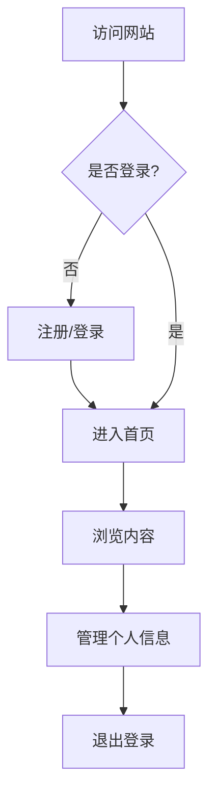
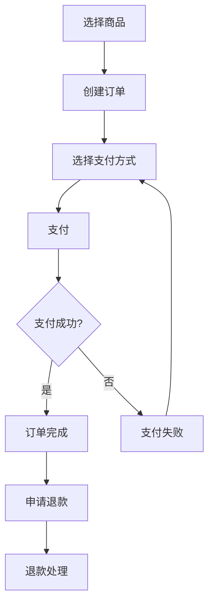
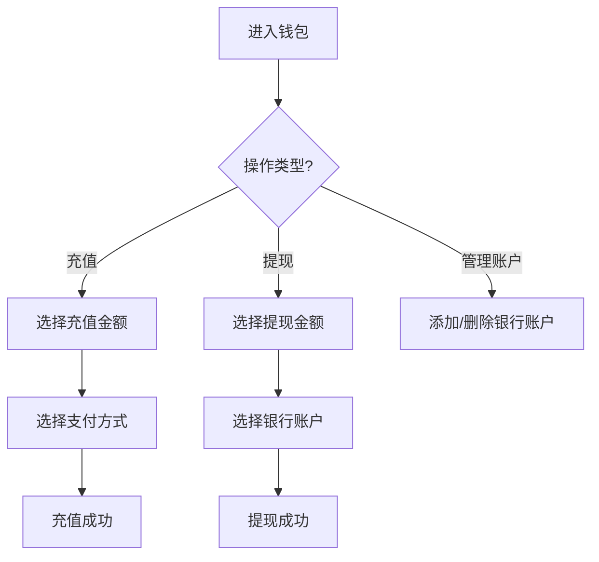

# 核心业务流程总览

## 1. 文档说明

本文档提供所有业务模块的核心流程概览，帮助快速理解产品的整体业务架构。

详细的业务流程和观测点请参考 `业务知识图谱/` 下的各业务域文档。

---

## 2. 房产业务域

### 2.1 核心流程
- **房产发布流程**：卖家发布房产信息
- **房产浏览流程**：买家浏览房产列表和详情
- **房产搜索流程**：买家搜索和筛选房产
- **房产收藏流程**：买家收藏感兴趣的房产
- **房产管理流程**：卖家管理已发布的房产

### 2.2 业务流程全景图

### 2.3 详细文档
- [房产业务全景](../业务知识图谱/房产业务域/房产业务全景.md)
- [房产发布业务流程](../业务知识图谱/房产业务域/房产发布业务流程.md)
- [房产浏览业务流程](../业务知识图谱/房产业务域/房产浏览业务流程.md)
- [房产搜索业务流程](../业务知识图谱/房产业务域/房产搜索业务流程.md)
- [房产收藏业务流程](../业务知识图谱/房产业务域/房产收藏业务流程.md)

---

## 3. 车辆业务域

### 3.1 核心流程
- **车辆发布流程**：卖家发布车辆信息
- **车辆浏览流程**：买家浏览车辆列表和详情
- **车辆搜索流程**：买家搜索和筛选车辆

### 3.2 业务流程全景图

### 3.3 详细文档
- [车辆业务全景](../业务知识图谱/车辆业务域/车辆业务全景.md)（待补充）

---

## 4. 招聘业务域

### 4.1 核心流程
- **职位发布流程**：企业发布招聘职位
- **职位浏览流程**：求职者浏览职位列表和详情
- **职位搜索流程**：求职者搜索和筛选职位
- **简历投递流程**：求职者投递简历

### 4.2 业务流程全景图

### 4.3 详细文档
- [招聘业务全景](../业务知识图谱/招聘业务域/招聘业务全景.md)（待补充）

---

## 5. 用户业务域

### 5.1 核心流程
- **用户注册流程**：新用户注册账号
- **用户登录流程**：用户登录系统
- **个人信息管理流程**：用户管理个人信息
- **会话管理流程**：用户会话的创建、续期、销毁

### 5.2 业务流程全景图

### 5.3 详细文档
- [用户业务全景](../业务知识图谱/用户业务域/用户业务全景.md)（待补充）

---

## 6. 交易业务域

### 6.1 核心流程
- **订单创建流程**：买家创建订单
- **订单支付流程**：买家支付订单
- **订单状态流转**：订单状态的变化
- **退款流程**：买家申请退款

### 6.2 业务流程全景图

### 6.3 详细文档
- [交易业务全景](../业务知识图谱/交易业务域/交易业务全景.md)（待补充）

---

## 7. 钱包业务域

### 7.1 核心流程
- **充值流程**：用户充值到钱包
- **提现流程**：用户从钱包提现
- **银行账户管理流程**：用户管理银行账户

### 7.2 业务流程全景图

### 7.3 详细文档
- [钱包业务全景](../业务知识图谱/钱包业务域/钱包业务全景.md)（待补充）

---

## 8. 变更历史

| 日期 | 版本 | 变更内容 | 变更人 |
|-----|------|---------|--------|
| 2026-03-24 | v1.0 | 初始版本 | AI |
