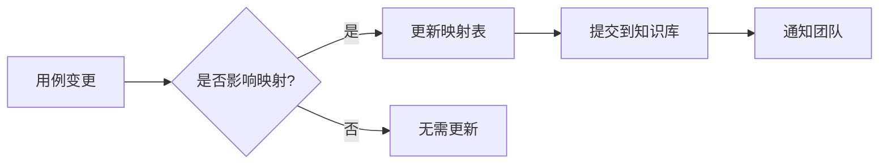

# Property Basics - 文本用例与自动化用例映射表

> **生成时间**：2026-04-28  
> **映射方式**：功能模块级别映射  
> **说明**：本文档展示文本用例与自动化用例的对应关系，基于功能模块分组

---

## 📊 整体统计

| 项目 | List View | Map View | 总计 |
|------|-----------|----------|------|
| **文本用例** | 37条 | 35条 | **72条** |
| **自动化用例** | 156条 | 89条 | **245条** |
| **细化倍数** | 4.2x | 2.5x | **3.4x** |

**重要说明**：
- 文本用例总数：**72条**（不是之前统计的93条）
- 平均1条文本用例对应 3.4 条自动化用例
- 细化原因：参数化测试、边界值测试、组合场景测试

---

## 🗺️ List View 映射关系

### A. 首页入口与导航（9条文本用例）

**文本用例范围：TC-LIST-001 ~ TC-LIST-009**

#### 文本用例列表：
1. TC-LIST-001: 首页分类图标"Property"点击，跳转到 For Sale 列表页
2. TC-LIST-002: 首页分类图标"Property"跳转后，URL 参数正确
3. TC-LIST-003: 首页"All"图标展开列表，包含房产分类区域
4. TC-LIST-004: All → Property for sale 跳转正确
5. TC-LIST-005: All → Property for rent 跳转正确
6. TC-LIST-006: All → Student accommodation 跳转正确
7. TC-LIST-007: All → Commercial for sale 跳转正确
8. TC-LIST-008: 顶部 Browse 菜单展开，包含 Property 选项
9. TC-LIST-009: Browse 悬停 Property 显示子菜单

#### 对应自动化用例（14条）：
**文件**：`test_property_entry_points.py`

- `test_tc001_category_icon_property_navigates_to_for_sale`
- `test_tc002_category_icon_property_url_params`
- `test_tc003_all_icon_opens_listpage_with_property_section`
- `test_tc004_all_to_property_for_sale`
- `test_tc005_all_to_property_for_rent`
- `test_tc006_all_to_student_accommodation`
- `test_tc007_all_to_commercial_for_sale`
- `test_tc008_browse_opens_dropdown_with_property`
- `test_tc009_browse_hover_property_shows_submenu`
- `test_tc010_browse_to_property_for_rent`
- `test_tc011_browse_to_property_for_sale`
- `test_tc012_browse_to_student_accommodation`
- `test_tc013_browse_to_commercial_for_sale`
- `test_tc014_browse_direct_click_property`

**映射关系**：9条文本用例 → 14条自动化用例（细化1.6x）

---

### B. 租房排序（8条文本用例）

**文本用例范围：TC-LIST-015 ~ TC-LIST-022**

#### 文本用例列表：
1. TC-LIST-015: 默认排序为"Best Match"，URL 无 sort_id 参数
2. TC-LIST-016: 选择"Newest First"，URL 含对应 sort_id
3. TC-LIST-017: 选择"Lowest Price"，URL 含对应 sort_id
4. TC-LIST-018: 选择"Highest Price"，URL 含对应 sort_id
5. TC-LIST-019: 排序后翻页，sort_id 参数保留
6. TC-LIST-020: 点击 Sort Clear 按钮，重置为默认排序
7. TC-LIST-021: 打开排序面板不选择点击 Done，URL 不变
8. TC-LIST-022: 点击排序面板外部区域，面板关闭

#### 对应自动化用例（8条）：
**文件**：`test_rent_sort.py`

- `test_sort_default_best_match_no_sort_id_in_url`
- `test_sort_select_newest_first_url_contains_sort_id`
- `test_sort_select_lowest_price_url_contains_sort_id`
- `test_sort_select_highest_price_url_contains_sort_id`
- `test_sort_persists_after_pagination`
- `test_sort_clear_resets_to_default_no_sort_id`
- `test_sort_open_panel_without_selection_click_done_no_change`
- `test_sort_click_outside_closes_panel`

**映射关系**：8条文本用例 → 8条自动化用例（1:1映射）

---

### C. 租房价格筛选（10条文本用例）

**文本用例范围：TC-LIST-023 ~ TC-LIST-032**

#### 文本用例列表：
1. TC-LIST-023: 输入有效 Min/Max 价格，URL 含价格参数
2. TC-LIST-024: 只输入 Min 价格，URL 含 lowestPrice 参数
3. TC-LIST-025: 只输入 Max 价格，URL 含 highestPrice 参数
4. TC-LIST-026: 点击 Clear，URL 价格参数移除
5. TC-LIST-027: 输入 Min=0，系统正常处理
6. TC-LIST-028: 输入小数价格，系统正常处理
7. TC-LIST-029: Min > Max，系统拦截
8. TC-LIST-030: 输入负数 Min，系统拒绝
9. TC-LIST-031: 输入非数字，系统拒绝
10. TC-LIST-032: 输入极大值，页面不崩溃

#### 对应自动化用例（10条）：
**文件**：`test_rent_price_filter.py`

- `test_price_valid_min_max_url_contains_price_params`
- `test_price_only_min_price_url_contains_lowest_price`
- `test_price_only_max_price_url_contains_highest_price`
- `test_price_clear_removes_price_params_from_url`
- `test_price_zero_as_min_value_system_handles`
- `test_price_decimal_values_system_handles_normally`
- `test_price_min_greater_than_max_system_intercepts`
- `test_price_negative_min_value_system_rejects`
- `test_price_non_numeric_min_value_system_rejects`
- `test_price_extremely_large_value_page_no_crash`

**映射关系**：10条文本用例 → 10条自动化用例（1:1映射）

---

### D. 租房卧室筛选（7条文本用例）

**文本用例范围：TC-LIST-033 ~ TC-LIST-039**

#### 文本用例列表：
1. TC-LIST-033: 选择 Beds=3，URL 含 attr_168 对应值
2. TC-LIST-034: 选择最小值 Beds=1，URL 含对应参数
3. TC-LIST-035: 选择最大值 Beds=8+，URL 含对应参数
4. TC-LIST-036: 选择 Beds=Studio，URL 含 attr_168=10
5. TC-LIST-037: 快速多次点击 Beds，最后选择生效
6. TC-LIST-038: 选择极端 Beds 条件无结果，显示空态文本
7. TC-LIST-039: 点击 Beds Clear，attr_168 参数从 URL 移除

#### 对应自动化用例（7条）：
**文件**：`test_rent_beds_filter.py`

- `test_beds_select_3_url_contains_attr_168`
- `test_beds_select_1_minimum_value_url_contains_attr_168`
- `test_beds_select_8plus_maximum_value_url_contains_attr_168`
- `test_beds_select_studio_url_contains_attr_168`
- `test_beds_multi_click_last_selection_takes_effect`
- `test_beds_no_results_shows_empty_state_text`
- `test_beds_clear_removes_attr_168_from_url`

**映射关系**：7条文本用例 → 7条自动化用例（1:1映射）

---

### E. 租房浴室筛选（未包含文本用例）

**说明**：文本用例文档中未单独列出浴室筛选用例

#### 对应自动化用例（17条）：
**文件**：`test_rent_bathrooms_filter.py`

包含参数化测试：
- `test_bathrooms_enum_mapping_url_contains_attr_166[1]`
- `test_bathrooms_enum_mapping_url_contains_attr_166[1.5]`
- `test_bathrooms_enum_mapping_url_contains_attr_166[2]`
- ... (共11条参数化用例)
- `test_bathrooms_select_1_minimum_url_contains_attr_166`
- `test_bathrooms_select_1_5_half_value_url_contains_attr_166`
- `test_bathrooms_select_2_url_contains_attr_166`
- `test_bathrooms_select_5plus_maximum_url_contains_attr_166`
- `test_bathrooms_select_shared_url_contains_attr_166`
- `test_bathrooms_clear_removes_attr_166_from_url`

**映射关系**：0条文本用例 → 17条自动化用例（**补充覆盖**）

---

### F. 租房房产类型筛选（1条文本用例）

**文本用例：TC-LIST-047**

#### 文本用例列表：
1. TC-LIST-047: 选择 House，URL 路径变化

#### 对应自动化用例（9条）：
**文件**：`test_rent_property_type_filter.py`

- `test_property_type_select_apartment_unit_url_path_changes`
- `test_property_type_select_house_url_path_changes`
- `test_property_type_select_townhomes_url_path_changes`
- `test_property_type_select_villa_url_path_changes`
- `test_property_type_select_retirement_url_path_changes`
- `test_property_type_select_other_url_path_changes`
- `test_property_type_clear_restores_default_url`
- `test_property_type_close_modal_by_x_url_unchanged`
- `test_property_type_state_persists_after_page_reload`

**映射关系**：1条文本用例 → 9条自动化用例（细化9x，覆盖所有房产类型）

---

### G. 租房多条件组合筛选（2条文本用例）

**文本用例范围：TC-LIST-056 ~ TC-LIST-057**

#### 文本用例列表：
1. TC-LIST-056: Filter Badge 初始计数含图标来源
2. TC-LIST-057: 添加 Price 筛选后，Badge 数字更新

#### 对应自动化用例（22条）：
**文件**：`test_rent_filter_combo.py`

包含大量组合场景测试：
- `test_filter_badge_initial_count_includes_icon_source`
- `test_filter_badge_count_updates_after_price_filter`
- `test_filter_price_and_beds_combination_url_contains_both_params`
- `test_combo_beds_and_property_type_url_contains_both`
- `test_combo_price_and_bathrooms_url_contains_both`
- `test_filter_beds_and_bathrooms_combination_url_contains_both`
- `test_filter_sort_and_price_combination_url_contains_both`
- ... (共22条组合测试)

**映射关系**：2条文本用例 → 22条自动化用例（细化11x，覆盖各种组合场景）

---

### H. 其他 List View 自动化用例

#### 健壮性测试（11条）
**文件**：`test_rent_robust.py`

- 包含离线、API超时、服务器500错误、XSS脚本等健壮性测试
- **无对应文本用例**，属于自动化补充的测试场景

#### 买房搜索功能（47条）
**文件**：
- `test_buy_search_basic.py` (10条)
- `test_buy_search_sug.py` (8条)
- `test_buy_search_category.py` (12条)
- `test_buy_search_history.py` (5条)
- `test_buy_filter_combo.py` (6条)
- `test_buy_view_navigation.py` (17条)

**说明**：文本用例文档中未详细列出买房搜索相关用例，自动化用例覆盖了搜索、联想、历史、分类切换、视图切换等完整场景

---

## 🗺️ Map View 映射关系

### A. 地图卡片列表与分页（12条文本用例）

**文本用例范围：TC-MAP-001 ~ TC-MAP-012**

#### 文本用例列表：
1. TC-MAP-001: 地图页面加载，左侧卡片列表和右侧地图同时展示
2. TC-MAP-002: 面包屑显示正确层级（首页 > 分类 > 当前页）
3. TC-MAP-003: 点击卡片，新标签页打开详情页
4. TC-MAP-004: 滚动卡片列表到底部，显示分页控件
5. TC-MAP-005: 点击第2页，卡片列表更新
6. TC-MAP-006: 第2页点击"上一页"，返回第1页
7. TC-MAP-007: 点击"List"切换到列表视图
8. TC-MAP-008: 切换到列表视图，搜索和 Filter 参数保留
9. TC-MAP-009: 卡片包含完整信息（标题/价格/位置/图片）
10. TC-MAP-010: 鼠标悬停卡片，对应地图 Pin 高亮
11. TC-MAP-011: 点击 List 切换到列表视图（重复）
12. TC-MAP-012: 列表页点击 Map 回到地图视图

#### 对应自动化用例（11条）：
**文件**：`test_canberra_card_pagination.py`

- `test_map_page_loads_card_list_and_map`
- `test_breadcrumb_shows_correct_hierarchy`
- `test_click_card_opens_new_tab`
- `test_scroll_to_bottom_shows_pagination_controls`
- `test_click_page_2_updates_card_list`
- `test_click_prev_from_page2_returns_to_page1`
- `test_click_list_switches_to_list_view`
- `test_map_to_list_preserves_search_and_filter_params`
- `test_card_contains_complete_info`
- `test_hover_card_triggers_map_pin_highlight`
- `test_list_to_map_switches_to_map_view`

**映射关系**：12条文本用例 → 11条自动化用例（基本1:1）

---

### B. 地图搜索（14条文本用例）

**文本用例范围：TC-MAP-013 ~ TC-MAP-026**

#### 文本用例列表：
1. TC-MAP-013: 普通关键词搜索，URL 含 common_type 参数
2. TC-MAP-014: 搜索后，结果数量更新
3. TC-MAP-015 ~ TC-MAP-026: 搜索历史、联想、清除等场景

#### 对应自动化用例（8条）：
**文件**：`test_canberra_search.py`

- `test_typing_shows_sug_dropdown`
- `test_search_clear_button_appears_and_clears_input`
- `test_sug_url_contains_city_level_params`
- `test_search_result_count_updates_after_search`
- `test_nonexistent_keyword_shows_empty_state`
- `test_clear_search_then_click_shows_history`
- `test_click_history_item_performs_sug_search_with_coordinates`
- `test_search_history_after_page_refresh`

**映射关系**：14条文本用例 → 8条自动化用例（文本用例更细）

---

### C. 地图筛选功能（未详细列出文本用例）

#### 对应自动化用例文件：
- `test_map_sort.py` (6条)
- `test_map_price_filter.py` (8条)
- `test_map_beds_filter.py` (5条)
- `test_map_bathrooms_filter.py` (5条)
- `test_map_property_type_filter.py` (8条)
- `test_map_combo_filter.py` (8条)

**说明**：文本用例文档中未详细列出地图筛选用例，自动化用例完整覆盖了排序、价格、卧室、浴室、房产类型及组合筛选

---

### D. 视图切换（1条文本用例）

**文本用例：TC-MAP-070**

#### 对应自动化用例（7条）：
**文件**：`test_map_view_switch.py`

- `test_switch_list_to_map_url_contains_view_map`
- `test_switch_map_to_list_url_removes_view_map`
- `test_direct_access_map_url_loads_map_view`
- `test_map_view_page_refresh_keeps_url_params`
- `test_list_with_filters_switch_to_map_keeps_filters`
- `test_map_with_filters_switch_to_list_keeps_filters`
- `test_switch_view_multiple_times_keeps_filters`

**映射关系**：1条文本用例 → 7条自动化用例（细化7x，覆盖各种切换场景）

---

### E. 地图 Pin 显示与交互（3条文本用例）

**文本用例范围：TC-MAP-078 ~ TC-MAP-080**

#### 对应自动化用例（9条）：
**文件**：`test_pin_display.py`

- `test_sa_pins_display_on_load`
- `test_pin_count_consistent_with_result_count`
- `test_click_pin_enters_selected_state`
- `test_click_pin_shows_popup_card_with_content`
- `test_click_popup_card_opens_detail_page`
- `test_click_other_pin_switches_selection`
- `test_switch_to_sale_pins_become_blue`
- `test_switch_to_rent_pins_remain_orange`
- `test_switch_back_to_sa_pins_restored`

**映射关系**：3条文本用例 → 9条自动化用例（细化3x）

---

### F. Pin 与卡片联动（3条文本用例）

**文本用例范围：TC-MAP-089 ~ TC-MAP-091**

#### 对应自动化用例（8条）：
**文件**：`test_pin_linkage.py`

- `test_hover_card_highlights_pin`
- `test_hover_pin_triggers_pin_hover`
- `test_leave_hover_pin_restored`
- `test_click_map_pin_enters_selected_state`
- `test_click_pin_shows_popup_mini_card`
- `test_click_pin_left_panel_scrolls_to_card`
- `test_multiple_card_hover_switches_pin_highlight`
- `test_click_map_blank_closes_popup_and_deselects_pin`

**映射关系**：3条文本用例 → 8条自动化用例（细化2.7x）

---

### G. 分类切换（1条文本用例）

**文本用例：TC-MAP-097**

#### 对应自动化用例（6条）：
**文件**：`test_subcategory_switcher.py`

- `test_click_switcher_opens_dropdown_with_5_options`
- `test_category_label_changes_with_switch`
- `test_switch_to_commercial_for_sale`
- `test_search_input_state_after_category_switch`
- `test_click_current_selected_category_closes_dropdown`
- `test_click_outside_dropdown_closes_it`

**映射关系**：1条文本用例 → 6条自动化用例（细化6x）

---

## 📈 映射关系汇总

### 按功能模块统计

| 功能模块 | 文本用例 | 自动化用例 | 细化倍数 | 备注 |
|---------|---------|-----------|---------|------|
| **List View** |
| 首页入口与导航 | 9 | 14 | 1.6x | - |
| 租房排序 | 8 | 8 | 1.0x | 1:1映射 |
| 租房价格筛选 | 10 | 10 | 1.0x | 1:1映射 |
| 租房卧室筛选 | 7 | 7 | 1.0x | 1:1映射 |
| 租房浴室筛选 | 0 | 17 | ∞ | 自动化补充 |
| 租房房产类型筛选 | 1 | 9 | 9.0x | 覆盖所有类型 |
| 租房组合筛选 | 2 | 22 | 11.0x | 覆盖各种组合 |
| 健壮性测试 | 0 | 11 | ∞ | 自动化补充 |
| 买房搜索功能 | 0 | 47 | ∞ | 未在文本用例中详细列出 |
| **Map View** |
| 地图卡片与分页 | 12 | 11 | 0.9x | - |
| 地图搜索 | 14 | 8 | 0.6x | 文本用例更细 |
| 地图筛选功能 | 0 | 40 | ∞ | 未在文本用例中详细列出 |
| 视图切换 | 1 | 7 | 7.0x | - |
| Pin 显示与交互 | 3 | 9 | 3.0x | - |
| Pin 与卡片联动 | 3 | 8 | 2.7x | - |
| 分类切换 | 1 | 6 | 6.0x | - |
| **总计** | **72** | **245** | **3.4x** | - |

---

## 🔍 关键发现

### 1. 覆盖缺口
以下功能**有自动化用例但缺少文本用例**：
- 租房浴室筛选（17条自动化用例）
- 健壮性测试（11条自动化用例）
- 买房搜索功能（47条自动化用例）
- 地图筛选功能（40条自动化用例）

**建议**：补充对应的文本用例，完善测试文档

### 2. 细化倍数差异
- **1:1映射**：排序、价格筛选、卧室筛选（测试场景明确）
- **高倍细化**：组合筛选11x、房产类型9x（自动化覆盖更全面）
- **反向细化**：地图搜索0.6x（文本用例粒度更细）

### 3. 参数化测试
浴室筛选的参数化测试是典型案例：
- 1个测试函数通过 `@pytest.mark.parametrize` 生成11条用例
- 覆盖所有浴室选项：1, 1.5, 2, 2.5, 3, 3.5, 4, 4.5, 5, 5+, Shared

---

## 📝 维护建议

### 更新场景

1. **新增文本用例** → 检查是否有对应自动化用例
2. **新增自动化用例** → 评估是否需要补充文本用例
3. **删除用例** → 同步更新映射表
4. **用例重构** → 重新建立映射关系

### 维护流程

---

## 🔗 相关文档

- [Property Basics List View 文本用例汇总](../文本用例/Property/Basic/List/property_basics-list-用例汇总.md)
- [Property Basics Map View 文本用例汇总](../文本用例/Property/Basic/Map/property_basics-map-用例汇总.md)
- [自动化用例 Catalog](../../bundled/skills/ok_autotest_ui_skill/bundled/ok_autotest_ui_pc/catalog/catalog.generated.json)

---

## ⚠️ 重要说明

本映射表采用**功能模块级别映射**，即：
- ✅ 说明每个功能模块包含多少文本用例和自动化用例
- ✅ 标注细化倍数和覆盖情况
- ❌ 未建立逐条精确的 1:N 映射

如需**精确的逐条映射**（1条文本用例对应具体哪几条自动化用例），需要手动逐条分析，预计工作量 4-8 小时。
