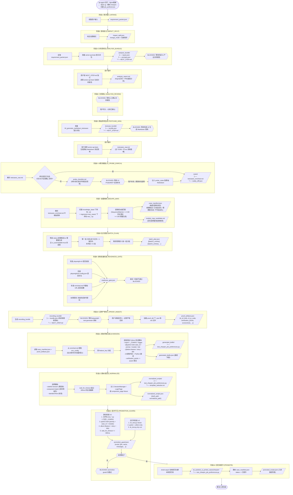

# 新需求测试用例脚本生成 - 完整流程与数据流转

## 流程图



## 数据流转详解

### 阶段1: 需求接入

| 输入 | 处理 | 输出 |
|------|------|------|
| CLI 参数: figma链接, 站点, 模块, 功能, 需求文档, git-diff等 | 封装为 `RequirementPacket` 数据结构 | `.qa_agent/runs/<run_id>/requirement_packet.json` |

`requirement_packet.json` 示例结构:
```json
{
  "change_mode": "仅新需求",
  "figma_url": "https://figma.com/xxx",
  "prd_refs": [],
  "git_diff_summary": "",
  "candidate_modules": ["zhaopin"],
  "site": "sg",
  "feature_name": "job_preferences",
  "risk_hints": [],
  "assumptions": ["原型来源=Figma"]
}
```

---

### 阶段2: 影响拆分

| 输入 | 处理 | 输出 |
|------|------|------|
| `requirement_packet.json` | 根据是否有 figma / git_diff 判定变更模式 | `impact_split.json` |

判定逻辑:
- 只有 figma -> `仅新需求`
- 只有 diff -> `仅回归`
- 都有 -> `混合`

---

### 阶段3: 分析资料包 (BLOCKED)

| 输入 | 处理 | 输出 |
|------|------|------|
| `requirement_packet.json` | 将 `senior-qa-brain/references/prompts/` 下的提示词路径组装为资料包 | `analysis_bundle/` 目录 |

资料包包含:
- `inputs.json`: 需求包原文
- `prompts.json`: 4 个提示词文件路径 (01_analyze_figma ~ 04_generate_markdown_testcases)
- `NEXT_STEP.md`: 人工操作指引

**阻塞等待**: 用户需要使用 senior-qa-brain AI 生成分析报告, 然后通过 `--分析报告 ./report.md` 传回。

---

### 阶段4: 分析确认 (BLOCKED)

| 输入 | 处理 | 输出 |
|------|------|------|
| `analysis_report.md` | 人工门禁, 等待 `--分析已确认` 标志 | 无新产物, 仅放行 |

---

### 阶段5: 原始用例生成 (BLOCKED)

| 输入 | 处理 | 输出 |
|------|------|------|
| `analysis_report.md` + `04_generate_markdown_testcases.md` | 组装用例生成资料包 | `testcase_bundle/` 目录 |

**阻塞等待**: 用户调用 senior-qa-brain 生成 Markdown 用例, 通过 `--原始用例 ./testcases_raw.md` 传回。

`testcases_raw.md` 内容结构示例:
```markdown
## 测试环境配置
| 配置项 | 值 |
|--------|------|
| 站点   | SG   |
| 基础URL | https://sg.test.example.com |
| 测试账号 | user@test.com |

## 测试用例
| TC_ID | 标题 | 优先级 | 前置条件 | 步骤 | 期望结果 |
|-------|------|--------|----------|------|----------|
| TC001 | 设置岗位偏好 | P0 | 已登录 | 1.进入偏好页 2.选择岗位 | 保存成功 |
```

---

### 阶段6: UI探测增强

| 输入 | 处理 | 输出 |
|------|------|------|
| `testcases_raw.md` + (可选) `probe_notes.json` | 检查是否包含 5 项 MCP 实测确认章节; 若缺少则生成 checklist 并阻塞; 若提供了 probe_notes 则注入 | `testcases_enriched.md` + `reality_diff.json` |

5 项必须补充的章节:
1. 页面入口（MCP实测确认）
2. 页面字段说明（MCP录制确认）
3. 成功验证（MCP实测确认）
4. 失败验证（MCP实测确认）
5. 设计与真实环境差异（MCP实测确认）

---

### 阶段7: 查重映射

| 输入 | 处理 | 输出 |
|------|------|------|
| `testcases_enriched.md` + `knowledge_base/*.md` + `test_cases/test_*.py` | 对每条用例: 1)与知识库文档相似度匹配 2)与已有脚本 allure.title 匹配 | `case_manifest.json` + `module_map_candidate.md` |

查重判定规则:
- 完全匹配 (>=0.92): 标记为 `已有自动化`, 跳过生成
- 近似匹配 (>=0.85): 标记为 `需要重生成`
- 无匹配: 标记为 `新增候选`, 进入后续生成流程
- `ui_automatable=false`: 标记为 `不可自动化`, 跳过

---

### 阶段8: 批次规划

| 输入 | 处理 | 输出 |
|------|------|------|
| `case_manifest.json` (筛选 status=新增候选/需要重生成 且 ui_automatable=true) | 第一批优先包含 P0 正向 + 负向用例, 每批 <=5 条 | `batch_plan.json` |

---

### 阶段9: 录制准备检查

| 输入 | 处理 | 输出 |
|------|------|------|
| 本机环境 + `testcases_enriched.md` | 4 项检查: playwright-cli / 配置文件 / 基础URL / 账号凭据 | `readiness_gate.json` |

---

### 阶段10: 证明产物导入 (BLOCKED)

| 输入 | 处理 | 输出 |
|------|------|------|
| `recording_bundle/` -> 用户录制 -> `proof_dir/` | 解析每个 .json/.md 证明文件, 提取录制 JS 代码、验证点、截图等 | `proof_artifacts.json` |

`proof_artifacts.json` 核心结构:
```json
{
  "TC001": {
    "tc_id": "TC001",
    "batch_id": "batch_1",
    "refs": ["e101", "e102"],
    "cli_js_code": ["await page.goto('https://...')", "await page.click('#btn')"],
    "verification_points": ["保存成功"],
    "screenshots": ["bug-TC001.png"]
  }
}
```

---

### 阶段11: 脚本草稿生成

| 输入 | 处理 | 输出 |
|------|------|------|
| `case_manifest.json` + `proof_artifacts.json` + `testcases_enriched.md` | 1) 提取 env_config(站点/账号/浏览器) 2) JS代码翻译为Python 3) 渲染完整 pytest 脚本 | `generated_drafts/test_zhaopin_job_preferences.py` |

JS -> Python 翻译示例:
```
await page.getByRole('button', { name: 'Save' }).click()
  -->
page.get_by_role("button", name="Save").click()
```

生成的脚本结构:
```python
import pytest
import allure

_CONFIG = { "site": "sg", "base_url": "...", ... }

@pytest.mark.case_id_zhaopin_tc001_...
@pytest.mark.p0
@pytest.mark.zhaopin
@pytest.mark.sg
@allure.feature("OK")
@allure.story("job_preferences")
@allure.title("设置岗位偏好")
def test_tc001_...(page, config):
    with allure.step("执行录制流程"):
        page.goto("https://...")
        page.get_by_role("button", name="Save").click()
    with allure.step("验证关键点"):
        assert page.locator("body").inner_text().__contains__("保存成功")
```

---

### 阶段12: 脚本规范化

| 输入 | 处理 | 输出 |
|------|------|------|
| 草稿脚本 + `case_manifest.json` + `env_config` | 1) 选模板 2) 截断超长 wait 3) 注入 fixture | `normalized_scripts/test_zhaopin_job_preferences.py` |

模板选择逻辑:
| 条件 | 模板 | 注入内容 |
|------|------|----------|
| 有测试账号 + 角色非 visitor | `stateful-session` | `SessionManager` + `LoginPage` + `prepared_page` fixture |
| 多条用例 | `component-batch` | `component_page` fixture |
| 其他 | `standard-flow` | 不额外注入 |

---

### 阶段13: 提升守卫

| 输入 | 处理 | 输出 |
|------|------|------|
| 规范化脚本 | 5 项静态检查 + 3 项运行时检查 | `promotion_guard.json` |

**静态检查** (必须全过):
1. 文件名 `test_*.py`
2. 包含 `_CONFIG` 配置块
3. pytest.mark 标记齐全 (priority + case_id + module/site)
4. allure 装饰器齐全 (feature + story + title)
5. `wait_for_timeout` 不超过 300ms

**运行时检查** (必须全过):
1. `ok_test.py doctor` - 回归项目环境健康检查
2. `pytest --collect-only` - 用例可被 pytest 正常收集
3. `ok_test.py dry-run` - 回归预演通过

---

### 阶段14: 回归池提升

| 输入 | 处理 | 输出 |
|------|------|------|
| 规范化脚本 (已通过守卫) | `shutil.copy2` 复制到目标目录 | `ok_autotest_ui_pc/test_cases/<module>/test_xxx.py` |

最终入库路径:
```
bundled/skills/ok_autotest_ui_skill/bundled/ok_autotest_ui_pc/
  └── test_cases/
      └── zhaopin/
          └── test_zhaopin_job_preferences.py    <-- 最终入库位置
```

同时更新 `case_manifest.json`, 将所有相关用例的 status 从 `新增候选`/`需要重生成` 改为 `已提升`。
